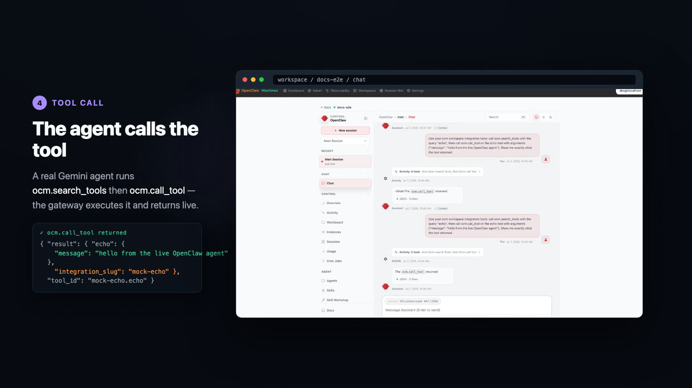
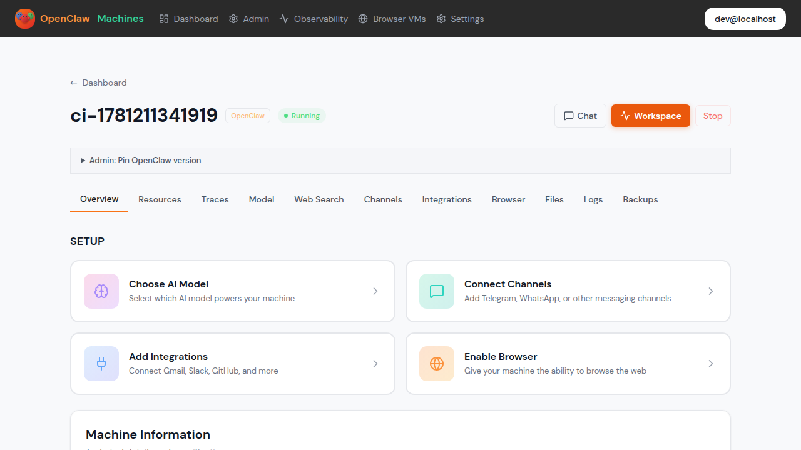
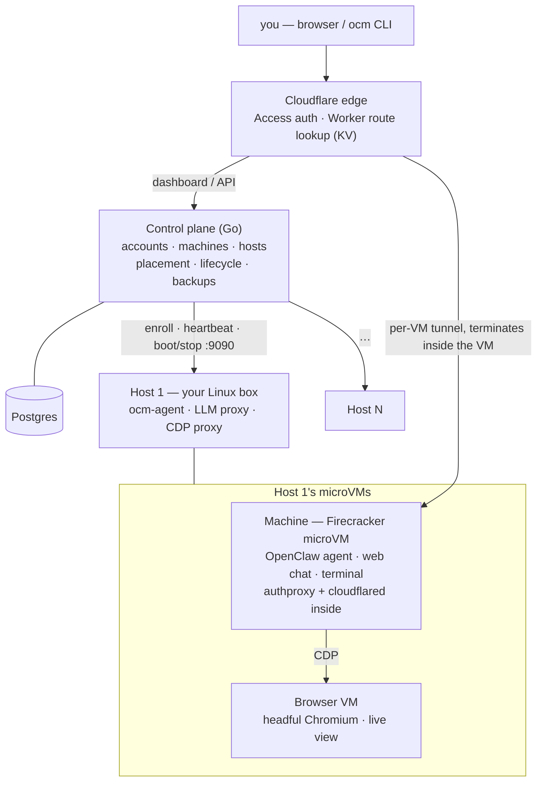

#  OpenClaw Machines

**Run as many isolated OpenClaw agents as you need, on hardware you own.**

[](LICENSE)
[](https://github.com/mathaix/OpenClawMachines/actions)
[](https://github.com/mathaix/OpenClawMachines)

OpenClaw Machines is an **open-source platform for running
[OpenClaw](https://github.com/openclaw/openclaw) in secure AI sandboxes on your
own infrastructure**. A **control plane** orchestrates your hosts, and each
agent runs in its own
[Firecracker](https://github.com/firecracker-microvm/firecracker) microVM on
them — hardware-isolated, safe for untrusted and agent-generated code. A
**Cloudflare data plane** is the front door: every machine gets its own
subdomain behind edge auth, reached through a tunnel that terminates *inside*
the VM — no inbound ports on your hosts. See it running at
[openclawmachines.com](https://openclawmachines.com).

The Apache-2.0 **public core** ships every piece of that stack:

- a [**minimal control plane**](docs/architecture.md#control-plane-port-8080) —
  Go API, Postgres-backed accounts, machines, and hosts;
  [placement](docs/architecture.md#scheduling--capacity-management),
  [machine lifecycle](docs/architecture.md#machine-lifecycle),
  [host enrollment](docs/host-enrollment.md),
  [backups](docs/architecture.md#backup--restore), and
  [durable workflows](docs/architecture.md#durable-workflows-dbos);
- the [**host agent**](docs/architecture.md#worker-agents-host-vms--port-90909091)
  (`ocm-agent`) — boots, supervises, and reaps Firecracker microVMs on your
  enrolled Linux boxes, managing bridge/TAP networking and rootfs staging;
- a per-host [**LLM proxy**](docs/architecture.md#ai-gateway-litellm--per-host)
  (LiteLLM) — one place for model keys and BYO-key support, with per-machine
  usage tracking across providers (or your own locally served models);
- the [**OpenClaw runtime**](docs/architecture.md#firecracker-microvms) — the
  in-VM pieces: auth proxy, web-chat gateway, live terminal, and the
  artifact-driven runtime staging/upgrade flow;
- the [**browser runtime**](docs/architecture.md#browser-vms-cdp--live-view) —
  paired Chromium browser VMs with CDP routing and a watchable live view;
- [**workspace integrations / native MCP**](docs/workspace-integrations-mcp.md)
  — GitHub, Google Workspace, OpenAPI, GraphQL, and remote-MCP tools connected
  once per workspace and exposed to machines through the OCM MCP facade;
- and the [**build pipelines**](docs/building.md) that assemble it all — every
  component's build command, the GCS artifact bucket layout, host provisioning
  scripts, and the [release lanes](docs/ci-release.md).

The `ocm` CLI lives in the separate
[`mathaix/ocm-cli`](https://github.com/mathaix/ocm-cli) Apache-2.0 repository.

## Video link

Click the screenshot to watch the 43-second demo on YouTube. This is a linked
image, not an embedded player.

[](https://youtu.be/XJRNcXEvc34)

The demo covers host onboarding, agent spin-up, the running Firecracker VM
terminal, workspace MCP integrations, and an agent tool call end to end.



## Why OpenClaw Machines

- **Security.** Real isolation, not containers: one Firecracker microVM per
  agent, with its own guest kernel behind a KVM hardware boundary — and auth
  enforced at the edge and again inside every VM.
- **Cost.** One flat server cost: rent a single bare-metal box and run as many
  hardware-isolated agents as it fits — see
  [how the options compare](#how-the-options-compare). The same architecture
  cuts token spend too: route agents to open-source models running on your own
  GPU hardware instead of paying per-token APIs.
- **Sovereignty.** Your hardware, your data, your keys. Run the control plane
  and workers on machines you own, and route model traffic through the per-host
  LLM proxy to any provider — or to models served on your own GPUs.
- **Open source.** Apache-2.0 public core and companion
  [`ocm` CLI](https://github.com/mathaix/ocm-cli), permissively licensed for
  adoption, embedding, and contribution.
- **Enterprise.** Multi-user accounts and teams, admin-gated host management,
  encrypted per-machine secrets, and capacity/placement policies across your
  fleet.
- **Ecosystem.** Browser VMs for web automation, live terminal and web chat,
  per-VM routing, workspace-scoped native MCP integrations, backups/snapshots,
  agent memory, and observability with OpenTelemetry/Opik tracing and
  per-machine usage tracking.

## How the options compare

If you run [OpenClaw](https://github.com/openclaw/openclaw) today, you have a
few options:

1. **Local hardware** — run it on your own laptop or desktop.
2. **A VPS** (e.g. Hostinger, DigitalOcean) — rent a virtual server and run it
   there.
3. **A managed service** (e.g. KiloClaw) — spin up a hosted OpenClaw instance and
   pay per instance.

OpenClaw Machines is the **fourth option**: rent **one bare-metal server**
(OVHcloud, Hetzner, …), point OpenClaw Machines at it, and spin up as many
**hardware-isolated** OpenClaw instances as the box will hold. One agent or
fifty — **the cost stays one flat server**.

| Feature | Local hardware | VPS (Hostinger) | Managed (KiloClaw) |  |
|---|---|---|---|---|
| Setup effort | Low | Medium | Lowest | Medium (provision + enroll host) |
| Per-agent isolation | Process-level | Shared-kernel / container | Per instance (managed) | **Hardware — Firecracker microVM** |
| Run many agents | Limited by your box | Limited by VPS size | Yes — but pay for each | **Yes — as many as the server fits** |
| Multi-user / teams | No | Manual | Varies | **Yes — built-in accounts & teams** |
| Cost model | Your own hardware | Pay per VPS | Pay per instance | **Pay per server (flat)** |
| Cost at scale | Doesn't scale | Rises with size | Highest (linear per agent) | **Lowest per agent** |
| Hardware control | Full (but limited) | Virtualized, shared | None | **Full — dedicated bare metal** |
| Data & keys stay yours | Yes | Mostly | No (their infra) | **Yes — your hardware** |
| Backups / snapshots | Manual | Provider snapshots | Managed | **Built-in** |
| Ops / maintenance | You | You | None | You (self-hosted control plane) |

In short: the **managed** route is easiest but priced per agent; **local** and
**VPS** are cheap to start but don't isolate or scale well. **OpenClaw Machines**
trades a little more setup for the best economics and isolation once you're
running more than a couple of agents — one server, many hardware-isolated agents,
all yours.

## How it works

OpenClaw Machines turns your own Linux servers into a pool of secure, on-demand
sandboxes. Each sandbox is a real Firecracker microVM (its own kernel,
hardware-isolated via KVM) that runs one AI agent. The platform is the **control
plane** that creates those VMs, keeps track of them, routes traffic to them, and
tears them down — so you can run many untrusted agents safely on infrastructure
you own. Think: a mini-cloud for AI agents, that you self-host.

1. **Control plane (Go backend) — the brain.** Accounts, machines, hosts, and
   config; the API the UI/CLI call; placement and lifecycle orchestration.
2. **Hosts + worker agents — your Linux boxes.** Enroll a host with an install
   script; its worker agent boots and stops Firecracker microVMs when told to.
3. **Machines — one isolated microVM per agent.** Inside: the OpenClaw agent, a
   web chat gateway, and a live terminal.
4. **Browser VMs** — separate microVMs running headful Chromium with a live
   view, driven by the agent over CDP for browser automation.
5. **Routing / data plane** — every running VM gets its own subdomain and a
   Cloudflare Tunnel that terminates **inside the VM**, with auth enforced at
   the edge and again in-VM.
6. **Workspace integrations (native MCP)** — connect external tools once per
   workspace (GitHub, Google Workspace, or any OpenAPI / GraphQL / remote-MCP
   endpoint); the control plane exposes them to each machine's agent through a
   single built-in MCP server, so the agent discovers and calls them with
   `ocm.search_tools` / `ocm.call_tool` instead of per-integration wiring.



The full design — data plane, routing, tunnels, lifecycle, config, and the
build/release flow — is in **[docs/architecture.md](docs/architecture.md)**, and
the five-layer stack (React UI → Cloudflare edge → Go control plane → host
agents → Firecracker sandboxes) is in **[docs/tech-stack.md](docs/tech-stack.md)**.

## Requirements

OpenClaw Machines runs Firecracker microVMs, which require KVM. You need a
KVM-enabled Linux host: bare metal, or a cloud VM with nested virtualization
enabled. It does not run on macOS, Windows/WSL, or a standard cloud VM without
nested virtualization.

Check your host:

```bash
make preflight
```

## Getting started

**[The Getting Started guide](docs/getting-started.md)** is three stages, each
ending with something working:

1. **Local evaluation** — the full stack + a real Firecracker machine on one KVM
   box. No Cloudflare, no cloud account.
2. **Cloudflare + a dedicated host** — the production-shaped deployment:
   domain, tunnels, edge auth, and an enrolled cloud or bare-metal host.
3. **The full workflow** — create and use machines (chat, terminal, browser
   VMs), lifecycle, backups, runtime upgrades.

## Project docs

- [**Getting Started**](docs/getting-started.md) — the three-stage guide above
- [**User guide**](docs/user-guide.md) — using a machine day-to-day (model, chat, terminal, browser VM, files, logs, traces, backups)
- [**Workspace integrations / native MCP**](docs/workspace-integrations-mcp.md) — connect GitHub, Google Workspace, OpenAPI, GraphQL, and remote-MCP tools once per workspace
- [Architecture](docs/architecture.md) — data plane, routing, tunnels, lifecycle, [workspace integrations / native MCP](docs/architecture.md#workspace-integrations--native-mcp)
- [Tech stack](docs/tech-stack.md) — the five layers, client to sandbox
- [Local and BYO-host setup](docs/local-setup.md)
- [Control plane deployment profiles](docs/control-plane-profiles.md)
- [Self-hosted control plane prerequisites](docs/self-hosted-control-plane.md)
- [LLM operator runbook](llms/self-hosted-setup.txt)
- [Public docs inventory](docs/public-docs-inventory.md)
- [Contributing](CONTRIBUTING.md) · [Security policy](SECURITY.md) · [Code of conduct](CODE_OF_CONDUCT.md)
- [`ocm` CLI project](https://github.com/mathaix/ocm-cli)

## Community & support

- **[GitHub Discussions](https://github.com/mathaix/OpenClawMachines/discussions)** — questions, ideas, show & tell
- **[Issues](https://github.com/mathaix/OpenClawMachines/issues)** — bugs and feature requests
- **[Roadmap](https://github.com/mathaix/OpenClawMachines/issues/25)** — the open-source readiness tracker: what's done, what's next
- Found a vulnerability? See the [security policy](SECURITY.md).

## Contributing

See [CONTRIBUTING.md](CONTRIBUTING.md) and the
[code of conduct](CODE_OF_CONDUCT.md).

## License

[Apache-2.0](LICENSE)
