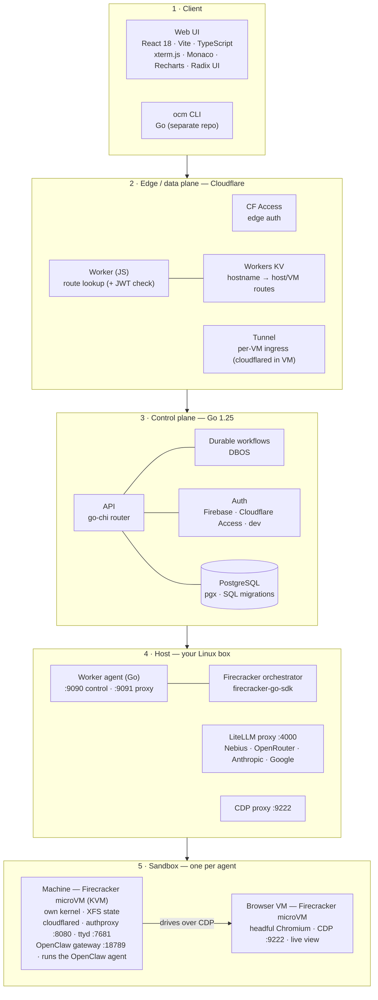

<p align="center">
  
</p>

# OpenClaw Machines

**Run as many isolated OpenClaw agents as you need, on hardware you own.**

[](LICENSE)
[](https://github.com/mathaix/OpenClawMachines/actions)
[](https://github.com/mathaix/OpenClawMachines)

OpenClaw Machines is an **open-source platform for running AI agents in secure,
sandboxed [Firecracker](https://github.com/firecracker-microvm/firecracker)
microVMs**. Each [OpenClaw](https://github.com/openclaw/openclaw) agent runs in
its own KVM-backed microVM, so you can execute agent-generated and untrusted code
on infrastructure you control.

The Apache-2.0 public core includes a minimal control plane, host enrollment,
machine lifecycle, placement, worker agents, and runtime pieces needed to run
Firecracker sandboxes locally or in a self-hosted/operator-hosted deployment.
The `ocm` CLI lives in the separate
[`mathaix/ocm-cli`](https://github.com/mathaix/ocm-cli) Apache-2.0 repository.

## Why OpenClaw Machines

- **Real isolation, not containers.** One Firecracker microVM per agent, with a
  separate guest kernel and KVM hardware boundary.
- **Bring your own hosts.** Run the control plane and workers on your own
  KVM-enabled Linux machines.
- **Local or operator-hosted.** Start with one local host, then operate the same
  public core in a self-managed deployment.
- **Apache-2.0.** The public core and companion `ocm` CLI are permissively
  licensed for adoption, embedding, and contribution.
- **Built for agents.** Terminal, web chat, browser automation, per-VM routing,
  and OpenClaw runtime integration.

## Ways to run OpenClaw

If you run OpenClaw today, you have a few options:

1. **Local hardware** — run it on your own laptop or desktop.
2. **A VPS** (e.g. Hostinger, DigitalOcean) — rent a virtual server and run it
   there.
3. **A managed service** (e.g. KiloClaw) — spin up a hosted OpenClaw instance and
   pay per instance.

OpenClaw Machines adds a **fourth option**: rent a **bare-metal server** from a
provider like **OVHcloud** or **Hetzner**, point OpenClaw Machines at it, and
spin up **as many isolated OpenClaw instances as you need** — for one flat server
cost.

| Feature | Local hardware | VPS (Hostinger) | Managed (KiloClaw) | **OpenClaw Machines** |
|---|---|---|---|---|
| Setup effort | Low | Medium | Lowest | Medium (provision + enroll host) |
| Per-agent isolation | Process-level | Shared-kernel / container | Per instance (managed) | **Hardware — Firecracker microVM** |
| Run many agents | Limited by your box | Limited by VPS size | Yes — but pay for each | **Yes — as many as the server fits** |
| Multi-user / teams | No | Manual | Varies | **Yes — built-in accounts & teams** |
| Cost model | Your own hardware | Pay per VPS | Pay per instance | **Pay per server (flat)** |
| Cost at scale | Doesn't scale | Rises with size | Highest (linear per agent) | **Lowest per agent** |
| Hardware control | Full (but limited) | Virtualized, shared | None | **Full — dedicated bare metal** |
| Data & keys stay yours | Yes | Mostly | No (their infra) | **Yes — your hardware** |
| Backups / snapshots | Manual | Provider snapshots | Managed | **Built-in** |
| Ops / maintenance | You | You | None | You (self-hosted control plane) |

In short: the **managed** route is easiest but priced per agent; **local** and
**VPS** are cheap to start but don't isolate or scale well. **OpenClaw Machines**
trades a little more setup for the best economics and isolation once you're
running more than a couple of agents — one server, many hardware-isolated agents,
all yours.

## How it works

OpenClaw Machines lets you take your own Linux servers and turn them into a pool
of secure, on-demand sandboxes. Each sandbox is a real Firecracker microVM (its
own kernel, hardware-isolated via KVM) that runs one AI agent. The platform is
the **control plane** that creates those VMs, keeps track of them, routes traffic
to them, and tears them down — so you can run many untrusted agents safely on
infrastructure you own.

Think: a mini-cloud for AI agents, that you self-host.

### Architecture

For the full design — data plane, routing, tunnels, lifecycle, config, and the
build/release flow — see **[docs/architecture.md](docs/architecture.md)**.

```text
┌──────────────────────────────────────────────────────────────────────────────┐
│                              User Layer                                      │
│   Browser (Dashboard + Workspace)              SSH (cloudflared access ssh)  │
└─────────────────────┬──────────────────────────────────┬─────────────────────┘
                      │                                  │
┌─────────────────────▼──────────────────────────────────▼─────────────────────┐
│                         Cloudflare Edge                                       │
│   CF Access (edge auth)                    CF Tunnel Network                 │
└──────┬──────────────────────────────────────────┬────────────────────────────┘
       │ dashboard / API                          │ per-VM tunnel
┌──────▼──────────────────────────────────────────│────────────────────────────┐
│                   Control Plane                 │                            │
│                                                 │                            │
│   Go API :8080 ──► RuntimeService               │                            │
│                       │                         │                            │
│                  PlacementService                │                            │
│                  (bin-pack placement)            │                            │
│                       │                         │                            │
│              HostReconciler ◄── heartbeat ──┐   │                            │
│                       │                     │   │                            │
│              Host Provisioner               │   │                            │
│                                             │   │                            │
│   ┌── Postgres ───────┐  ┌── Object store ─┐   │   │                          │
│   │   + pgvector       │  │ rootfs          │   │   │                          │
│   └────────────────────┘  │ agent           │   │   │                          │
│                           │ backups         │   │   │                          │
│                           └─────────────────┘   │   │                          │
└─────────────────────┬───────────────────────│───│────────────────────────────┘
                      │ HTTP :9090            │   │
┌─────────────────────▼───────────────────────│───│────────────────────────────┐
│              Host VM (GCP / OVH / Hetzner) × N  │                            │
│                                                 │                            │
│   Worker Agent ─────────────────────────────┘   │                            │
│   :9090 control · :9091 proxy                   │                            │
│                                                 │                            │
│   LiteLLM Proxy (192.168.100.1:4000)            │                            │
│   CDP Proxy     (192.168.100.1:9222)            │                            │
│                                                 │                            │
│   Bridge Network 192.168.100.0/24               │                            │
│   ┌─────────────────────────────────────────────│───────────────────────────┐│
│   │          Firecracker MicroVM × M per Host   │                          ││
│   │                                             │                          ││
│   │   cloudflared ◄─────────────────────────────┘                          ││
│   │       │                                                                ││
│   │   authproxy :8080 (machine token JWT)                                  ││
│   │       ├──► PTY Server :7681 (terminal)                                 ││
│   │       ├──► OpenClaw Gateway :18789                                     ││
│   │       └──► User Ports                                                  ││
│   │                                                                        ││
│   │   [Optional] Browser VM (headful Chromium, CDP :9222, live view)       ││
│   └────────────────────────────────────────────────────────────────────────┘│
└─────────────────────────────────────────────────────────────────────────────┘
```

### The building blocks

1. **Control plane (the Go backend) — the brain.** Holds the database of
   accounts, machines, hosts, and config. Exposes the API the UI/CLI call.
   Decides which host a new VM should land on (placement) and orchestrates its
   lifecycle.
2. **Hosts + worker agents — your Linux boxes.** You "enroll" a host (run an
   install script), and a worker agent on that box talks to the control plane and
   actually boots/stops Firecracker microVMs when told to.
3. **The microVM (a "Machine") — one isolated VM per agent.** Inside it runs:
   - the OpenClaw agent,
   - a terminal (ttyd on port 7681),
   - and the runtime that wires it all together.
4. **Browser VMs — separate, account-scoped microVMs for browser automation.**
   Each is its own Firecracker VM running **headful Chromium** with a live view
   you can watch in a tab. A browser VM **pairs 1:1** with a machine at runtime;
   the agent drives it over **CDP (Chrome DevTools Protocol, port 9222)**, routed
   by a host-side CDP proxy to the paired VM. They have their own lifecycle, so a
   browser can be created ahead of time and re-used across machine restarts.
5. **Routing / data plane — how a user reaches a running VM** from a browser,
   securely.

### What happens when you create a machine

1. You ask the control plane to create a machine (via the UI or the `ocm` CLI).
2. The control plane picks a host with capacity (**placement**) and tells that
   host's worker agent to boot a microVM from a prepared root filesystem image.
3. The VM comes up, the agent inside registers, and config/credentials get
   injected.
4. A **route** is published so the VM is reachable at its own hostname
   (e.g. `m-<name>.yourdomain.com`).
5. When you're done, the control plane stops/destroys the VM and frees the
   capacity.

### How you actually reach a running VM

Each running VM gets its own subdomain (e.g. `m-<name>.yourdomain.com`) and its
own Cloudflare Tunnel that terminates **inside the VM** — there's no proxy hop
through the worker agent on the data path:

```text
Your browser
   → Cloudflare Access   (edge auth — validates your session)
   → Cloudflare Tunnel   (secure path straight into the VM)
   → cloudflared         (running inside the VM)
   → authproxy :8080     (verifies the machine token — HS256 JWT)
   → service in the VM   (terminal :7681 · OpenClaw gateway :18789 · your ports)
```

So you get a web chat with the agent, a live terminal, or a browser view — each
scoped to one isolated VM, with auth enforced at the edge **and again inside the
VM**.

### Supporting features that make it useful

- **LLM proxy.** A per-host LiteLLM proxy on the bridge network handles the
  agents' model calls (Nebius, OpenRouter, Anthropic, etc.), so you can centralize
  keys, support BYO-keys, and track token usage per machine/account.
- **Credentials & secrets.** Per-machine encrypted secrets and provider
  credentials, injected into the VM.
- **Backups / snapshots.** Capture and restore a machine's state.
- **Per-VM routing & access.** Each VM gets its own hostname and isolated access
  path.
- **Capacity & placement policies.** Spread agents across your fleet and respect
  limits.

## Tech stack

OpenClaw Machines is built in five layers — from the browser down to the
hardware-isolated sandbox.



### The stack, layer by layer

1. **Client.** A **React 18 + TypeScript** single-page app built with **Vite**,
   using **xterm.js** for the live terminal, **Monaco** for code, **Recharts**
   for usage views, and **Radix UI** primitives. The companion **`ocm` CLI** is a
   Go app (in the separate [`mathaix/ocm-cli`](https://github.com/mathaix/ocm-cli)
   repo).

2. **Edge / data plane (Cloudflare).** A **Cloudflare Worker** (JavaScript)
   authenticates each request (HS256 JWT) and looks up which host/VM it belongs to
   in **Workers KV**, then forwards it through a **Cloudflare Tunnel**
   (`cloudflared`) into your private host. This layer is what makes per-VM access
   secure and is optional in local mode.

3. **Control plane (Go 1.25).** The backend serves the API with the **go-chi**
   router, talks to **PostgreSQL** via **pgx** (with SQL migrations), and runs
   long-lived operations as **DBOS** durable workflows. Auth pluggably supports
   **Firebase**, **Cloudflare Access**, or a dev mode. Ships as a few Go binaries:
   `server`, `agent`, `authproxy`, `ocm-secrets`.

4. **Host (your Linux box).** A **worker agent** (Go) runs on each enrolled host
   and drives the **Firecracker orchestrator** (via `firecracker-go-sdk`) to boot,
   stop, and reap microVMs. On the host bridge network it also runs a **LiteLLM
   proxy** (`:4000`) that handles the VMs' model traffic (Nebius, OpenRouter,
   Anthropic, Google) and a **CDP proxy** (`:9222`) that routes Chrome DevTools
   traffic to each machine's paired browser VM.

5. **Sandbox (one per agent).** Each agent gets its own **Firecracker microVM**
   on **KVM** — its own guest kernel, **XFS**-backed state storage, an in-VM
   **cloudflared** tunnel and **authproxy** (`:8080`, machine-token JWT) guarding a
   **ttyd** terminal (`:7681`) and the **OpenClaw gateway** (`:18789`), with the
   **OpenClaw** runtime inside. For browser automation, a separate **browser VM**
   (headful Chromium with a live view) pairs 1:1 with the machine, and the agent
   drives it over **CDP** (Chrome DevTools Protocol, port 9222) via the host CDP
   proxy.

**Cross-cutting:** request tracing via **Opik** and **OpenTelemetry**, encrypted
per-machine secrets, and built-in backups/snapshots.

## Project Docs

- [**Getting Started**](docs/getting-started.md) — clone → run the control plane → enroll a GCP n2 host → provision a VM
- [Architecture](docs/architecture.md) — data plane, routing, tunnels, lifecycle
- [Contributing](CONTRIBUTING.md)
- [Security policy](SECURITY.md)
- [Code of conduct](CODE_OF_CONDUCT.md)
- [`ocm` CLI project](https://github.com/mathaix/ocm-cli)
- [Local and BYO-host setup](docs/local-setup.md)
- [Control plane deployment profiles](docs/control-plane-profiles.md)
- [Self-hosted control plane prerequisites](docs/self-hosted-control-plane.md)
- [LLM operator runbook](llms/self-hosted-setup.txt)
- [Public docs inventory](docs/public-docs-inventory.md)

## Requirements

OpenClaw Machines runs Firecracker microVMs, which require KVM. You need a
KVM-enabled Linux host: bare metal, or a cloud VM with nested virtualization
enabled. It does not run on macOS, Windows/WSL, or a standard cloud VM without
nested virtualization.

Check your host:

```bash
make preflight
```

**New here? Start with the [Getting Started guide](docs/getting-started.md)** —
it walks you from a clone to a running agent on a GCP n2 host (the same path
works on AWS, Hetzner, or bare metal).

See [docs/local-setup.md](docs/local-setup.md) for local and BYO-host runtime
setup expectations. For a production-like operator deployment that keeps the
hosted Cloudflare/Firebase/Worker/KVM architecture, see
[docs/self-hosted-control-plane.md](docs/self-hosted-control-plane.md).

For CI and release safety boundaries, see
[`docs/ci-release.md`](docs/ci-release.md).
