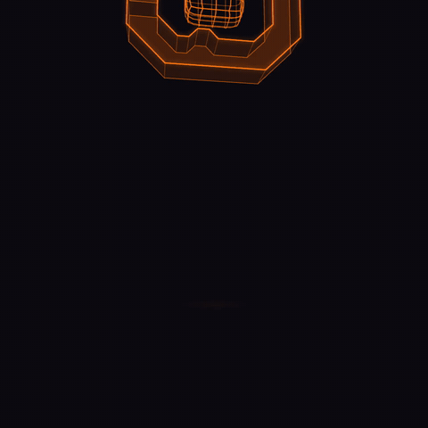

<p align="center">
  
</p>

# OpenClaw Machines

**Run as many isolated OpenClaw agents as you need, on hardware you own.**

[](LICENSE)
[](https://github.com/mathaix/OpenClawMachines/actions)
[](https://github.com/mathaix/OpenClawMachines)

OpenClaw Machines is an **open-source platform for running AI agents in secure,
sandboxed [Firecracker](https://github.com/firecracker-microvm/firecracker)
microVMs**. Each [OpenClaw](https://github.com/openclaw/openclaw) agent runs in
its own KVM-backed microVM, so you can execute agent-generated and untrusted code
on infrastructure you control.

The Apache-2.0 public core includes a minimal control plane, host enrollment,
machine lifecycle, placement, worker agents, and runtime pieces needed to run
Firecracker sandboxes locally or in a self-hosted/operator-hosted deployment.
The `ocm` CLI lives in the separate
[`mathaix/ocm-cli`](https://github.com/mathaix/ocm-cli) Apache-2.0 repository.


## Why OpenClaw Machines

- **Real isolation, not containers.** One Firecracker microVM per agent, with a
  separate guest kernel and KVM hardware boundary.
- **Bring your own hosts.** Run the control plane and workers on your own
  KVM-enabled Linux machines.
- **Local or operator-hosted.** Start with one local host, then operate the same
  public core in a self-managed deployment.
- **Apache-2.0.** The public core and companion `ocm` CLI are permissively
  licensed for adoption, embedding, and contribution.
- **Built for agents.** Terminal, web chat, browser automation, per-VM routing,
  and OpenClaw runtime integration.
- **One flat server cost.** Rent a single bare-metal box and run as many
  hardware-isolated agents as it fits — see
  [how the options compare](docs/comparison.md).

## How it works

OpenClaw Machines turns your own Linux servers into a pool of secure, on-demand
sandboxes. Each sandbox is a real Firecracker microVM (its own kernel,
hardware-isolated via KVM) that runs one AI agent. The platform is the **control
plane** that creates those VMs, keeps track of them, routes traffic to them, and
tears them down — so you can run many untrusted agents safely on infrastructure
you own. Think: a mini-cloud for AI agents, that you self-host.

1. **Control plane (Go backend) — the brain.** Accounts, machines, hosts, and
   config; the API the UI/CLI call; placement and lifecycle orchestration.
2. **Hosts + worker agents — your Linux boxes.** Enroll a host with an install
   script; its worker agent boots and stops Firecracker microVMs when told to.
3. **Machines — one isolated microVM per agent.** Inside: the OpenClaw agent, a
   web chat gateway, and a live terminal.
4. **Browser VMs** — separate microVMs running headful Chromium with a live
   view, driven by the agent over CDP for browser automation.
5. **Routing / data plane** — every running VM gets its own subdomain and a
   Cloudflare Tunnel that terminates **inside the VM**, with auth enforced at
   the edge and again in-VM.

The full design — data plane, routing, tunnels, lifecycle, config, and the
build/release flow — is in **[docs/architecture.md](docs/architecture.md)**, and
the five-layer stack (React UI → Cloudflare edge → Go control plane → host
agents → Firecracker sandboxes) is in **[docs/tech-stack.md](docs/tech-stack.md)**.

## Requirements

OpenClaw Machines runs Firecracker microVMs, which require KVM. You need a
KVM-enabled Linux host: bare metal, or a cloud VM with nested virtualization
enabled. It does not run on macOS, Windows/WSL, or a standard cloud VM without
nested virtualization.

Check your host:

```bash
make preflight
```

## Getting started

**[The Getting Started guide](docs/getting-started.md)** is three stages, each
ending with something working:

1. **Local evaluation** — the full stack + a real Firecracker machine on one KVM
   box. No Cloudflare, no cloud account.
2. **Cloudflare + a dedicated host** — the production-shaped deployment:
   domain, tunnels, edge auth, and an enrolled cloud or bare-metal host.
3. **The full workflow** — create and use machines (chat, terminal, browser
   VMs), lifecycle, backups, runtime upgrades.

## Project docs

- [**Getting Started**](docs/getting-started.md) — the three-stage guide above
- [Architecture](docs/architecture.md) — data plane, routing, tunnels, lifecycle
- [Tech stack](docs/tech-stack.md) — the five layers, client to sandbox
- [Comparison](docs/comparison.md) — local vs VPS vs managed vs OpenClaw Machines
- [Local and BYO-host setup](docs/local-setup.md)
- [Control plane deployment profiles](docs/control-plane-profiles.md)
- [Self-hosted control plane prerequisites](docs/self-hosted-control-plane.md)
- [LLM operator runbook](llms/self-hosted-setup.txt)
- [Public docs inventory](docs/public-docs-inventory.md)
- [Contributing](CONTRIBUTING.md) · [Security policy](SECURITY.md) · [Code of conduct](CODE_OF_CONDUCT.md)
- [`ocm` CLI project](https://github.com/mathaix/ocm-cli)

## Community & support

- **[GitHub Discussions](https://github.com/mathaix/OpenClawMachines/discussions)** — questions, ideas, show & tell
- **[Issues](https://github.com/mathaix/OpenClawMachines/issues)** — bugs and feature requests
- **[Roadmap](https://github.com/mathaix/OpenClawMachines/issues/25)** — the open-source readiness tracker: what's done, what's next
- Found a vulnerability? See the [security policy](SECURITY.md).

## Contributing

See [CONTRIBUTING.md](CONTRIBUTING.md) and the
[code of conduct](CODE_OF_CONDUCT.md).

## License

[Apache-2.0](LICENSE)
