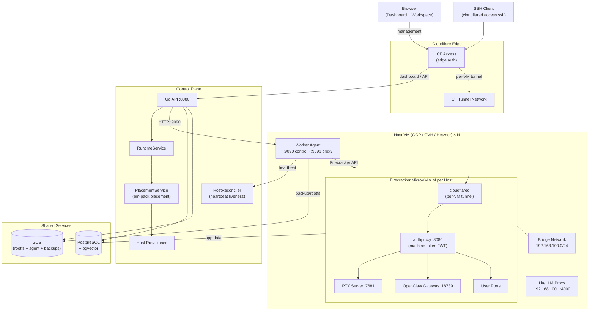
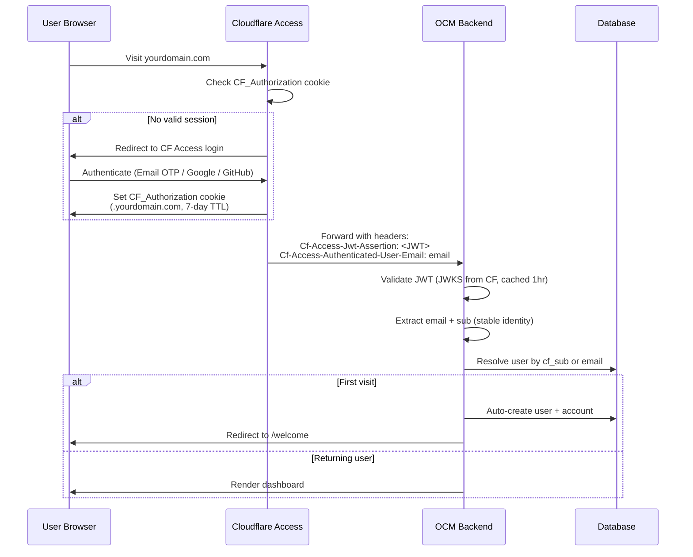
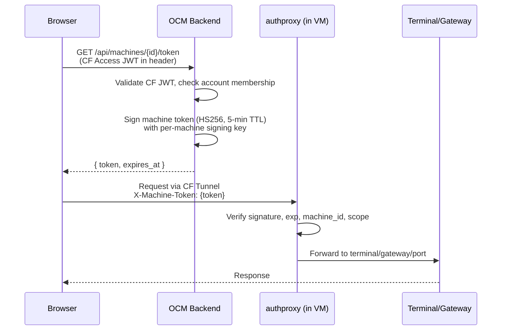
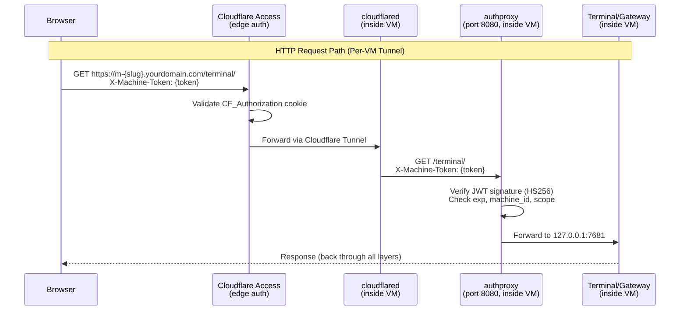
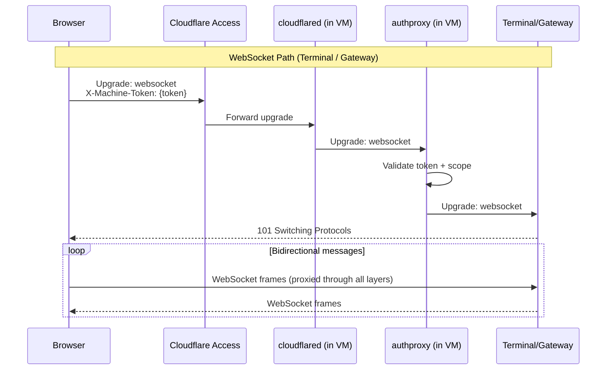
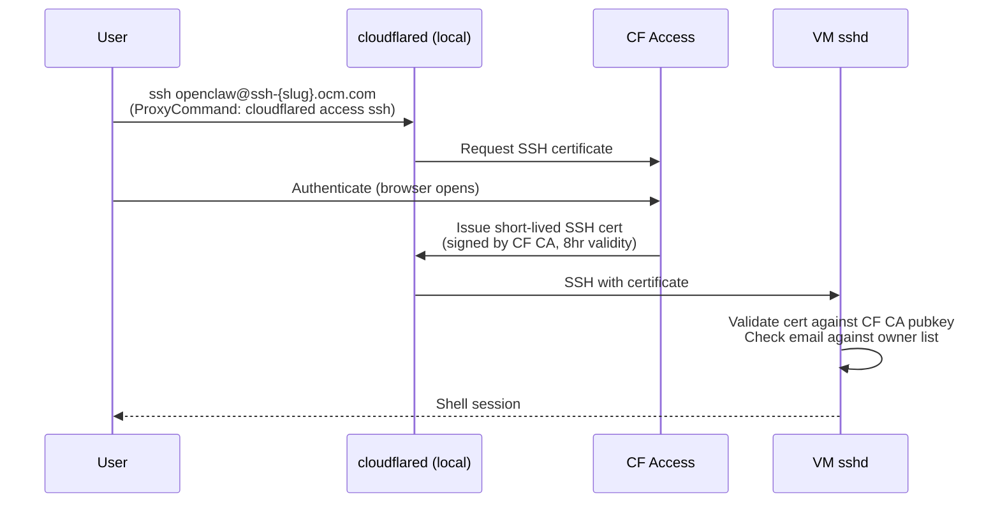
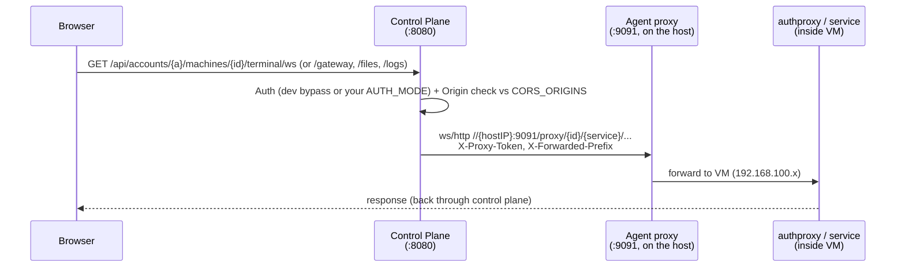
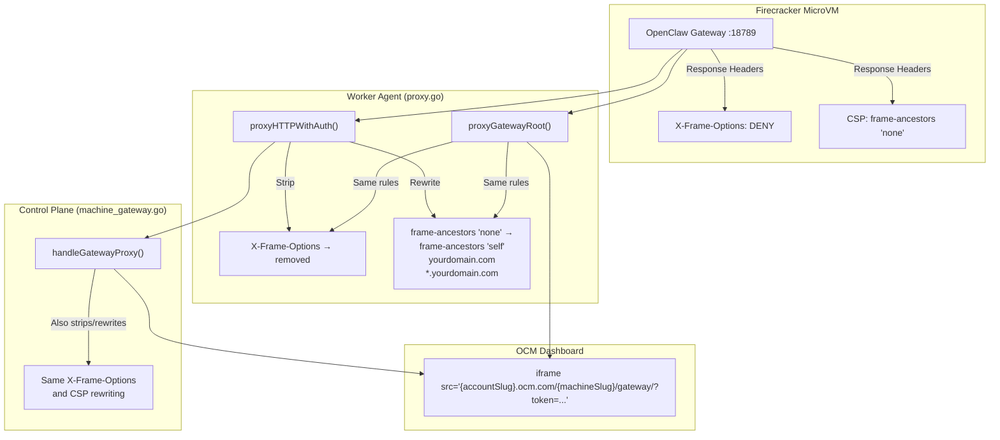

# Architecture

## System Overview

Split-plane architecture. A stateless **Control Plane** API manages users, machines, and placement. **Worker Agents** on Host VMs run Firecracker MicroVMs — one per OpenClaw Machine. Multiple users' Machines share Host VMs via capacity-based bin-packing placement.

### Related Documentation

- [config-lifecycle.md](config-lifecycle.md) — Config assembly, seed write, and runtime updates (two assembly paths)
- [routing.md](routing.md) — Data-plane request path (Worker, KV, Agent proxy)
- [tunnel-architecture.md](tunnel-architecture.md) — Per-VM tunnel lifecycle and auth proxy
- [terminal_connectivity.md](terminal_connectivity.md) — WebSocket terminal connections
- [unified-auth-rearchitecture.md](unified-auth-rearchitecture.md) — Authentication architecture
- [host-enrollment.md](host-enrollment.md) — Non-GCP host enrollment guide (OVH, Hetzner, bare metal)
- [lifecycle_architecture.md](lifecycle_architecture.md) — Machine/host lifecycle design rationale
- [designs/longjob_worker.md](designs/longjob_worker.md) — Worker fleet design (spot instances, DBOS, preemption)

```
┌──────────────────────────────────────────────────────────────────────────────┐
│                              User Layer                                      │
│   Browser (Dashboard + Workspace)              SSH (cloudflared access ssh)  │
└─────────────────────┬──────────────────────────────────┬─────────────────────┘
                      │                                  │
┌─────────────────────▼──────────────────────────────────▼─────────────────────┐
│                         Cloudflare Edge                                       │
│   CF Access (edge auth)                    CF Tunnel Network                 │
└──────┬──────────────────────────────────────────┬────────────────────────────┘
       │ dashboard / API                          │ per-VM tunnel
┌──────▼──────────────────────────────────────────│────────────────────────────┐
│                   Control Plane                 │                            │
│                                                 │                            │
│   Go API :8080 ──► RuntimeService               │                            │
│                       │                         │                            │
│                  PlacementService                │                            │
│                  (bin-pack placement)            │                            │
│                       │                         │                            │
│              HostReconciler ◄── heartbeat ──┐   │                            │
│                       │                     │   │                            │
│              Host Provisioner               │   │                            │
│                                             │   │                            │
│   ┌── PostgreSQL ──┐  ┌── GCS ──────┐   │   │                            │
│   │   + pgvector       │  │ rootfs      │   │   │                            │
│   └────────────────────┘  │ agent       │   │   │                            │
│                           │ backups     │   │   │                            │
│                           └─────────────┘   │   │                            │
└─────────────────────┬───────────────────────│───│────────────────────────────┘
                      │ HTTP :9090            │   │
┌─────────────────────▼───────────────────────│───│────────────────────────────┐
│              Host VM (GCP / OVH / Hetzner) × N  │                            │
│                                                 │                            │
│   Worker Agent ─────────────────────────────┘   │                            │
│   :9090 control · :9091 proxy                   │                            │
│                                                 │                            │
│   LiteLLM Proxy (192.168.100.1:4000)            │                            │
│   CDP Proxy     (192.168.100.1:9222)            │                            │
│                                                 │                            │
│   Bridge Network 192.168.100.0/24               │                            │
│   ┌─────────────────────────────────────────────│───────────────────────────┐│
│   │          Firecracker MicroVM × M per Host   │                          ││
│   │                                             │                          ││
│   │   cloudflared ◄─────────────────────────────┘                          ││
│   │       │                                                                ││
│   │   authproxy :8080 (machine token JWT)                                  ││
│   │       ├──► PTY Server :7681 (terminal)                                 ││
│   │       ├──► OpenClaw Gateway :18789                                     ││
│   │       └──► User Ports                                                  ││
│   │                                                                        ││
│   │   [Paired] Browser VM (headful Chromium CDP :9222)                     ││
│   └────────────────────────────────────────────────────────────────────────┘│
└─────────────────────────────────────────────────────────────────────────────┘
```

<details>
<summary>Mermaid version (click to expand)</summary>



</details>

## Key Design Decisions

| Decision | Rationale |
|----------|-----------|
| **Firecracker MicroVMs** | ~125ms boot, ~5MB overhead, KVM isolation. No K8s. Proven in production |
| **Split-plane (Control + Workers)** | Stateless Control Plane on the control-plane host. Worker Agents on dedicated hosts. Clean separation |
| **Capacity-based scheduling** | Machines are placed on Hosts with free vCPU + memory. Multi-tenant — different users' Machines share Hosts |
| **Host auto-scaling** | Provisioner creates new Hosts when all are full, drains idle Hosts to save cost |
| **Cloud-agnostic workers** | Hosts run on any Linux box with KVM — GCP, OVH, Hetzner, bare metal. Token-based enrollment for non-GCP hosts |
| **Cloudflare Access + Per-VM Tunnels** | CF Access for auth at edge, per-VM tunnels for direct access. No LBs, certs, or proxy chains to manage |
| **Managed Postgres (PostgreSQL)** | pgvector + tsvector, serverless, branching |
| **LiteLLM per Host** | AI proxy runs on bridge IP (192.168.100.1:4000), accessible to all MicroVMs on that Host. BYOK |

## Data Model

### Core Entities

| Entity | Description |
|--------|-------------|
| **User** | Cloudflare Access auth (Email OTP, Google, GitHub) |
| **Account** | Organization/workspace. Users belong to Accounts via membership |
| **Machine** | One OpenClaw instance. An Account owns 1–N Machines |
| **Host** | Shared across users. Multiple Machines per Host. Capacity-tracked |
| **LLM usage** | Tracked per Machine |

### Account Model

Users belong to one or more Accounts via the `account_members` table:
- User creates an Account → becomes `owner`
- Owner invites members → they become `member` or `admin`
- Machines belong to Accounts, not directly to Users
- API routes use `/accounts/{accountId}/machines/*` pattern

### Database Schema

Derived from migrations `001_initial.sql` through `032_machine_backups.sql`. OpenClaw manages its own state inside the MicroVM (config, channels, memory, sessions) — the platform database only tracks multi-tenant concerns.

```sql
-- ============================================================
-- Users
-- ============================================================
CREATE TABLE users (
    id              SERIAL PRIMARY KEY,
    email           TEXT NOT NULL UNIQUE,
    name            TEXT NOT NULL,
    avatar_url      TEXT,
    auth_provider   TEXT NOT NULL,          -- 'google' | 'github' (legacy, kept for migration)
    auth_provider_id TEXT,                  -- nullable (not used for CF Access users)
    cf_sub          TEXT UNIQUE,            -- Cloudflare Access stable identity (migration 014)
    status          TEXT NOT NULL DEFAULT 'active',
    created_at      TIMESTAMPTZ NOT NULL DEFAULT now()
);

-- ============================================================
-- Accounts (organization/workspace — owns machines)
-- ============================================================
CREATE TABLE accounts (
    id              SERIAL PRIMARY KEY,
    name            TEXT NOT NULL,
    slug            TEXT NOT NULL UNIQUE,   -- URL namespace
    created_by      INT NOT NULL REFERENCES users(id),
    created_at      TIMESTAMPTZ NOT NULL DEFAULT now()
);

-- ============================================================
-- Account Members (users <-> accounts, many-to-many)
-- ============================================================
CREATE TABLE account_members (
    account_id      INT NOT NULL REFERENCES accounts(id) ON DELETE CASCADE,
    user_id         INT NOT NULL REFERENCES users(id) ON DELETE CASCADE,
    role            TEXT NOT NULL DEFAULT 'member',  -- 'owner' | 'admin' | 'member'
    created_at      TIMESTAMPTZ NOT NULL DEFAULT now(),
    PRIMARY KEY (account_id, user_id)
);

-- ============================================================
-- Hosts (Worker Agent VMs — shared across accounts)
-- ============================================================
CREATE TABLE hosts (
    id              SERIAL PRIMARY KEY,
    vm_name         TEXT NOT NULL,
    vm_id           TEXT,
    zone            TEXT NOT NULL,
    region          TEXT NOT NULL,
    machine_type    TEXT NOT NULL,

    external_ip     TEXT,
    internal_ip     TEXT,
    tunnel_url      TEXT,
    source_image    TEXT,                   -- GCP image used (migration 005)
    status_message  TEXT,                   -- (migration 012)

    status          TEXT NOT NULL DEFAULT 'provisioning',
        -- 'provisioning' | 'ready' | 'draining' | 'stopped' | 'unreachable' | 'error'

    -- Capacity tracking
    capacity_vcpus      INT NOT NULL,
    capacity_memory_mb  INT NOT NULL,
    used_vcpus          INT NOT NULL DEFAULT 0,
    used_memory_mb      INT NOT NULL DEFAULT 0,
    machine_count       INT NOT NULL DEFAULT 0,

    -- Version tracking (migration 013)
    agent_version       TEXT,
    rootfs_snapshot     TEXT,

    -- Provider fields (migration 030) — multi-provider host support
    provider            TEXT NOT NULL DEFAULT 'gcp',         -- 'gcp' | 'ovhcloud' | 'hetzner' | 'customer_owned'
    provider_class      TEXT NOT NULL DEFAULT 'managed',     -- 'managed' | 'registered'
    lifecycle_mode      TEXT NOT NULL DEFAULT 'provisioned', -- 'provisioned' (GCP) | 'registered' (enrolled)
    agent_endpoint      TEXT,                                -- how control plane reaches agent
    agent_endpoint_type TEXT NOT NULL DEFAULT 'public_http', -- 'public_http' | 'tunnel'
    provider_host_id    TEXT,                                -- provider-specific instance ID
    provider_metadata   JSONB NOT NULL DEFAULT '{}'::jsonb,
    capabilities        JSONB NOT NULL DEFAULT '{}'::jsonb,
    labels              JSONB NOT NULL DEFAULT '{}'::jsonb,
    agent_token         TEXT,                                -- per-host auth token (enrolled hosts)

    created_at      TIMESTAMPTZ NOT NULL DEFAULT now()
);

-- ============================================================
-- Machines (one OpenClaw instance per Machine)
-- ============================================================
CREATE TABLE machines (
    id              UUID PRIMARY KEY DEFAULT gen_random_uuid(),
    account_id      INT NOT NULL REFERENCES accounts(id),
    name            TEXT NOT NULL,
    slug            TEXT NOT NULL,          -- unique per account (migration 006)
    status          TEXT NOT NULL DEFAULT 'stopped',
        -- 'provisioning' | 'running' | 'stopped' | 'error'
    status_message  TEXT,

    -- Sizing
    vcpus           INT NOT NULL DEFAULT 2,
    memory_mb       INT NOT NULL DEFAULT 2048,
    data_volume_gb  INT NOT NULL DEFAULT 5, -- (migration 010)

    -- Placement (set by PlacementService)
    host_id         INT REFERENCES hosts(id),
    vm_ip           TEXT,

    -- Networking
    tunnel_hostname TEXT,
    tunnel_id       TEXT,                   -- per-VM CF Tunnel ID (migration 015)
    custom_domain   TEXT,

    -- Auth tokens
    gateway_token   TEXT,                   -- OpenClaw gateway auth
    proxy_token     TEXT,                   -- Worker→Agent path (migration 004)
    signing_key     TEXT,                   -- machine token signing (migration 015)

    -- Provisioning tracking
    provision_step          TEXT,
    provisioning_started_at TIMESTAMPTZ,
    provisioning_completed_at TIMESTAMPTZ,

    -- Version tracking (migration 011)
    rootfs_snapshot     TEXT,
    openclaw_version    TEXT,
    last_started_at     TIMESTAMPTZ,

    -- Operation tracking (migration 026) — CAS-style transition ownership
    current_operation_id UUID,

    -- Backup support (migration 032)
    backups_enabled     BOOLEAN NOT NULL DEFAULT false,
    backup_key          BYTEA,               -- encrypted with platform master key

    created_at      TIMESTAMPTZ NOT NULL DEFAULT now(),
    started_at      TIMESTAMPTZ,
    stopped_at      TIMESTAMPTZ,

    CONSTRAINT machines_account_slug_unique UNIQUE (account_id, slug)
);

-- ============================================================
-- Machine Operations (lifecycle operation tracking — migration 026)
-- Prevents concurrent start/stop/delete on the same machine.
-- ============================================================
CREATE TABLE machine_operations (
    id              UUID PRIMARY KEY DEFAULT gen_random_uuid(),
    machine_id      UUID NOT NULL REFERENCES machines(id) ON DELETE CASCADE,
    kind            TEXT NOT NULL,            -- 'start' | 'stop' | 'delete' | 'migrate'
    state           TEXT NOT NULL,            -- 'pending' | 'in_progress' | 'completed' | 'failed'
    idempotency_key TEXT,
    error_code      TEXT,
    error_message   TEXT,
    created_at      TIMESTAMPTZ NOT NULL DEFAULT now(),
    completed_at    TIMESTAMPTZ
);
-- Only one active (non-completed) operation per machine at a time
CREATE UNIQUE INDEX idx_machine_operations_active_unique
ON machine_operations(machine_id) WHERE state IN ('pending', 'in_progress');

-- ============================================================
-- Machine Placements (placement state machine — migration 027)
-- Tracks reserved→active→released lifecycle of host assignments.
-- ============================================================
CREATE TABLE machine_placements (
    id              UUID PRIMARY KEY DEFAULT gen_random_uuid(),
    machine_id      UUID NOT NULL REFERENCES machines(id) ON DELETE CASCADE,
    host_id         INT NOT NULL REFERENCES hosts(id),
    vm_ip           TEXT,
    state           TEXT NOT NULL DEFAULT 'reserved', -- 'reserved' | 'active' | 'released'
    reserved_at     TIMESTAMPTZ NOT NULL DEFAULT now(),
    activated_at    TIMESTAMPTZ,
    released_at     TIMESTAMPTZ,
    created_by_operation_id UUID REFERENCES machine_operations(id)
);

-- ============================================================
-- Machine Backups (migration 032)
-- ============================================================
CREATE TABLE machine_backups (
    id              SERIAL PRIMARY KEY,
    machine_id      UUID NOT NULL REFERENCES machines(id) ON DELETE CASCADE,
    timestamp       TIMESTAMPTZ NOT NULL,
    gcs_path        TEXT NOT NULL,
    size_bytes      BIGINT NOT NULL,
    compressed_bytes BIGINT NOT NULL,
    checksum_sha256 TEXT NOT NULL,
    hmac_sha256     TEXT NOT NULL,
    nonce           BYTEA NOT NULL,
    trigger         TEXT NOT NULL,            -- 'manual' | 'migration'
    host_id         INT REFERENCES hosts(id),
    created_at      TIMESTAMPTZ NOT NULL DEFAULT NOW()
);

-- ============================================================
-- Enrollment Tokens (migration 031) — token-based host registration
-- ============================================================
CREATE TABLE enrollment_tokens (
    id              SERIAL PRIMARY KEY,
    token           TEXT NOT NULL UNIQUE,
    provider        TEXT NOT NULL,
    provider_class  TEXT NOT NULL DEFAULT 'registered',
    labels          JSONB NOT NULL DEFAULT '{}'::jsonb,
    used            BOOLEAN NOT NULL DEFAULT false,
    used_by_host_id INT REFERENCES hosts(id),
    expires_at      TIMESTAMPTZ NOT NULL,
    created_at      TIMESTAMPTZ NOT NULL DEFAULT now()
);

-- ============================================================
-- Secrets (encrypted key-value per Machine)
-- ============================================================
CREATE TABLE secrets (
    id              SERIAL PRIMARY KEY,
    machine_id      UUID NOT NULL REFERENCES machines(id) ON DELETE CASCADE,
    key             TEXT NOT NULL,
    encrypted_value TEXT NOT NULL,
    created_at      TIMESTAMPTZ NOT NULL DEFAULT now(),
    updated_at      TIMESTAMPTZ NOT NULL DEFAULT now(),
    UNIQUE(machine_id, key)
);

-- ============================================================
-- Account Credentials (encrypted API keys / tokens per Account)
-- Supports three credential types aligned with OpenClaw's auth model:
--   'api_key'  — static subscription keys (Anthropic, OpenAI, Google)
--   'token'    — bot tokens / PATs with optional expiry (Telegram, Discord)
--   'oauth'    — OAuth2 with refresh (WhatsApp, Google OAuth, Slack)
-- ============================================================
CREATE TABLE account_credentials (
    id              SERIAL PRIMARY KEY,
    account_id      INT NOT NULL REFERENCES accounts(id) ON DELETE CASCADE,
    provider        TEXT NOT NULL,          -- 'anthropic' | 'openai' | 'google' | 'discord' | 'telegram' | 'whatsapp' | custom
    name            TEXT,                   -- display name (migration 009)
    encrypted_value TEXT NOT NULL,          -- AES-256-GCM ciphertext (api_key/token: the key; oauth: access_token)
    encrypted_refresh_token TEXT,           -- AES-256-GCM ciphertext (oauth only: refresh_token)
    last_four       TEXT,
    credential_type TEXT DEFAULT 'api_key', -- 'api_key' | 'token' | 'oauth'
    expires_at      TIMESTAMPTZ,           -- token/oauth expiry (null = no expiry)
    last_validated  TIMESTAMPTZ,
    created_at      TIMESTAMPTZ NOT NULL DEFAULT now(),
    updated_at      TIMESTAMPTZ NOT NULL DEFAULT now()
);

-- ============================================================
-- Custom Providers (user-defined OpenAI-compatible providers)
-- Enables extensibility without code changes for standard API protocols.
-- ============================================================
CREATE TABLE custom_providers (
    id              SERIAL PRIMARY KEY,
    account_id      INT NOT NULL REFERENCES accounts(id) ON DELETE CASCADE,
    name            TEXT NOT NULL,          -- provider key (e.g. 'groq', 'together')
    display_name    TEXT NOT NULL,          -- human-readable name
    base_url        TEXT NOT NULL,          -- upstream API base URL
    api_protocol    TEXT NOT NULL DEFAULT 'openai-completions', -- API protocol type
    auth_method     TEXT NOT NULL DEFAULT 'bearer_header',      -- how to inject credentials
    credential_type TEXT NOT NULL DEFAULT 'api_key',            -- expected credential type
    allowed_hosts   TEXT[] NOT NULL,        -- proxy egress allowlist
    headers         JSONB,                  -- extra headers to inject
    created_at      TIMESTAMPTZ NOT NULL DEFAULT now(),
    UNIQUE(account_id, name)
);

-- ============================================================
-- LLM Usage (token/cost accounting — tracked by LiteLLM proxy)
-- ============================================================
CREATE TABLE llm_usage (
    id              BIGSERIAL PRIMARY KEY,
    account_id      INT NOT NULL REFERENCES accounts(id),
    machine_id      UUID NOT NULL REFERENCES machines(id),
    provider        TEXT NOT NULL,
    model           TEXT NOT NULL,
    input_tokens    INT NOT NULL DEFAULT 0,
    output_tokens   INT NOT NULL DEFAULT 0,
    cost_microcents BIGINT NOT NULL DEFAULT 0,
    request_id      TEXT,
    created_at      TIMESTAMPTZ NOT NULL DEFAULT now()
);

-- ============================================================
-- Account Events (account lifecycle audit log)
-- ============================================================
CREATE TABLE account_events (
    id              BIGSERIAL PRIMARY KEY,
    event_id        UUID NOT NULL DEFAULT gen_random_uuid(),
    event_type      TEXT NOT NULL,
    account_id      INT NOT NULL REFERENCES accounts(id),
    actor_user_id   INT REFERENCES users(id),
    target_user_id  INT REFERENCES users(id),
    metadata        JSONB,
    created_at      TIMESTAMPTZ NOT NULL DEFAULT now()
);

-- ============================================================
-- Machine Events (machine lifecycle audit log)
-- ============================================================
CREATE TABLE machine_events (
    id              BIGSERIAL PRIMARY KEY,
    event_id        UUID NOT NULL DEFAULT gen_random_uuid(),
    event_type      TEXT NOT NULL,
    event_source    TEXT NOT NULL,

    machine_id      UUID NOT NULL REFERENCES machines(id),
    host_id         INT,
    user_id         INT,

    duration_ms     INT,
    error_code      TEXT,
    error_message   TEXT,
    metadata        JSONB,

    created_at      TIMESTAMPTZ NOT NULL DEFAULT now()
);
```

**Tables removed from original design:**
- `channels` — OpenClaw manages channel config in its own JSON5 inside the MicroVM
- `memory` — OpenClaw runs its own SQLite + embeddings; dimensions are provider-dependent, not fixed at 1536

**Store interface design:** The monolithic `Store` interface is split into narrow domain repos (`MachineRepo`, `HostRepo`, `PlacementRepo`, `OperationRepo`, `EnrollmentRepo`, `BackupRepo`, etc.). Services depend on the narrowest interface they need (e.g., `RuntimeStore` composes `MachineRepo + HostRepo + PlacementRepo + ...`). The aggregate `Store` interface still exists for code that needs the full store.

## Scheduling & Capacity Management

### Architecture

Scheduling was refactored from a monolithic scheduler into domain-specific services:

| Package | Responsibility |
|---------|---------------|
| `internal/fleet/` | **PlacementService** — machine-to-host placement with placement records (reserved→active→released) |
| `internal/machines/` | **RuntimeService** — machine start/stop/delete lifecycle, orchestrates placement + agent + tunnel + KV |
| `internal/reconciler/` | **HostReconciler** — heartbeat-based liveness, marks unreachable hosts, cleans up orphaned machines |
| `internal/store/` | Domain repos (MachineRepo, HostRepo, PlacementRepo, OperationRepo, etc.) — narrow interfaces instead of one monolithic Store |

### Machine Operations

Every lifecycle action (start, stop, delete, migrate) creates a `machine_operations` record. A unique index on `(machine_id) WHERE state IN ('pending','in_progress')` prevents concurrent operations on the same machine. This replaces ad-hoc race prevention in individual handlers.

### Machine Placement

When a user starts a Machine, the **RuntimeService** coordinates placement:

```
1. User clicks "Start Machine"
2. RuntimeService creates a "start" operation (machine_operations)
3. PlacementService.Reserve() finds a Host:
   a. Check affinity: if machine has home_host_id, try that host first
   b. Otherwise: SELECT host with capacity, bin-pack (fill fullest first)
      WHERE status = 'ready'
        AND (capacity_vcpus - used_vcpus) >= machine.vcpus
        AND (capacity_memory_mb - used_memory_mb) >= machine.memory_mb
      ORDER BY used_memory_mb DESC
      FOR UPDATE SKIP LOCKED
   c. Or: targeted placement (TargetHostID) for admin migration
4. Atomic placement:
   - Allocate capacity on host
   - Assign machine to host (host_id, vm_ip)
   - Create placement record (state='reserved')
5. RuntimeService calls Agent: POST /vms {machine_id, config, sizing}
6. On success: activate placement record (state='active')
7. On failure: release placement, free capacity
```

### Capacity Release

When a Machine stops:

```
1. User clicks "Stop Machine" (or Machine crashes)
2. RuntimeService creates a "stop" operation
3. Agent stops Firecracker VM, cleans up TAP + rootfs copy
4. PlacementService.Release() frees capacity:
   - host: used_vcpus -= N, used_memory_mb -= N
   - machine: host_id retained (home_host_id for affinity), vm_ip cleared
   - placement record: state → 'released'
5. machines.status = 'stopped'
6. Route + tunnel cleanup
```

### Bin-Packing Strategy

Hosts are filled densely to minimize cost:
- **Pack first**: Place on the fullest Host that has capacity (reduces active Host count)
- **Region-aware**: Prefer Hosts in the user's preferred region
- **Headroom**: Keep 1–2 Hosts with spare capacity per region for fast placement (no cold-start wait)
- **Drain idle**: Hosts at 0 Machines for >15 min are stopped

### Capacity Policies (migration 028)

Configurable capacity limits per host pool. Allows different sizing for different provider classes (e.g., OVH dedicated servers have different capacity than GCP n2-standard-16).

### Capacity Example

A `n2-standard-16` Host (16 vCPUs, 64GB RAM) can fit:
- 8 × Small Machines (2 vCPU, 2GB) = 16 vCPUs, 16GB used
- 4 × Medium Machines (4 vCPU, 4GB) = 16 vCPUs, 16GB used
- 2 × Large Machines (8 vCPU, 8GB) = 16 vCPUs, 16GB used
- Or a mix of sizes

## Component Breakdown

### Dashboard
- React + TypeScript + Vite app at `app.yourdomain.com`
- Tailwind CSS + Radix UI components
- Pages: Machine list, Machine detail (logs + config + channels), Settings, Onboarding
- Real-time log streaming via WebSocket
- Config editor (Monaco), channel setup wizard

### Control Plane (port 8080)

Stateless Go API server. Manages users, machines, and orchestrates Host Agents.

- **Auth** — Cloudflare Access (edge auth). Per-VM machine tokens (HS256 JWT). Agent tokens for host comms. Enrollment tokens for host registration
- **RuntimeService** (`internal/machines/`) — Machine start/stop/delete lifecycle with operation locking
- **PlacementService** (`internal/fleet/`) — Machine-to-host placement with affinity, bin-packing, and placement records
- **HostReconciler** (`internal/reconciler/`) — Heartbeat-based host liveness detection, marks unreachable hosts, cleans up orphaned machines
- **Config Manager** — Generates OpenClaw `config.json5`, injects secrets
- **Host Provisioner** — Spins up/down Host VMs on GCP Compute Engine
- **Host Enrollment** — Token-based registration for non-GCP hosts (OVH, Hetzner, customer-owned)

### Worker Agents (Host VMs — port 9090/9091)

Go process running on each Host VM. Manages Firecracker MicroVMs for all Machines placed on that Host. Multi-tenant — different users' Machines coexist.

**Control API (port 9090 — firewalled, Control Plane only):**

| Endpoint | Purpose |
|----------|---------|
| `POST /vms` | Create MicroVM for a Machine |
| `GET /vms` | List all MicroVMs on this Host |
| `GET /vms/{machine_id}` | Get Machine status + IP |
| `POST /vms/{machine_id}/stop` | Stop MicroVM (preserves data volume) |
| `DELETE /vms/{machine_id}` | Destroy MicroVM + delete data volume |
| `POST /vms/{machine_id}/backup` | Backup data volume → GCS (encrypted) |
| `POST /vms/{machine_id}/restore` | Restore data volume from GCS backup |
| `GET /vms/{machine_id}/backup-download/{id}` | Stream decrypted backup as tar.gz |
| `GET /health` | Health check + capacity info |
| `GET /info` | Detailed: region, capacity, used, machine list |
| `POST /heartbeat` | Agent heartbeat (returns config including backup master key) |

**Proxy API (port 9091 — tunneled via Cloudflare, user-facing):**

| Endpoint | Purpose |
|----------|---------|
| `/health` | Agent health check |
| `/progress?machine_id=X` | SSE stream of provisioning progress |
| `/logs?machine_id=X` | SSE stream of VM logs |
| `/proxy/{machineID}/health` | Per-machine health (gateway + browser ports) |
| `/proxy/{machineID}/logs` | Per-machine log streaming |
| `/proxy/{machineID}/gateway/*` | Proxy to OpenClaw gateway API (port 18789) |
| `/proxy/{machineID}/terminal/*` | ttyd terminal proxy (port 7681) |

All `/proxy/*` routes require per-machine proxy token via `?token=` query param or `X-Proxy-Token` header.

**Responsibilities:**
- Firecracker VM lifecycle (create, monitor, restart, destroy)
- Network bridge setup (tap devices per VM, NAT for outbound, 192.168.100.0/24)
- Rootfs management (reflink/CoW copies from template, rootfs locking for concurrent safety)
- Persistent volume management (ext4 data volumes, survive VM restarts)
- Browser VM management (independent, account-scoped Chromium VMs paired 1:1 with a machine at runtime for CDP access)
- Cloudflare Tunnel registration and routing
- CDP proxy on bridge IP (port 9222) for transparent Chrome DevTools Protocol routing
- API proxy on bridge IP (192.168.100.1:4000) for LLM + channel + custom providers
- Resource monitoring (CPU, memory, disk per VM)
- Security: block GCP metadata access, block VM-to-VM lateral movement

### Firecracker MicroVMs

Each Machine runs in its own Firecracker MicroVM, optionally paired at runtime with an independent browser VM (see next section):

| Property | Detail |
|----------|--------|
| **Boot time** | ~125ms |
| **Memory overhead** | ~5MB per VM |
| **Isolation** | KVM hardware virtualization |
| **Rootfs** | Pre-built ext4 image with Node.js + OpenClaw + cloudflared + authproxy + ffmpeg |
| **Networking** | Tap device per VM, bridge to host, NAT outbound |
| **Persistent storage** | Separate ext4 data volume, survives restarts |
| **Sizing** | 1–8 vCPUs, 2048MB–8GB memory (configured per Machine) |
| **Runtime owner** | `systemd-unit` by default (each VM is an `ocm-vm-<id>.service` transient unit). See below. |

#### Runtime Owner Abstraction

Firecracker VMs are launched through a pluggable `firecrackerRuntimeOwner` interface with two implementations, selected at agent startup from `VM_RUNTIME_OWNER` (default `"systemd-unit"`):

| Owner | How Firecracker is launched | When used |
|---|---|---|
| `direct` | `exec.Cmd` child of the agent process | Legacy default (pre-2026-04). Still selectable via env var. |
| `systemd-unit` | `StartTransientUnit` over go-systemd dbus; Firecracker runs as a named systemd unit | New default (2026-04-11 onward). |

**Transient unit naming:**
- Machine VMs → `ocm-vm-<machine-id>.service`
- Browser VMs → `ocm-browser-vm-<browser-vm-id>.service`

**Unit properties set at StartTransientUnit:**
- `ExecStart=/usr/local/bin/firecracker --api-sock <sock> --id <vm-id> --no-seccomp`
- `KillMode=process` — stopping the unit kills only the Firecracker process, leaving orphaned sockets for the caller to clean up
- `CollectMode=inactive-or-failed` — systemd garbage-collects crashed units automatically
- `Restart=no` — failed VMs stay failed; the agent decides whether to recreate

**Why systemd-unit:**
- **Debuggability** — each VM has its own `journalctl -u ocm-vm-...` and `systemctl status`
- **Clean shutdown** — `systemctl stop ocm-vm-...` kills a single VM without touching the agent or other VMs
- **Garbage collection** — crashed units auto-clean, no leftover zombie state in the agent's in-memory map
- **Agent self-update no longer destructive** — see the Agent Update Model section below; systemd parents the VMs so they survive the agent's own restart

**Migration semantics:** a VM launched by the `direct` owner (e.g., by an older agent) is inherited by the new agent through `Recover()` as a direct-fork PID reattachment. It continues to run correctly, but it's NOT a systemd unit. To convert such a VM into a systemd-managed one, stop and start it — the restart goes through the current owner, which creates a fresh transient unit.

#### Agent Update Model (manual, 2026-04-11 onward)

Pre-2026-04-11 the agent polled GCS every 5 minutes for a new manifest and auto-updated on detection. That auto-restart killed every running VM on every host — any `make upload-agent` was a fleet-wide VM kill within 5 minutes. No staging, no canary, no operator control.

The current model is **manual per-host**:

1. Engineer runs `make upload-agent` on the rootfs-build host — publishes a new binary + manifest to GCS.
2. Nothing happens on the fleet. Hosts stay on their current version.
3. Admin opens AdminHosts in the UI, sees an amber "Update" badge on hosts whose heartbeat reports an older version than the GCS manifest.
4. Admin clicks "Update" on a host. Control plane routes this to `POST /admin/hosts/{id}/trigger-update` → agent-side `POST /trigger-update` → `Updater.CheckAndUpdate` → download + verify + `systemctl restart ocm-agent`.
5. The agent's own systemd unit has `KillMode=process`, so the restart kills only the agent process — Firecracker children (machine and browser VMs) survive. Under the `systemd-unit` runtime owner they're parented by systemd directly and continue running.
6. The new agent boots, runs its **startup** `CheckAndUpdate` (no-op — already on the target version), and calls `Recover()` to rebuild its in-memory state from systemd units + state files.
7. No background polling. The host stays on the new version until another manual click.

The startup self-update check is preserved so that freshly provisioned hosts pull the latest agent at first boot — operators don't need to click "Update" on a brand-new host, only on already-running ones.

**What's in the code:**

- `backend/internal/selfupdate/updater.go` exports `Updater.CheckAndUpdate` (used by both startup and manual trigger) but no longer has `Updater.Run` — that loop was deleted along with its failure-counter backoff.
- `backend/cmd/agent/main.go` calls `CheckAndUpdate` once at startup (`main.go:83`) and passes the `*Updater` into `agentapi.NewServer` so the manual trigger handler can call it. There is no `go updater.Run(ctx)` anywhere.
- `backend/internal/config/config.go` no longer has `AgentUpdateInterval` / `AGENT_UPDATE_INTERVAL` — those were the only knobs on the polling loop.
- `backend/internal/agentapi/handlers_update.go` contains the `handleTriggerUpdate` path; gated by an `updateInProgress` atomic to prevent concurrent triggers.

**Operator consequences:**
- A bad agent binary no longer takes down the whole fleet at once. The admin updates host 1, validates, then host 2.
- If the admin forgets to click update, hosts drift behind latest. The amber badge in AdminHosts is the signal.
- If a host reboots for external reasons (kernel panic, live migration), its boot-time `CheckAndUpdate` still fires — the host will come back up on the latest GCS version. Acceptably rare in practice.

See `docs/superpowers/specs/2026-04-11-manual-agent-update-design.md` for the full design rationale.

### Browser VMs (CDP + Live View)

As of PR #70 (2026-04-11), browser VMs are **independent account-scoped resources** with their own lifecycle, not companion VMs coupled to a main machine. They pair 1:1 with a machine at runtime to grant network access + CDP routing + live view embedding.

| Property | Detail |
|----------|--------|
| **Rootfs** | Kernel Images `kernel-browser-rootfs` — Ubuntu + headful Chromium + Neko WebRTC + CDP (~898 MiB compressed, ~3.46 GiB uncompressed) |
| **Kernel args** | `init=/sbin/overlay-init`, NAT1TO1 IP for Neko WebRTC, per-VM WebRTC port slot |
| **IP** | Allocated from the host's bridge subnet by the agent, recorded in `browser_vm_placements` |
| **Protocol** | Chrome DevTools Protocol on port 9222 |
| **Live view** | Neko WebRTC on a per-VM UDP port range (DNAT via iptables on the host external IP) |
| **CDP routing** | CDP proxy on bridge IP routes by source VM IP to the currently-paired browser VM |
| **Isolation** | `AllowVMPair()` installs bridge rules permitting only paired machine-to-browser traffic |
| **Pairing** | `machines.browser_vm_id` points at the paired browser VM. Auto-unpairs on host mismatch at machine start. |

#### Lifecycle decoupling

Browser VMs have their own CRUD API (`/api/accounts/{id}/browser-vms`), their own start/stop lifecycle (`POST /browser-vms/{id}/start`, `POST /browser-vms/{id}/stop`), and their own placement table (`browser_vm_placements`). A machine that stops or moves hosts no longer forces its browser VM to stop too — the pairing is just a pointer that gets unpaired and re-paired as needed.

The old "browser capability" toggle on machines is gone. `configassembly` derives the gateway's browser block from the current `machines.browser_vm_id` pointer instead of a capability flag.

#### Why the rewrite

The legacy model (browser-rootfs with Alpine + stealth Chromium + no live view) was tightly coupled to the main machine: creating a machine created its browser VM, stopping one stopped the other, and the browser VM had no independent identity. Kernel Images gives us headful Chromium with Neko WebRTC for live view — users can see the AI agent's browser in a tab — but only if the browser VM is addressable as a first-class resource. The new model lets browser VMs be created ahead of time, re-used across machine restarts, and inspected / debugged independently.

#### Agent API (browser VM specific)

| Endpoint | Purpose |
|---|---|
| `POST /browser-vms` | Create standalone browser VM (agent-side) |
| `DELETE /browser-vms/{id}` | Destroy browser VM. Three states: (a) in `o.browserVMs` → normal stop + cleanup, (b) in `o.quarantinedBrowserVMs` → best-effort cleanup of the quarantined unit / tap / rootfs / socket / DNAT, (c) truly unknown → idempotent `already_gone` success. State (c) was added in `99c13b2` for delete retries; state (b) was added in `f514f88` after a Codex finding showed that collapsing (b) into (c) would orphan quarantined host state with no control-plane handle. |
| `POST /browser-vms/{id}/pair` | Install bridge rules + set CDP target for a paired machine |
| `POST /browser-vms/{id}/unpair` | Remove bridge rules + reset CDP target. Idempotent: returns 200 if the agent has no record of the VM. |
| `GET /browser-vms/{id}/health` | Probe CDP port + Neko live port |

#### Pair/unpair safety contract

The control plane's `handlePairBrowser` and `handleUnpairBrowser` handlers fail loud on any agent-side error so that stale firewall rules or CDP targets can't be stranded on the host with no retry path:

- **Pair** — DB row is written first, then the agent installs bridge rules, then the CDP target is set. Every step can roll back the DB pair: first-host-lookup failure returns 503 and unpairs; firewall failure returns 502 and unpairs; CDP target failure returns 502, removes the firewall rules, and unpairs. A pair-swap (machine already had a different browser VM paired) runs `cleanupBrowserPairing` on the previous VM before overwriting the pointer — a transient DB error while looking up the previous VM returns 503 without wiping the pointer (distinguishes `pgx.ErrNoRows` from transient).
- **Unpair** — the explicit user-triggered path does agent-side cleanup first, then drops the DB pointer. Any agent-side failure (host lookup, firewall removal, CDP reset) returns 503/502 and leaves the DB pair intact so the caller can retry. This differs from the best-effort `cleanupBrowserPairing` helper used by stop/delete flows, which does swallow agent errors because the browser VM is going away regardless.

#### Running list on a host

Browser VMs under the new runtime owner are systemd transient units named `ocm-browser-vm-<browser-vm-id>.service`. List with:

```bash
systemctl list-units --type=service 'ocm-browser-vm-*' --all
```

Or list both machine and browser VMs at once: `systemctl list-units 'ocm-*' --all`.

### AI Gateway (LiteLLM — per Host)

An AI proxy per host:

- Runs on bridge IP `192.168.100.1:4000`, accessible to all MicroVMs on that Host
- Each Machine gets a virtual key (`sk-ocm-xxx`) for proxy-managed keys
- **Auth flow**: MicroVM sends request with virtual key → proxy validates against Control Plane (cached 60s) → swaps for real API key → forwards to provider
- **Usage tracking**: Async worker pool records tokens + cost to Control Plane
- **BYOK mode**: Machine uses its own API keys directly (proxy bypassed)
- **Channel/CDN proxy**: Channel providers (Telegram, Discord, WhatsApp) route through the same proxy with dynamic host resolution — Discord CDN (`cdn.discordapp.com`, `media.discordapp.net`) and WhatsApp media (`lookaside.fbsbx.com`) are resolved from request paths. CDN requests skip auth injection (pre-signed URLs). Telegram file downloads use `/file/bot{KEY}/{path}` rewriting.

### Shared Services

**Managed Postgres (PostgreSQL)**
- pgvector for agent memory (embeddings per Machine)
- Full schema: users, machines, hosts, channels, secrets, llm_usage, events, memory
- Serverless, branches for dev/staging

**Google Cloud Storage (GCS)**
- Rootfs image storage and distribution
- Agent binary distribution with manifest-based self-update
- Encrypted data volume backups (`gs://YOUR-ARTIFACT-BUCKET/backups/`)

**Cloudflare Tunnels (Per-VM)**
- Each MicroVM gets its own isolated tunnel: `ocm-vm-{machine-slug}`
- DNS: `m-{slug}.yourdomain.com` → tunnel → VM authproxy (port 8080)
- Inside VM: cloudflared → authproxy → terminal/gateway/user ports
- Tunnel lifecycle: created on VM start, deleted on VM stop/destroy
- Tunnel reaper: background goroutine cleans orphaned tunnels every 10 minutes
- Auth: CF Access JWT + per-VM machine tokens (HS256, 5-min TTL)

**Cloudflare KV (Route Cache)**

The Control Plane maintains a KV cache for fast route resolution:

- **Route entries** (`route:{accountSlug}:{machineSlug}`) — Contains `machine_id`, `host_hostname`, `proxy_token`. TTL: 1 hour.
- **Account entries** (`account:{accountSlug}`) — Contains `account_id`, `user_ids`. TTL: 24 hours.

Consistency model:
- **Sync writes** for critical paths (machine start/stop) — blocks until confirmed
- **Fire-and-forget** for non-critical updates (account creation) — async with retry
- **Self-healing** — When the Cloudflare Worker calls `/api/internal/resolve`, the backend queries the database and refreshes KV

The database (Postgres) is the source of truth; KV is a performance cache.

### Durable Workflows (DBOS)

Long-running operations (machine migration, invitation emails) use [DBOS](https://docs.dbos.dev/) for crash-safe, resumable execution. DBOS checkpoints each step to Postgres — if a worker crashes mid-workflow, another worker resumes from the last completed step.

**Queues:**

| Queue | Purpose |
|-------|---------|
| `machine-lifecycle` | Migrations, starts, stops |
| `host-maintenance` | Host operations |
| `artifact-install` | Artifact operations |
| `reconcile` | Reconciliation |
| `notifications` | Email workflows |

**Workflow kinds:**

| Kind | Handler | Steps | Typical Duration |
|------|---------|-------|------------------|
| `migration` | `runMigrationWorkflow` | 12 phases (prepare → backup → restore → verify) | 5–20 min |
| `provision` | Machine provisioning | — | — |
| `backup` | Backup creation | — | — |
| `restore` | Backup restore | — | — |
| `install_plugin` | Plugin install | — | — |
| `send_notification` | `runInvitationEmailWorkflow` | 2 steps (render → deliver via Resend) | <5 sec |

Each step has its own retry policy. Migration steps retry 1–5× depending on idempotency safety. Notification delivery retries 5× with exponential backoff (5s base, 3× factor, 5min cap).

**Observability tables** (migration `034_workflow_runs.sql`):

- `workflow_runs` — Status projection (queued → running → completed/failed), current phase, input/output JSON
- `workflow_events` — Audit trail of phase transitions and errors
- `workflow_locks` — Mutual exclusion per resource (e.g., one migration per machine at a time)

DBOS also manages its own internal tables (`dbos_operations`, `dbos_recorded_outputs`) for step-level checkpointing.

### Control Plane Workers (Spot Fleet)

The backend binary supports three operating modes via `RUN_MODE`:

```
RUN_MODE=api      → HTTP API + enqueue workflows (control-plane host)
RUN_MODE=worker   → Execute workflows only (spot/preemptible instances)
RUN_MODE=""       → Both in one process (legacy, default)
```

**Why the split:** Some serverless hosts throttle CPU between requests, which kills DBOS executor goroutines. Workers need always-on CPU to poll queues and execute multi-minute workflows.

```
┌────────────────────┐
│  Control Plane(API)│
│  RUN_MODE=api      │──── Enqueue via Postgres ────┐
│  No DBOS executor  │                              │
└────────────────────┘                   ┌──────────▼───────────┐
                                         │    PostgreSQL     │
                                         │  workflow_runs       │
                                         │  dbos_operations     │
                                         └──────────┬───────────┘
                                    ┌───────────────┼───────────────┐
                             ┌──────▼──────┐                 ┌──────▼──────┐
                             │  Worker A   │                 │  Worker B   │
                             │  e2-small   │                 │  e2-small   │
                             │  spot ~$2.50│                 │  spot ~$2.50│
                             └─────────────┘                 └─────────────┘
```

**API mode** initializes: auth, CORS, HTTP router, tunnel manager, provisioner, KV, reconciler. DBOS context is created with `EnableEnqueue: true` (can write to queues) but `dbos.Launch()` is never called (no executor goroutines).

**Worker mode** initializes: store, placement, agent client, KV, tunnel manager, machine runtime. No HTTP router — only a `/healthz` endpoint for MIG health checks. DBOS runs with `EnableRuntime: true`, polling Postgres for queued work.

**Preemption handling:** On GCE, workers long-poll the metadata server (`/instance/preempted?wait_for_change=true`). On preemption signal (30-second warning), they send SIGTERM to trigger graceful DBOS shutdown — in-flight steps checkpoint, and another worker resumes the workflow.

**Deployment:** 2× `e2-small` spot instances in a GCE managed instance group (MIG), auto-healing via health checks. See [designs/longjob_worker.md](designs/longjob_worker.md) for instance template, startup script, and rollout plan.

## Machine Lifecycle

All lifecycle operations go through the **RuntimeService** (`internal/machines/runtime.go`), which orchestrates placement, agent calls, tunnel management, and KV route sync. Each operation is tracked via `machine_operations` to prevent concurrent actions.

```
CREATE:
  1. User creates Machine via Dashboard (name, sizing, config)
  2. Control Plane: INSERT into machines (status='stopped')
  3. Generate slug, gateway_token
  4. Machine appears in Dashboard as "Stopped"

START:
  1. User clicks "Start"
  2. RuntimeService.Start():
     a. Create "start" operation (prevents concurrent start/stop/delete)
     b. PlacementService.Reserve() → find host, allocate capacity, create placement record
     c. Assemble config (configassembly), decrypt LLM credentials (channel tokens pulled on demand)
     d. Agent: POST /vms {machine_id, vcpus, memory, config, secrets, llm_keys}
     e. Agent boots Firecracker VM (rootfs copy, data volume, tap, metadata)
     f. Create Cloudflare Tunnel + DNS route
     g. Activate placement record, sync KV route
     h. machines.status = 'running'
  3. OpenClaw starts inside VM, connects to channels
  4. Dashboard shows "Running", log streaming available

STOP:
  1. User clicks "Stop" (or idle timeout, or crash)
  2. RuntimeService.Stop():
     a. Create "stop" operation
     b. Agent: POST /vms/{machine_id}/stop
     c. Agent stops VM, cleans up tap + rootfs copy (keeps data volume)
     d. PlacementService.Release(): free capacity, release placement record
     e. machines.status = 'stopped', home_host_id retained for affinity
     f. Clean up KV route + Cloudflare Tunnel
  3. Persistent data preserved for next start

DELETE:
  1. User deletes Machine
  2. RuntimeService.Delete():
     a. Create "delete" operation
     b. If running, stop first (above)
     c. Agent: DELETE /vms/{machine_id} (destroys data volume)
     d. CASCADE deletes: secrets, llm_usage, events, backups
     e. DELETE from machines
```

## Data Persistence

### Storage Architecture: Shared PD per Host

Each host VM has a dedicated GCP persistent disk (`pd-balanced`, 50GB) mounted at `/var/lib/ocm/data/`. MicroVM data volumes are **sparse ext4 files** on this shared disk — one file per machine:

```
/var/lib/ocm/data/
├── {machine_id_1}.ext4          # 5GB sparse file (only allocated blocks consume space)
├── {machine_id_2}.ext4
├── {machine_id_2}.ext4.pre-upgrade   # backup before version upgrade
└── ...
```

This model provides ~1 second data volume creation (no GCP API calls), survives host VM replacement (PD persists independently), and requires minimal code change from the local-file approach. The PD is zone-locked and not auto-deleted with the host instance.

### Data Volume Lifecycle

| Event | Data Volume Action |
|-------|-------------------|
| **First Start** | `ensureDataVolume()` creates sparse ext4 file, formats it, attaches as Firecracker `/dev/vdb` |
| **VM Boot** | Init script runs `e2fsck -p /dev/vdb`, mounts to `/data`, symlinks `/home/openclaw` and `/workspace` into it |
| **Stop** | `cleanupEphemeral()` destroys VM, tap device, rootfs copy — **keeps data volume file** |
| **Restart** | `ensureDataVolume()` finds existing file, reuses it. VM boots with preserved `/data` |
| **Delete** | `Destroy()` deletes the `.ext4` file and any `.pre-upgrade` backup |
| **Upgrade** | If rootfs version > data volume version, `ensureDataVolume()` copies `.ext4` to `.ext4.pre-upgrade` before boot |
| **Rollback** | Renames `.pre-upgrade` back to active `.ext4`, restarts VM |

## Host Lifecycle

### Provisioned Hosts (GCP)

GCP hosts are created by the Provisioner when capacity is needed. The Provisioner creates a GCE VM with nested virtualization, injects metadata (agent/rootfs manifests), and waits for the agent to come online.

### Enrolled Hosts (OVH, Hetzner, Customer-Owned)

Non-GCP hosts are added via **enrollment tokens** — a token-based registration flow:

```
1. Admin creates enrollment token (POST /api/admin/hosts/enrollment-tokens)
   → Returns one-time token + install command
2. Operator runs install script on the server:
   curl -sL {backend}/api/agent/install | bash -s -- {TOKEN}
3. Install script calls POST /api/agent/register with token
   → Control plane validates token, creates host record, creates Cloudflare Tunnel
   → Returns: agent config, tunnel token, GCS credentials
4. Script writes config, installs systemd service, starts agent
5. Agent heartbeats → host status = 'ready'
```

Enrolled hosts have `lifecycle_mode='registered'` and `provider_class='registered'`. They use `agent_token` for authentication instead of GCP metadata-based auth.

### Host Status States

| Status | Meaning |
|--------|---------|
| `provisioning` | GCP VM being created, waiting for agent |
| `ready` | Agent healthy, accepting machines |
| `draining` | Marked for removal, no new placements |
| `stopped` | Intentionally stopped (GCP: VM halted) |
| `unreachable` | Heartbeat stale > threshold, detected by HostReconciler |
| `error` | Failed provisioning or persistent errors |

### Host Reconciler

The `HostReconciler` runs as a background goroutine, checking host health:

1. **Stale heartbeat detection**: Hosts that haven't heartbeated within the threshold are marked `unreachable`
2. **GCP instance check**: For GCP hosts, also checks if the GCE instance still exists
3. **Non-GCP hosts**: Uses `HeartbeatOnlyChecker` (always returns "exists") — relies solely on heartbeat staleness
4. **Machine cleanup**: Machines on unreachable hosts are marked `error`, their routes and tunnels cleaned up

### Stop vs Destroy Semantics

- **Stop** (`POST /vms/{id}/stop`): Gracefully shuts down the Firecracker VM. Cleans up ephemeral resources (rootfs copy, tap device, tunnel route). Frees host capacity (vCPUs, memory). Releases placement record. Data volume file remains on the shared PD. Machine status → `stopped`, `home_host_id` retained for affinity (used by PlacementService on restart).
- **Destroy** (`DELETE /vms/{id}`): Stops the VM if running, then deletes the data volume file and all associated resources. Machine removed from database.

### Host Affinity

Stopped machines retain `home_host_id` in the database (set during `PlacementService.Release()`). On restart, the `RuntimeService.Start()` checks affinity first — if the home host is available and has capacity, the machine is placed back on it (where its data volume file exists). If the host is unavailable or at capacity, auto-placement finds another host. Admin migration (see Backup & Restore below) handles data volume transfer when moving to a different host.

### Backup & Restore

Data volumes can be backed up to GCS and restored on any host, enabling cross-host migration and disaster recovery.

**Architecture:**
- **Agent handles all GCS I/O** — the agent has the data volume locally, compresses/encrypts/uploads directly. The control plane orchestrates and stores metadata only.
- **Envelope encryption** — platform master key (GCP Secret Manager `OCM_BACKUP_MASTER_KEY`) wraps per-machine backup keys (stored in `machines.backup_key`). Backup data encrypted with AES-256-CTR + HMAC-SHA256 integrity.
- **Heartbeat config delivery** — the backup master key is delivered to agents via the heartbeat response (`BackupMasterKey` field), not as an env var. Agents receive it on their regular heartbeat poll.
- **Auto-enable** — all new machines get backups enabled automatically when the master key is configured. Existing machines without keys are backfilled at startup via `backfillBackupKeys()`.

**Key management:**
```
Platform master key (OCM_BACKUP_MASTER_KEY, 32-byte hex in Secret Manager)
  └── wraps per-machine key (machines.backup_key, AES key-wrap)
        └── encrypts backup data (AES-256-CTR + HMAC-SHA256)
```
The control plane decrypts the per-machine key and sends the raw key to the agent for each operation. The agent never sees the master key.

**Backup pipeline:**
```
Backup:  data volume → zstd -3 → AES-256-CTR encrypt → HMAC-SHA256 sign → upload to GCS
Restore: download from GCS → verify HMAC → AES-256-CTR decrypt → zstd decompress → write data volume
```

**GCS path:** `gs://YOUR-ARTIFACT-BUCKET/backups/{machineID}/{timestamp}.ext4.zst.enc`

**Retention:** Maximum 3 backups per machine. When a new backup is created, the oldest beyond the limit is deleted from both GCS and the database.

#### Backup flow (create)

```
User (frontend)                Control Plane                         Agent (host)                    GCS
     │                                │                                   │                            │
     │ POST /backups                  │                                   │                            │
     ├───────────────────────────────>│                                   │                            │
     │                                │ 1. Auth check (JWT + account)     │                            │
     │                                │ 2. Machine must be stopped        │                            │
     │                                │ 3. Acquire operation lock         │                            │
     │                                │ 4. Decrypt per-machine key        │                            │
     │                                │    (master key → backup_key)      │                            │
     │                                │                                   │                            │
     │                                │ POST /vms/{id}/backup             │                            │
     │                                ├──────────────────────────────────>│                            │
     │                                │                                   │ 5. Read data volume (.ext4) │
     │                                │                                   │ 6. Compress (zstd -3)       │
     │                                │                                   │ 7. Encrypt (AES-256-CTR)    │
     │                                │                                   │ 8. Compute HMAC-SHA256      │
     │                                │                                   │ 9. Upload encrypted blob    │
     │                                │                                   ├───────────────────────────>│
     │                                │                  {gcs_path, hmac, │                            │
     │                                │<──────────────── nonce, sha256}   │                            │
     │                                │                                   │                            │
     │                                │ 10. Store backup record in DB     │                            │
     │                                │ 11. Enforce retention (max 3)     │                            │
     │  201 Created {record}          │                                   │                            │
     │<───────────────────────────────│                                   │                            │
```

#### Restore flow

```
User (frontend)                Control Plane                         Agent (host)                    GCS
     │                                │                                   │                            │
     │ POST /backups/{id}/restore     │                                   │                            │
     ├───────────────────────────────>│                                   │                            │
     │                                │ 1. Auth check (JWT + account)     │                            │
     │                                │ 2. Machine must be stopped        │                            │
     │                                │ 3. Acquire operation lock         │                            │
     │                                │ 4. Decrypt per-machine key        │                            │
     │                                │ 5. Look up backup record (DB)     │                            │
     │                                │                                   │                            │
     │                                │ POST /vms/{id}/restore            │                            │
     │                                │ {gcs_path, key, nonce, hmac}      │                            │
     │                                ├──────────────────────────────────>│                            │
     │                                │                                   │ 6. Download from GCS       │
     │                                │                                   │<───────────────────────────│
     │                                │                                   │ 7. Verify HMAC-SHA256      │
     │                                │                                   │ 8. Decrypt (AES-256-CTR)   │
     │                                │                                   │ 9. Decompress (zstd)       │
     │                                │                                   │ 10. Write to temp file     │
     │                                │                                   │ 11. Atomic rename over     │
     │                                │                                   │     existing data volume   │
     │                                │                                   │ 12. Remove .version sidecar│
     │                                │                    204 No Content │     (forces re-evaluation) │
     │                                │<──────────────────────────────────│                            │
     │  200 OK {status: restored}     │                                   │                            │
     │<───────────────────────────────│                                   │                            │
     │                                │                                   │                            │
     │ User starts machine normally — boots with restored data volume     │                            │
```

**Safety properties:**
- HMAC verification ensures backup integrity (detects tampering or corruption)
- Atomic rename means the data volume is either fully old or fully restored, never partial
- Operation lock prevents concurrent backup/restore/start/stop on the same machine
- Version sidecar removal ensures correct OpenClaw upgrade behavior after restoring an older backup

#### Download flow

Two download paths, tried in order:

1. **Agent proxy** (primary) — control plane proxies through the agent, which downloads from GCS, decrypts, and optionally converts to tar.gz (mounts ext4 read-only with `noload` to skip journal replay, then walks the filesystem into a tar archive). Supports both `format=tar.gz` and `format=ext4`.

2. **Direct GCS** (fallback) — if the agent is unreachable, control plane streams directly from GCS. Only supports `format=ext4` (raw decrypted volume) since the control plane can't mount ext4 for tar.gz conversion.

#### Delete flow

Deleting a backup deletes the GCS object via the agent first, then removes the database record. If the GCS delete fails, the DB record is preserved so the user can retry (prevents orphaned GCS objects with no metadata).

**Operations:**
| Operation | Endpoint | Trigger |
|-----------|----------|---------|
| Enable/disable backups | `PUT /machines/{id}` | User |
| Create backup | `POST /machines/{id}/backups` | User (machine stopped) |
| List backups | `GET /machines/{id}/backups` | User |
| Restore from backup | `POST /machines/{id}/backups/{id}/restore` | User (machine stopped) |
| Download backup | `GET /machines/{id}/backups/{id}/download?format=tar.gz` | User |
| Delete backup | `DELETE /machines/{id}/backups/{id}` | User |

**Admin Migration** (`POST /api/admin/machines/migrate`):
Moves a machine between hosts with full data preservation:
1. Acquire migration operation lock (prevents concurrent lifecycle actions)
2. Stop VM on source host (direct `StopVM` call, not `RuntimeService.Stop()`)
3. Backup data volume to GCS (encrypted, persisted to DB with `trigger=migration`)
4. Destroy VM on source host (best-effort cleanup)
5. Release source host capacity and placement
6. Start on target host using targeted placement (`StartOptions.TargetHostID`)
7. Auto-restore: wait for running → stop → restore backup → start again
8. Return `migrated_and_restored` on success

The `force=true` flag allows migration even without backup capability (data loss accepted). Targeted placement uses `PlaceMachineOnSpecificHost` — an atomic store method that locks the specific host, checks capacity, allocates a VM IP, and assigns the machine in one transaction.

### Versioning

Each rootfs embeds `/etc/ocm-versions.json` (snapshot name, OpenClaw version, agent commit, data version, build timestamp). The init script writes a version marker to `/data/.ocm-version`. On subsequent boots, it compares the marker to the rootfs version and runs migration scripts (`/usr/local/lib/ocm-migrations/`) sequentially if needed. Migrations are forward-only and idempotent.

Per-machine version tracking in the database (`rootfs_snapshot`, `openclaw_version`, `last_started_at`) enables fleet-wide version visibility and upgrade prompting.

### Target Simplification Plan (Phased)

Channel semantics for these phases are defined in `docs/design/versioned-release-and-upgrade.md` (Terminology).

Validated on April 3, 2026, current coupling points are:
- OpenClaw is baked into rootfs.
- PTY is provided by `/usr/local/bin/agent --pty-server` inside the guest rootfs.
- Placement still uses `source_image` assumptions for host eligibility.
- Agent lifecycle owns Firecracker lifecycle, so agent replacement is host-disruptive.

Desired end state:
- Users independently select `rootfs_version` and `openclaw_version` per machine.
- OpenClaw updates are per-machine and do not require rootfs rebuilds.
- PTY updates are per-machine and independent of host agent updates.
- Host selection is based on artifact compatibility/capabilities, not `source_image`.
- Agent control-plane updates are non-disruptive to running VMs (after supervisor split).

#### Phase 0 — Release Model and API Surface
- Add immutable release records for `rootfs`, `browser_rootfs`, `openclaw`, and `agent`.
- Add host artifact state (`staged`, `active`, `default`) per artifact kind.
- Extend machine API/model with desired versions:
  - `rootfs_version`
  - `openclaw_version`
  - `channel` (optional)
- Keep legacy fields for compatibility while dual-writing.

#### Phase 1 — Decouple OpenClaw from Rootfs
- Move OpenClaw into a separate versioned artifact (`openclaw-release`) staged on host and mounted/unpacked for each VM.
- Keep rootfs focused on base OS/init/network/authproxy/ssh/bootstrap tooling.
- VM boot resolves OpenClaw from selected artifact version; fallback to baked OpenClaw is temporary only during cutover.
- Initial apply model: next boot (or controlled machine restart), not in-place gateway hot-swap in running VMs.
- Result: OpenClaw upgrade/rollback becomes machine-scoped (`version pointer` change + gateway restart), not host/rootfs-scoped.

#### Phase 2 — Plugin Tier Separation
- Formalize two plugin paths with explicit ownership:
  - Bundled plugins (read-only, tied to OpenClaw release artifact)
  - User plugins (writable, persistent on `/data`)
- Load order: user plugins override bundled plugins on conflict.
- OpenClaw upgrades must preserve user plugin state by default.

#### Phase 3 — Placement and Compatibility Gate
- Replace hard `source_image` placement filtering with compatibility checks:
  - host can stage/requested `rootfs_version`
  - host can stage/requested `openclaw_version`
  - `agent x rootfs x openclaw` compatibility policy passes
- Fail fast with actionable errors if requested versions are unavailable/incompatible.

#### Phase 4 — PTY Decoupling
- Replace guest PTY dependency on `agent --pty-server` with a dedicated guest PTY service artifact (for example `ocm-ptyd`).
- Add independent PTY version tracking and health/rollback flow (machine-scoped).
- Remove rootfs build-time dependency on injecting host `agent` binary for terminal functionality.

#### Phase 5 — Host Lifecycle Split (Supervisor vs Control Agent)
- Split host software into:
  - `vm-supervisor` (stable Firecracker lifecycle owner)
  - `control-agent` (updatable APIs/reporting/release management)
- Control-agent updates become non-disruptive; only supervisor upgrades require maintenance windows.

#### Rollout and Safety Rules
- Stage/canary first, then account-level rollout, then fleet rollout.
- Phase 1: enforce checksum verification (fail closed), with signature verification optional/flagged.
- Phase 2+: enforce signed manifests + checksum verification (fail closed).
- Keep automatic rollback on failed health checks for OpenClaw and PTY upgrades.
- Maintain dual-read/write compatibility until legacy cache/snapshot paths are fully removed.

## Backend Packages

| Package | What It Does | Changes for OCM |
|---------|-------------|-----------------|
| `internal/orchestrator/` | Firecracker VM lifecycle (create, destroy, network, rootfs, progress) | Keyed by `machine_id` |
| `internal/agentapi/` | Worker Agent HTTP API (control + proxy) | Routes use `machine_id`. Add browser proxy, backup/restore endpoints |
| `internal/provisioner/` | GCP VM creation (nested virt, metadata injection) | Hosts are long-lived + shared, with capacity tracking |
| `internal/network/` | Bridge setup (tap devices, NAT, iptables) | Configurable CIDR for non-standard subnets (`internal/agentapi/cidr.go`) |
| `internal/llmproxy/` | LiteLLM proxy (auth, usage tracking, key swap) | Virtual keys keyed by Machine. Usage → machine_id. Same auth cache |
| `internal/tunnel/` | Cloudflare Tunnel management | Route by Machine slug |
| `internal/metadata/` | Config injection into MicroVMs | Same pattern, inject OpenClaw config instead of workspace config |
| `internal/progress/` | Provisioning state machine + SSE | Same pattern, emit progress for Machine provisioning |
| `internal/store/` | PostgreSQL data layer (pgx, raw SQL) | New schema. Split into domain repos (MachineRepo, HostRepo, PlacementRepo, etc.) |
| `internal/auth/` | JWT auth | CF Access + per-VM machine tokens + agent tokens + enrollment tokens |

### New Packages

| Package | What It Does |
|---------|-------------|
| `internal/machines/` | **RuntimeService** — machine start/stop/delete lifecycle orchestration |
| `internal/fleet/` | **PlacementService** — machine-to-host placement with placement records and affinity |
| `internal/reconciler/` | **HostReconciler** — heartbeat-based liveness, unreachable host detection, machine cleanup |
| `internal/backup/` | Backup crypto (AES-256-CTR, HMAC-SHA256), GCS storage, key management |
| `internal/cdpproxy/` | Chrome DevTools Protocol proxy for browser VM support |
| `internal/kvstore/` | Cloudflare KV abstraction |
| `internal/secrets/` | Secret management abstraction |
| `internal/rootfs/` | GCS-based rootfs management with download locking |
| `internal/selfupdate/` | Agent self-update from GCS manifest |

## Backend Structure

```
backend/
├── cmd/
│   ├── server/main.go          # Control Plane
│   ├── agent/main.go           # Worker Agent (Host VM) + PTY server mode
│   └── authproxy/main.go       # In-VM auth proxy (machine token validation)
├── internal/
│   ├── api/                    # REST API (Chi router)
│   │   ├── server.go           # Route registration + Server struct
│   │   ├── enrollment.go       # Host enrollment token CRUD + install script
│   │   ├── admin_migrate.go    # Admin machine migration endpoint
│   │   ├── machine_backups.go  # Backup CRUD endpoints
│   │   ├── credentials.go      # Account credential management
│   │   └── ...                 # machine, config, admin, gateway handlers
│   ├── machines/               # RuntimeService — machine lifecycle orchestration
│   │   ├── runtime.go          # Start/Stop/Delete with operation locking
│   │   └── runtime_test.go
│   ├── fleet/                  # PlacementService — machine-to-host placement
│   │   ├── placement.go        # Reserve/Activate/Release with placement records
│   │   ├── placement_test.go
│   │   └── policy.go           # Capacity policy resolution
│   ├── reconciler/             # Host health reconciliation
│   │   ├── host.go             # HostReconciler — stale host detection + cleanup
│   │   ├── host_test.go
│   │   ├── heartbeat_checker.go # HeartbeatOnlyChecker for non-GCP hosts
│   │   └── heartbeat_checker_test.go
│   ├── backup/                 # Backup crypto + storage
│   │   ├── crypto.go           # AES-256-CTR encrypt/decrypt, HMAC, key gen
│   │   ├── gcs.go              # GCS upload/download/list/delete
│   │   └── store.go            # BackupStore interface
│   ├── agentapi/               # Worker Agent API
│   │   ├── server.go           # Control (9090) + Proxy (9091) routers
│   │   ├── handlers.go         # VM CRUD, backup/restore, proxy routes
│   │   └── cidr.go             # Configurable bridge CIDR for non-standard subnets
│   ├── auth/                   # CF Access JWT, machine tokens, agent tokens, enrollment auth
│   ├── config/                 # Config loading (Secret Manager, env)
│   ├── store/                  # PostgreSQL (pgx, raw SQL)
│   │   ├── store.go            # Domain repo interfaces (MachineRepo, HostRepo, etc.)
│   │   └── postgres.go         # Implementation
│   ├── scheduler/              # Legacy scheduler (being replaced by fleet/)
│   ├── orchestrator/           # Firecracker MicroVM orchestration
│   ├── provisioner/            # GCP VM provisioning for Hosts
│   ├── tunnel/                 # Cloudflare Tunnel management
│   ├── network/                # Bridge + NAT setup
│   ├── apiproxy/               # API proxy (LLM + channel CDN routing)
│   ├── cdpproxy/               # Chrome DevTools Protocol proxy (browser VMs)
│   ├── configassembly/         # Config assembly from platform defaults + user config + credentials
│   ├── kvstore/                # Cloudflare KV abstraction
│   ├── metadata/               # Config injection into MicroVMs
│   ├── rootfs/                 # GCS-based rootfs management with locking
│   ├── selfupdate/             # Agent self-update from GCS
│   └── progress/               # Provisioning state machine
├── pkg/
│   ├── crypto/                 # AES-256-GCM helpers (secret encryption)
│   └── version/                # Build version injection
├── migrations/                 # SQL migration files (001-032)
├── go.mod
└── Dockerfile
```

## Frontend Structure

```
frontend/src/
├── App.tsx                     # Router, auth guard (CF Access)
├── pages/
│   ├── Dashboard.tsx           # Machine list (cards: name, status, region)
│   ├── MachineView.tsx         # Single Machine: logs, terminal tabs
│   ├── MachineWorkspace.tsx    # Per-VM workspace (links to m-{slug} tunnel)
│   ├── Welcome.tsx             # First-time user setup (display name + slug)
│   ├── Admin.tsx               # Host management, disk stats, fleet view
│   └── Landing.tsx             # Landing page
├── components/
│   ├── Terminal.tsx             # xterm.js terminal with session persistence
│   ├── LogConsole.tsx           # Real-time log viewer (SSE)
│   ├── CreateMachineModal.tsx   # Create + auto-start modal
│   ├── MachineCard.tsx          # Dashboard machine card (status, actions)
│   ├── CopyButton.tsx           # Click-to-copy utility
│   └── ui/                      # Radix UI components
├── hooks/
│   └── useMachineToken.ts       # Machine token fetch + auto-refresh
├── lib/
│   ├── api.ts                   # Type-safe API client
│   ├── auth.tsx                 # Auth context (CF Access)
│   ├── useReconnectingWebSocket.ts  # WebSocket with auto-reconnect
│   └── types.ts                 # TypeScript interfaces
└── index.css                    # Tailwind
```

## Deployment

| Component | Where | How |
|-----------|-------|-----|
| Control Plane | Any container host | Docker (Go → alpine). Stateless |
| Dashboard | Any container host / static host | Docker (Vite → nginx). Static assets |
| Host VMs | GCP Compute Engine / OVH / Hetzner / bare metal | Minimal base image; agent + rootfs pulled from GCS at boot. GCP hosts auto-scaled by Provisioner; others enrolled via token |
| Postgres | PostgreSQL | Serverless, `us-east-2` |
| AI Gateway | Per-Host VM | LiteLLM on bridge IP, started by agent |
| CI/CD | Google Cloud Build | `cloudbuild.yaml` |
| Build Artifacts | GCS (`gs://YOUR-ARTIFACT-BUCKET/`) | Rootfs, agent, CLI — see [Build Process](build-process.md) |

## Authentication

### Cloudflare Access (Edge Authentication)

Users authenticate via Cloudflare Access at the edge. No custom auth code in the application — CF Access handles identity providers, session management, and cookie issuance.

**Auth Flow:**



**Auth Modes:**

| Mode | Purpose | Requirements |
|------|---------|--------------|
| `cfaccess` | Production | `CF_ACCESS_TEAM_DOMAIN`, `CF_ACCESS_AUD` |
| `dev` | Development | `DEV_BYPASS_EMAIL` (defaults to dev@localhost) |

Legacy auth mode (`AUTH_MODE=legacy`) has been removed. All auth goes through CF Access or dev bypass.

**Dev Bypass Mode:**

For local development without Cloudflare Access:
- Set `AUTH_MODE=dev` and optionally `DEV_BYPASS_EMAIL=your@email.com`
- All requests synthesize fake CF Access claims
- Logs warning on every auth check

### Per-VM Machine Tokens (Authorization)

After CF Access authenticates the user, per-VM access uses short-lived HS256 JWTs:



**Token properties:**
- **Algorithm:** HS256
- **TTL:** 5 minutes (frontend auto-refreshes at 4 min)
- **Signing key:** 32-byte random, unique per machine, rotated on stop
- **Scopes:** `terminal`, `gateway`, `port` (controls which services the token can access)

### Three Authentication Layers

Every request to a MicroVM passes through three distinct auth boundaries:

| Layer | Token | Validated By | Scope |
|-------|-------|-------------|-------|
| **1. CF Access (Edge)** | `CF_Authorization` cookie | Cloudflare edge | User identity across all `*.yourdomain.com` |
| **2. Machine Token (VM)** | `X-Machine-Token` header (HS256 JWT) | authproxy inside VM | Single machine — scoped to terminal/gateway/port |
| **3. Gateway Token (Internal)** | `OPENCLAW_GATEWAY_TOKEN` env var | OpenClaw gateway | Internal — authproxy → gateway (127.0.0.1 only) |

### Token Lifecycle

| Token | Generated | Stored | Lifetime | Scope |
|-------|-----------|--------|----------|-------|
| **CF Session** | By Cloudflare Access after login | `CF_Authorization` cookie (`.yourdomain.com`) | 7-day session | User identity across all domains |
| **Machine Token** | On demand via `GET /api/machines/{id}/token` | Frontend memory (not localStorage) | 5 minutes (auto-refreshed at 4 min) | Single machine — scoped to terminal/gateway/port |
| **Signing Key** | At machine creation | `machines.signing_key` (base64, 32 bytes) | Rotated on machine stop | Signs machine tokens — rotation invalidates all tokens |
| **Gateway Token** | At machine creation | `machines.gateway_token` + VM env (`OPENCLAW_GATEWAY_TOKEN`) | Machine lifetime | Internal auth — authproxy → gateway |
| **Proxy Token** | At machine creation | `machines.proxy_token` + Cloudflare KV | Machine lifetime | Legacy Worker→Agent path (fallback) |
| **Agent Token** | At host enrollment | `hosts.agent_token` + agent config file | Host lifetime | Agent→Control Plane auth (enrolled hosts) |
| **Enrollment Token** | Admin creates via API | `enrollment_tokens` table | 24 hours (configurable) | One-time host registration |

### Required Configuration

| Variable | Source | Description |
|----------|--------|-------------|
| `CF_ACCESS_TEAM_DOMAIN` | Cloudflare Zero Trust dashboard | Team domain (e.g., "my-team") |
| `CF_ACCESS_AUD` | CF Access app settings | Application Audience tag (64-char hex) |
| `AUTH_MODE` | Environment | `cfaccess` (prod) or `dev` (local) |
| `DEV_BYPASS_EMAIL` | Development only | Email to use in dev bypass mode |

**Cloudflare Zero Trust setup:**
- Create Access application for `*.yourdomain.com` + `yourdomain.com`
- Enable Email OTP + Google OAuth + GitHub OAuth identity providers
- Set session duration (e.g., 7 days)
- Policy: Allow all authenticated users (or restrict by email domain)

## Account Credentials (LLM API Keys & Channel Tokens)

Platform-managed API keys for LLM providers and channel tokens. Users save keys via the Dashboard. LLM keys are injected into MicroVMs at boot via the metadata server. Channel tokens (Telegram, Discord, etc.) are pulled on demand by the metadata server's SecretFetcher with a 60-second cache TTL — this ensures token rotations take effect without VM restarts.

### Storage & Encryption

Account-level API keys (Anthropic, OpenAI, Google) are stored in the `account_credentials` table, encrypted at rest using AES-256-GCM (`pkg/crypto/`). The encryption key is a 32-byte secret loaded from the `SECRET_ENCRYPTION_KEY` environment variable.

Each credential record stores:
- `provider` — one of `anthropic`, `openai`, `google`
- `encrypted_value` — AES-256-GCM ciphertext (random 12-byte nonce, base64 encoded)
- `last_four` — last 4 characters of the key (for display)
- `last_validated` — timestamp of last successful provider validation
- `credential_type` — defaults to `api_key`

The `EncryptedValue` field is tagged `json:"-"` so it is never included in API responses.

### API Endpoints

All routes are under the account-scoped group, behind `AccountMiddleware` (membership check):

| Endpoint | Purpose |
|----------|---------|
| `GET /api/accounts/{id}/credentials` | List credentials (encrypted values excluded) |
| `PUT /api/accounts/{id}/credentials/{provider}` | Add or replace a key — validates, encrypts, stores |
| `DELETE /api/accounts/{id}/credentials/{provider}` | Remove a credential |

**PUT flow:**
1. Validate provider is `anthropic`, `openai`, `google`, or `discord`
2. Validate key against provider API (lightweight call — see below)
3. Extract last 4 characters
4. Encrypt with `crypto.Encrypt(value, secretKey)`
5. UPSERT into `account_credentials`
6. Return credential metadata (encrypted value excluded)

### Key Validation

Each provider is validated with a minimal API call before the key is stored:

| Provider | Validation Call | Auth Method | Valid Status Codes |
|----------|-----------------|-------------|-------------------|
| `anthropic` | `GET /v1/models` (read-only, zero cost) | `x-api-key` header | 200, 429 |
| `openai` | `GET /v1/models` | `Authorization: Bearer` header | 200, 429 |
| `google` | `GET /v1beta/models` | `x-goog-api-key` header | 200, 429 |
| `discord` | `GET /api/v10/users/@me` | `Authorization: Bot` header | 200, 429 |

A 401 (or 400/403 for Google) means the key is invalid. All other non-success codes return an error to the caller. Keys that fail validation are not stored.

**Security notes:**
- All keys are sent via HTTP headers, never in query strings (prevents leakage in proxy/access logs)
- Validation uses read-only endpoints to avoid spending tokens or triggering side effects

### Credential Flow: Account to MicroVM

Two distinct flows for LLM keys vs channel tokens:

**LLM Keys (push at boot):**
```
1. User saves API key via PUT /api/accounts/{id}/credentials/{provider}
   → Key validated against provider API
   → Encrypted with AES-256-GCM, stored in account_credentials

2. User starts a Machine (POST /api/accounts/{id}/machines/{machineId}/start)
   → Control Plane calls store.ListAccountCredentialsWithValues(accountID)
   → Decrypts each credential with crypto.Decrypt(cred.EncryptedValue, secretKey)
   → Only LLM provider keys (anthropic, openai, google, nebius) go into llmKeys map

3. Control Plane → Host Agent: POST /vms
   → llmKeys passed in CreateVM request body as "llm_keys" field

4. Agent registers keys in VM metadata service
   → API proxy reads keys from metadata for upstream injection
```

**Channel Tokens (pull on demand):**
```
1. User connects a channel (Telegram, Discord, etc.) via Dashboard
   → Token encrypted and stored in account_credentials

2. Gateway starts inside VM, config references secrets via SecretRef
   → ocm-secrets exec provider resolves each SecretRef
   → Reads VM nonce from /run/ocm-nonce for authentication
   → HTTP GET to metadata server /v1/secrets (with X-Metadata-Nonce header)

3. Metadata server pull-through cache (60s TTL)
   → Cache hit: returns cached secrets immediately
   → Cache miss: SecretFetcher calls backend API
     GET /api/agent/machines/{machineID}/secrets
   → Backend decrypts channel credentials from DB, returns plaintext
   → Metadata server caches result, returns merged secrets

4. Token rotation: new token available within 60s (cache TTL)
   → No VM restart required
```

### Security Measures

- **Encryption at rest** — AES-256-GCM with random nonce per encryption
- **No plaintext in API responses** — `json:"-"` tag on `EncryptedValue`
- **Validation before storage** — invalid keys are rejected at the API layer
- **Decryption only at machine start (LLM) or on demand (channels)** — plaintext keys exist in memory only during the start flow or in the pull-cache (60s TTL)
- **Pull-cache auth** — channel secret fetches require VM nonce (constant-time comparison) + machine placement validation (agent can only fetch secrets for machines on its host)
- **Account membership enforced** — `AccountMiddleware` checks `account_members` table

## Security Hardening

### Proxy Route Authentication

All proxy API endpoints (port 9091, exposed via Cloudflare Tunnel) require proxy token validation via `validateProxyToken()` with `subtle.ConstantTimeCompare`. Progress and log streams are under `/proxy/{machineID}/` paths.

### Bearer Auth Empty-Token Guard

The `bearerAuth` middleware on the control API (port 9090) explicitly rejects all requests if `agentToken` is empty, preventing `ConstantTimeCompare([], [])` from returning 1. The agent also fatals on empty token at startup.

### Operation Locking

Machine lifecycle operations (start, stop, delete, migrate) use `machine_operations` with a unique index on active operations per machine. This prevents concurrent operations that could corrupt state (e.g., simultaneous start and delete).

### Startup Hardening

- **NAT failure is fatal** — if `bridge.SetupNAT()` fails, the agent exits. Without NAT rules, VMs lack network isolation.
- **Metadata server readiness check** — agent polls metadata server health for up to 2 seconds at startup. Failure is fatal on Linux.
- **Tunnel token required** — agent fatals if `tunnel-token` is not set.
- **Negative capacity guard** — `GREATEST(0, ...)` in SQL prevents host capacity counters from going negative.

### Input Validation

- **Slug validation** — Account and machine slugs validated against `^[a-z0-9][a-z0-9-]{0,61}[a-z0-9]$` at creation time, preventing injection into KV keys, DNS names, and tunnel routes.
- **File path traversal protection** — File proxy handlers sanitize paths with `path.Clean()` and reject any path containing `..`.
- **Enrollment token validation** — One-time use, expiry-checked, provider-bound.

## Scaling Model

- **Vertical (per Host):** n2-standard-16 fits ~8 small Machines or ~2 large Machines
- **Horizontal:** Provisioner creates new Hosts when all existing ones are full
- **Bin-packing:** Fill fullest Host first to minimize active Host count
- **Regional:** Hosts in multiple zones. PlacementService routes to user's preferred region
- **Scale down:** Idle Hosts (0 Machines for >15 min) are drained and stopped
- **Suspend/resume (future):** MicroVMs can be paused after idle timeout, resumed in ~125ms

## Data Plane Architecture

Requests from a user's browser to services inside a MicroVM reach the same
in-VM auth proxy through one of **two data planes**, selected by deployment
profile — not a single mandatory Cloudflare path:

| Data plane | Used by | Front door → in-VM auth proxy | Cloudflare? |
|---|---|---|---|
| **Per-VM tunnel** | Hosted / `operator` profile with a Cloudflare zone | Browser → CF Access → per-VM `cloudflared` (in VM) → authproxy | Yes |
| **Agent proxy** | Self-hosted / `local` profile (no tunnel) | Browser → control plane `:8080` → agent proxy `:9091` → authproxy (or service) | No |

Both terminate at the in-VM auth proxy and enforce the same machine-token auth;
they differ only in how the browser reaches the host. The **per-VM tunnel** is
the production front door when you run a Cloudflare data plane; the **agent
proxy** is the current path for self-hosted deployments and local evaluation,
where each VM boots with `cloudflared` disabled (`tunnel_token` empty) and is
reached entirely through the control plane. Both replaced the original 4-hop
chain (Browser → Worker → Agent → VM); the account-slug Worker route below is
the last remnant of that chain.

### Per-VM Tunnel Architecture (Production, hosted profile)

Each running MicroVM gets its own Cloudflare Tunnel with a dedicated subdomain: `m-{slug}.yourdomain.com`.





**Key properties:**
- **2 hops** (CF edge → VM), down from 4 hops in the old architecture
- **Zero public IPs** — VMs on private bridge (192.168.100.0/24)
- **Auto-TLS** — Cloudflare handles TLS termination
- **DDoS protection** — Cloudflare edge absorbs attacks
- **Ephemeral tunnels** — Created on VM start, deleted on VM stop

### SSH Access

SSH uses Cloudflare Access short-lived certificates instead of passwords:



### Self-Hosted / Agent-Proxy Data Plane (local & operator-without-tunnel)

When there is no Cloudflare data plane — the `local` profile, and `operator`
deployments that don't provision per-VM tunnels — the browser reaches VM
services through the **control plane and the host agent's proxy port**, with no
Cloudflare in the path:



The control-plane handlers are `machine_gateway.go` (gateway/dashboard/files),
`machine_terminal.go` (terminal WS), and `machine_logs.go` (SSE), each
forwarding to the agent's `/proxy/{machineID}/*` routes (`agentapi/proxy.go`).
Because `cloudflared` is disabled in this profile, the in-VM init
(`scripts/init-openclaw.sh`) boots with an empty `tunnel_token` — a warning, not
a fatal — and skips cloudflared supervision. This is the path exercised by the
Stage-1 walkthrough in [getting-started.md](getting-started.md); the
front-end's `dataPlaneUrl()` selects it whenever it isn't running against a
configured `DATA_PLANE_DOMAIN`.

**Key properties:** no public ingress, no Cloudflare account required, reachable
only through an authenticated control plane; the trade-off vs the per-VM tunnel
is that browser traffic hairpins through the control plane instead of hitting
the edge directly.

### Legacy Worker Routing (superseded)

The Cloudflare Worker (`worker.js`) can still route the
`{accountSlug}.yourdomain.com` subdomain pattern for dashboard iframe embedding
of the gateway SPA, forwarding through the agent proxy on the host. This is a
remnant of the original 4-hop chain; new traffic uses the per-VM tunnel
(hosted) or the agent-proxy data plane (self-hosted) above.

### Service Ports Inside MicroVM

| Port | Service | Protocol | Auth Method |
|------|---------|----------|-------------|
| 8080 | Auth Proxy | HTTP + WebSocket | Machine token (HS256 JWT, 5-min TTL) |
| 18789 | OpenClaw Gateway | HTTP + WebSocket | Gateway token (internal, from auth proxy) |
| 7681 | PTY Server (terminal) | WebSocket | None (accessed via auth proxy) |

### URL Construction (Frontend)

`dataPlaneUrl()` builds the target URL for the active data plane:

- **Hosted (per-VM tunnel)**: `https://m-{slug}.yourdomain.com/{path}` (terminal, gateway)
- **SSH (hosted)**: `ssh openclaw@ssh-{slug}.yourdomain.com` (via `cloudflared access ssh`)
- **Self-hosted / local (agent proxy)**: `/api/accounts/{a}/machines/{id}/{path}`
  through the control plane — selected whenever `DATA_PLANE_DOMAIN` isn't configured.

## WebSocket Architecture

WebSocket connections traverse **either** data plane to reach the same in-VM
service: hosted is CF Access → CF Tunnel → authproxy → service; self-hosted is
control plane (`:8080`) → agent proxy (`:9091`) → service. The two services that
use WebSocket are the OpenClaw Gateway (control channel) and the PTY server
(terminal).

### Keepalive Strategy

Cloudflare enforces a ~100-second idle timeout on WebSocket connections. Keepalive pings prevent silent drops.

| Layer | Mechanism | Interval | Timeout | Purpose |
|-------|-----------|----------|---------|---------|
| **Agent ↔ PTY** | WebSocket Ping/Pong | 25s ping | 35s read deadline | Prevent Cloudflare Tunnel idle timeout |
| **Agent ↔ Gateway** | Application-level ticks | Gateway sends tick events ~30s | 35s read deadline | Detect dead VM connections |
| **SSE Streams** | `: keepalive` comments | 30s | N/A | Keep log/progress streams alive |

### Terminal Session Persistence

PTY sessions survive browser disconnects:
- Session ID generated on first connect, stored in `sessionStorage`
- PTY process kept alive on disconnect (grace period)
- Reconnect with same session ID re-attaches to existing shell
- Distinct `replay` message type prevents terminal duplication

### WebSocket Auth by Service

| Service | Path | Auth | Internal Port |
|---------|------|------|---------------|
| **Terminal** | `/terminal/*` | Machine token (`terminal` scope) | 127.0.0.1:7681 |
| **Gateway** | `/gateway/*` | Machine token (`gateway` scope) | 127.0.0.1:18789 |
| **User ports** | `/port/{N}/*` | Machine token (`port` scope) | 127.0.0.1:{N} |

## CSP and iframe Security

The OpenClaw gateway serves its SPA with restrictive security headers (`X-Frame-Options: DENY` and `Content-Security-Policy: frame-ancestors 'none'`). Since the OCM dashboard embeds the gateway SPA in an iframe, these headers must be rewritten at the proxy layer.



### Rewrite Rules

Both proxy functions (`proxyHTTPWithAuth`, `proxyGatewayRoot`) in `proxy.go` and `handleGatewayProxy` in `machine_gateway.go` apply identical CSP rewriting:

| Original Header | Action | Rewritten Value |
|----------------|--------|-----------------|
| `X-Frame-Options: DENY` (or any value) | **Stripped entirely** | (removed) |
| `Content-Security-Policy: ... frame-ancestors 'none' ...` | **Rewritten** | `... frame-ancestors 'self' yourdomain.com *.yourdomain.com ...` |
| Other CSP directives | **Passed through** | Unchanged |

### Base Path Rewriting for SPA

When the gateway SPA is served at a sub-path (e.g., `/{machineSlug}/gateway/`), the `proxyGatewayRoot()` function intercepts the root HTML response and rewrites the SPA's base path variable:

```
Original:   window.__OPENCLAW_CONTROL_UI_BASE_PATH__=""
Rewritten:  window.__OPENCLAW_CONTROL_UI_BASE_PATH__="/{machineSlug}/gateway"
```

This ensures the SPA constructs correct URLs for its assets and API calls when served behind the proxy at a non-root path. The `Content-Length` header is recalculated after rewriting since the body size changes.

### Security Rationale

Stripping iframe restrictions is safe because of the layered auth model:

1. The iframe is only rendered in the authenticated OCM dashboard
2. The `frame-ancestors` allowlist restricts embedding to `yourdomain.com` and its subdomains
3. Every request to the iframe's content passes through CF Access (Layer 1) and machine token auth (Layer 2) before reaching the gateway
4. The gateway itself still enforces its own auth via gateway token (Layer 3)
