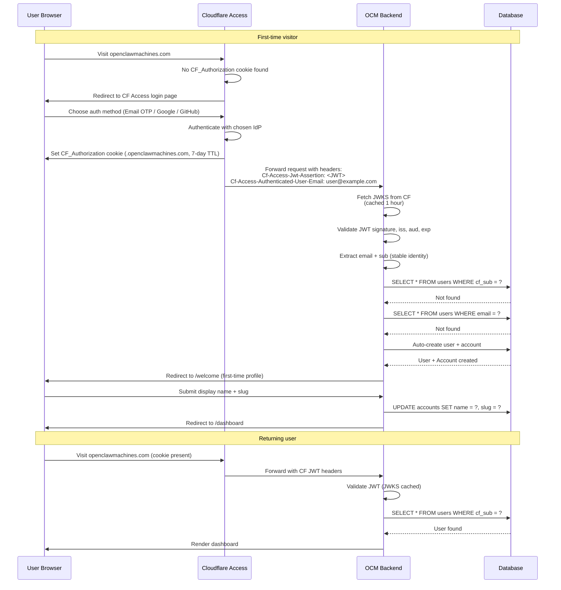
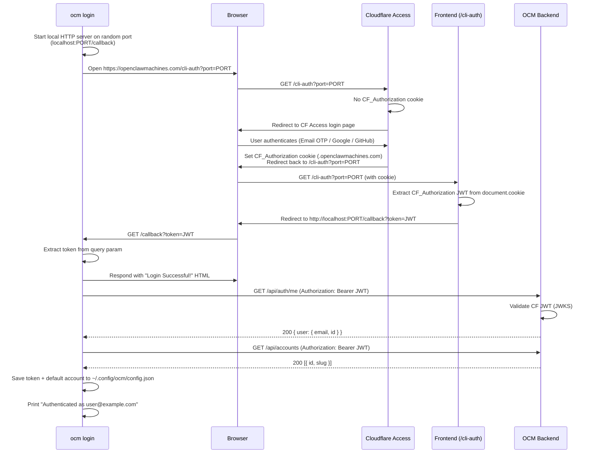
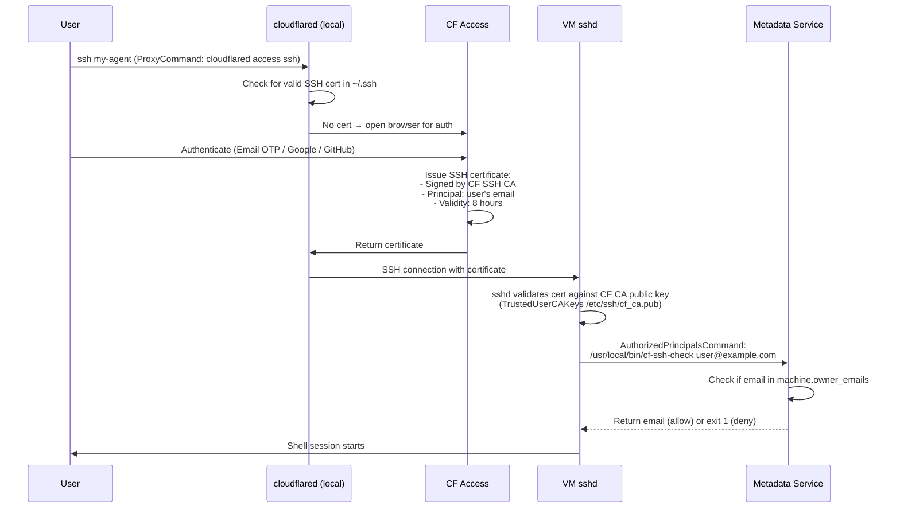

# Authentication Flow

OpenClaw Machines uses Cloudflare Access for user authentication and per-VM signed tokens for authorization. This document details the complete authentication and authorization flow.

---

## Table of Contents

- [Cloudflare Access Authentication](#cloudflare-access-authentication)
- [CLI Login Flow](#cli-login-flow)
- [Dev Bypass Mode](#dev-bypass-mode)
- [DualModeMiddleware](#dualmodemode)
- [User Resolver Middleware](#user-resolver-middleware)
- [Machine Token Flow](#machine-token-flow)
- [Auth Proxy (In-VM)](#auth-proxy-in-vm)
- [SSH Certificate Validation](#ssh-certificate-validation)
- [Environment Variables Reference](#environment-variables-reference)

---

## Cloudflare Access Authentication

Cloudflare Access handles all user authentication at the edge before requests reach the application.

### Flow Diagram



### JWT Validation

The backend validates every request via `CfAccessAuth.ValidateCfJWT()`:

1. **Fetch JWKS** from `https://{team}.cloudflareaccess.com/cdn-cgi/access/certs`
   - Cached for 1 hour
   - Refreshed automatically on cache miss or stale keys
   - **Fail closed**: If JWKS fetch fails AND cache expired → reject all requests

2. **Parse JWT header** from `Cf-Access-Jwt-Assertion` header
   - Extract `kid` (key ID) from JWT header
   - Look up RSA public key from JWKS cache

3. **Verify signature** using RSA public key

4. **Validate claims:**
   - `iss` (issuer) == `https://{team}.cloudflareaccess.com`
   - `aud` (audience) contains `CF_ACCESS_AUD` env var
   - `exp` (expiry) > current time

5. **Extract identity:**
   - `sub` (subject) — stable identity, never changes even if email changes
   - `email` — display identity, may change

### JWKS Caching

- **TTL:** 1 hour
- **Refresh:** Automatic on cache miss or access to stale key
- **Failure mode:** Fail closed — stale keys + failed refresh = reject all requests
- **Why fail closed:** Prevents trusting stale keys that may have been rotated after compromise

---

## CLI Login Flow

The `ocm login` command authenticates the CLI by opening a browser, leveraging Cloudflare Access to obtain a JWT, and passing it back to the CLI via a local callback server.

### Flow Diagram



### URL Derivation

The CLI derives the auth URL from the configured API URL:

```
API URL: https://api.openclawmachines.com
                    ↓ strip "api." prefix
Auth URL: https://openclawmachines.com/cli-auth?port=PORT
```

This can be overridden by setting `cf_app_domain` in `~/.config/ocm/config.json`.

**Code:** `cli/internal/commands/login.go` — `buildAuthURL()`

### CF Access Configuration

The `/cli-auth` path must be registered in the CF Access application so that CF Access intercepts the request and triggers the login flow. It is configured under the **OpenClaw Machines Dashboard** application in Cloudflare Zero Trust alongside the other protected paths:

| Domain | Path |
|--------|------|
| `openclawmachines.com` | `/dashboard` |
| `openclawmachines.com` | `/welcome` |
| `openclawmachines.com` | `/workspace` |
| `openclawmachines.com` | `/cli-auth` |

### Frontend Bridge (`/cli-auth` Page)

The React page at `/cli-auth` acts as a bridge between CF Access and the CLI's local server. It:

1. Reads the `port` query parameter from the URL
2. Extracts the `CF_Authorization` JWT from `document.cookie`
3. Redirects to `http://localhost:{port}/callback?token={JWT}`

The page makes no API calls — it purely relays the cookie value.

**Code:** `frontend/src/pages/CliAuth.tsx`

### Token Storage

After validation, the CLI saves the token and default account to `~/.config/ocm/config.json`:

```json
{
  "api_url": "https://api.openclawmachines.com",
  "token": "<CF_Authorization JWT>",
  "default_account_id": 123,
  "default_account_slug": "user-23"
}
```

### Non-Interactive Login

For CI/CD or headless environments, the browser flow can be skipped:

```bash
ocm login --token <CF_JWT>
```

This validates the token directly against `/api/auth/me` without starting a local server or opening a browser.

---

## Dev Bypass Mode

For local development without Cloudflare Access, the backend supports a dev bypass mode that synthesizes fake CF Access claims.

### Configuration

Set `AUTH_MODE=dev` and optionally `DEV_BYPASS_EMAIL=your@email.com` (defaults to `dev@localhost`).

### Behavior

Every request is authenticated as the configured email with a fake `cf_sub` of `"dev-bypass"`.

**Warning:** Logs a warning on every auth check. Never use in production.

### Code Reference

See `backend/internal/auth/devbypass.go`:

```go
func DevBypassMiddleware(email string) func(http.Handler) http.Handler {
    // Synthesizes claims: { Email: email, CfSub: "dev-bypass" }
    // Logs warning on every request
}
```

---

## DualModeMiddleware

During migration from legacy JWT tokens to Cloudflare Access, the backend supports both auth mechanisms simultaneously.

### Flow

1. **Try CF Access JWT first:**
   - Check `Cf-Access-Jwt-Assertion` header
   - If present → validate via `CfAccessAuth.ValidateCfJWT()`
   - Extract `email` + `cf_sub` → store in context → continue

2. **Fall back to legacy token:**
   - Check `Authorization: Bearer` header or `ocm_token` cookie
   - If present → validate via `Auth.ValidateToken()`
   - Extract `user_id` + `email` → store in context → continue

3. **Reject if neither is valid:**
   - Return 401 Unauthorized

### Configuration

Set `AUTH_MODE=legacy` to enable dual mode. Requires both `CF_ACCESS_TEAM_DOMAIN` + `CF_ACCESS_AUD` (for CF Access) and `JWT_SECRET` (for legacy tokens).

### Code Reference

See `backend/internal/auth/auth.go`:

```go
func DualModeMiddleware(cfAuth *CfAccessAuth, legacyAuth *Auth) func(http.Handler) http.Handler {
    // Try CF JWT first, fall back to legacy token
}
```

---

## User Resolver Middleware

After authentication (via CF Access or legacy token), the user resolver middleware looks up or creates the user record.

### Flow

1. **Extract claims from context:**
   - CF Access: `{ Email, CfSub }`
   - Legacy: `{ UserID, Email }`

2. **Resolve user:**
   - If `cf_sub` present → `SELECT * FROM users WHERE cf_sub = ?`
   - Else if `email` present → `SELECT * FROM users WHERE email = ?`
   - If not found → auto-create user + account

3. **Update context:**
   - Add `user_id` to claims
   - Store updated claims in request context

4. **Continue to handler**

### Auto-Create Logic

On first CF Access visit, if no user exists:

```sql
INSERT INTO users (email, name, cf_sub, created_at) VALUES (?, ?, ?, NOW())
INSERT INTO accounts (name, slug, created_at) VALUES ('Personal', 'user-{id}', NOW())
INSERT INTO account_members (account_id, user_id, role) VALUES (?, ?, 'owner')
```

Frontend detects new users (no `display_name` set) and shows Welcome page for profile completion.

---

## Machine Token Flow

Per-VM access uses short-lived signed tokens (HS256 JWTs) issued by the backend and validated by the in-VM auth proxy.

### Token Format

```json
{
  "header": { "alg": "HS256", "typ": "JWT" },
  "payload": {
    "sub": "user:123",
    "user_id": 123,
    "email": "user@example.com",
    "machine_id": "m-abc123",
    "account_id": 456,
    "scopes": ["terminal", "gateway", "port"],
    "iat": 1710000000,
    "exp": 1710000300
  }
}
```

**Key Properties:**
- **Algorithm:** HMAC-SHA256 (`HS256`)
- **TTL:** 5 minutes (`exp = iat + 300`)
- **Signing key:** 32-byte random key, unique per machine, stored in `machines.signing_key` (base64-encoded)
- **Transport:** `X-Machine-Token` header (never in cookies or URL query params for GET requests)
- **Scopes:** `terminal`, `gateway`, `port` (or `all`)

### Issuance Endpoint

```http
GET /api/machines/{id}/token
Authorization: Bearer <CF JWT via Cf-Access-Jwt-Assertion header>
```

**Backend flow:**

1. Validate CF JWT (middleware)
2. Check user is member of machine's account
3. Check machine status is `running` (not `stopping`, `stopped`, or `error`)
4. Load `machines.signing_key` from DB
5. Sign JWT with HS256 using signing key
6. Return `{ token: "...", expires_at: "2026-..." }`

**Frontend flow:**

1. Call `/api/machines/{id}/token` on workspace load
2. Store token in memory (not localStorage)
3. Set refresh timer at `exp - 60s` (4 minutes)
4. Attach token as `X-Machine-Token` header on all requests to `m-{slug}.openclawmachines.com`

### Signing Key Lifecycle

| Event | Action |
|-------|--------|
| **Machine creation** | Generate 32 bytes from `crypto/rand`, base64-encode, store in `machines.signing_key` |
| **Machine stop** | Rotate signing key (invalidates all outstanding tokens) |
| **Member removal** | Rotate signing key for all affected machines |
| **Machine delete** | Signing key deleted with machine record |

**Why this is better than static tokens:**
- Instant revocation: rotate signing key → all tokens invalid within seconds
- No stale authorization: tokens expire in 5 minutes, must be refreshed
- Scoped access: tokens encode what the user can do (terminal only, full access, etc.)
- Backend stays the authorization authority — VM just validates signatures

---

## Auth Proxy (In-VM)

Each VM runs an auth proxy (`/usr/local/bin/authproxy`) that validates machine tokens and reverse-proxies to internal services.

### Architecture

```
External Request → cloudflared → authproxy (port 8080) → internal service
                                    ↓
                               validate token
                                    ↓
                        /terminal → :7681 (ttyd)
                        /gateway  → :18789 (OpenClaw gateway)
                        /port/N   → :N (user-started servers)
```

### Validation Flow

Every request:

1. **Extract token** from `X-Machine-Token` header or `?token=` query param (header takes priority)
2. **Parse JWT header** — check `alg == HS256`
3. **Verify signature** with machine's signing key (loaded from metadata at boot)
4. **Check expiry** — reject if `exp < now`
5. **Check machine ID** — reject if `machine_id != this VM's ID`
6. **Check scope** — validate path against token scopes:
   - `/terminal/*` requires `terminal` scope
   - `/gateway/*` requires `gateway` scope
   - `/port/*` requires `port` scope
7. **Log access** — structured JSON with email, path, method, status, duration
8. **Forward request** to upstream service

**No fallback:** If any validation step fails, the request is rejected. There is no permissive mode.

### Logging

Auth proxy logs every request as structured JSON to stdout (collected by agent LogManager):

```json
{
  "ts": "2026-02-12T22:15:30.123Z",
  "event": "request",
  "email": "user@example.com",
  "machine_id": "m-abc123",
  "method": "GET",
  "path": "/terminal/ws",
  "status": 101,
  "duration_ms": 2
}
```

**Auth rejections:**

```json
{
  "ts": "2026-02-12T22:15:30.789Z",
  "event": "auth_reject",
  "reason": "token_expired",
  "machine_id": "m-abc123",
  "path": "/gateway/ws"
}
```

### Code Reference

See `backend/cmd/authproxy/main.go` (full auth proxy implementation).

---

## SSH Certificate Validation

SSH access uses Cloudflare Access short-lived certificates instead of static passwords.

### Flow Diagram



### sshd Configuration

Inside each VM, sshd is configured to trust Cloudflare Access SSH CA and validate principals:

```
# /etc/ssh/sshd_config additions
PubkeyAuthentication yes
TrustedUserCAKeys /etc/ssh/cf_ca.pub
AuthorizedPrincipalsCommand /usr/local/bin/cf-ssh-check %i
AuthorizedPrincipalsCommandUser nobody
PasswordAuthentication no
```

- `/etc/ssh/cf_ca.pub`: CF SSH CA public key, fetched from CF API at VM boot
- `/usr/local/bin/cf-ssh-check`: Script that validates email against metadata service
- `PasswordAuthentication no`: Static passwords are disabled entirely

### CF CA Public Key Distribution

1. Backend fetches CA pubkey from `https://{team}.cloudflareaccess.com/cdn-cgi/access/certs` at VM start
2. Passed to VM via metadata: `machines.cf_ca_pubkey`
3. Init script writes to `/etc/ssh/cf_ca.pub` at boot
4. If CF rotates CA key, new VMs pick it up automatically; running VMs need restart

### Principal Validation Script

`/usr/local/bin/cf-ssh-check` (see `scripts/cf-ssh-check`):

```bash
#!/bin/bash
EMAIL="$1"
# URL-encode email
# Query metadata: GET http://169.254.169.253/v1/ssh-check?email={encoded_email}
# Returns 200 if email in machine.owner_emails, 403 otherwise
# Exit 0 + print email if allowed, exit 1 if denied
```

The metadata endpoint `/v1/ssh-check` checks the email against `MachineConfig.OwnerEmails` (populated from account members at VM start).

---

## Environment Variables Reference

### Backend (Control Plane)

| Variable | Required | Purpose | Example |
|----------|----------|---------|---------|
| `AUTH_MODE` | Yes | Auth strategy | `cfaccess`, `dev`, or `legacy` |
| `CF_ACCESS_TEAM_DOMAIN` | If cfaccess | CF Zero Trust team domain | `my-team` |
| `CF_ACCESS_AUD` | If cfaccess | Application Audience tag | `64-char hex from CF Access app` |
| `DEV_BYPASS_EMAIL` | If dev | Email for dev bypass | `dev@localhost` |
| `JWT_SECRET` | If legacy | Secret for old tokens | `base64-random-string` |
| `CF_API_TOKEN` | For tunnels | Cloudflare API token | `Bearer token with Tunnel + DNS permissions` |
| `CF_ACCOUNT_ID` | For tunnels | Cloudflare account ID | From CF dashboard |
| `CF_ZONE_ID` | For tunnels | Zone ID for DNS | From CF dashboard |

### Frontend

| Variable | Required | Purpose | Example |
|----------|----------|---------|---------|
| `VITE_CF_TEAM_DOMAIN` | For logout | CF team domain for logout URL | `my-team` |

### Auth Proxy (In-VM)

| Variable | Required | Purpose | Source |
|----------|----------|---------|--------|
| `SIGNING_KEY` | Yes | Machine's signing key (base64) | Metadata service |
| `MACHINE_ID` | Yes | This VM's machine ID | Metadata service |
| `PORT` | No | Listen port (default 8080) | Hardcoded in init script |

### Metadata Service (In-VM)

Metadata config passed from backend at VM start via `metadata.RegisterMachine()`:

- `machine_id` — UUID
- `signing_key` — base64-encoded 32-byte key
- `tunnel_token` — Cloudflare tunnel token
- `vm_hostname` — DNS hostname (e.g., `m-{slug}.openclawmachines.com`)
- `owner_emails` — Array of authorized emails (for SSH principal check)
- `cf_ca_pubkey` — CF Access SSH CA public key (PEM format)
