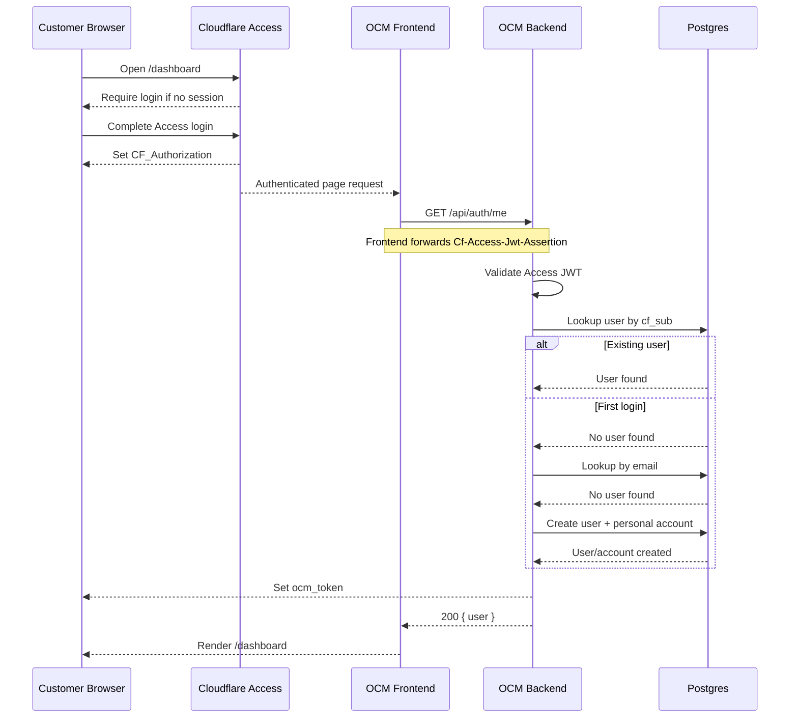
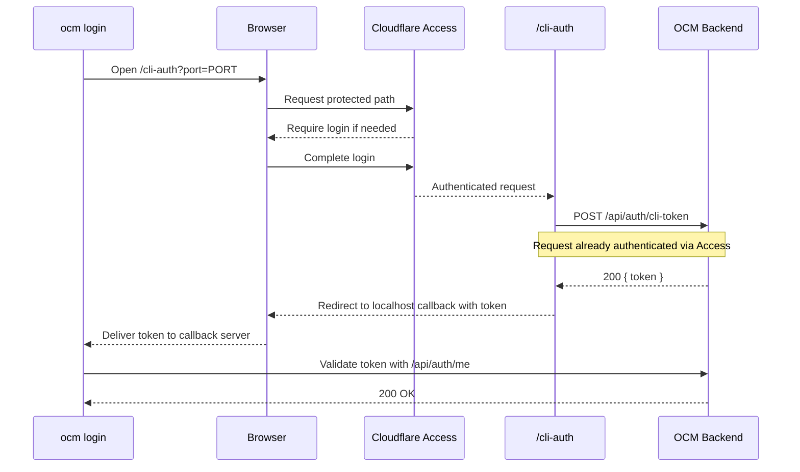
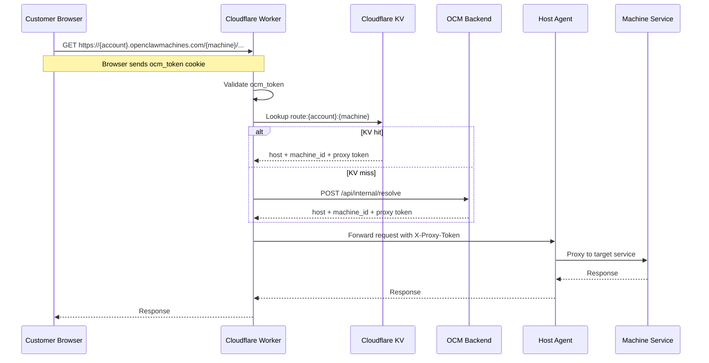
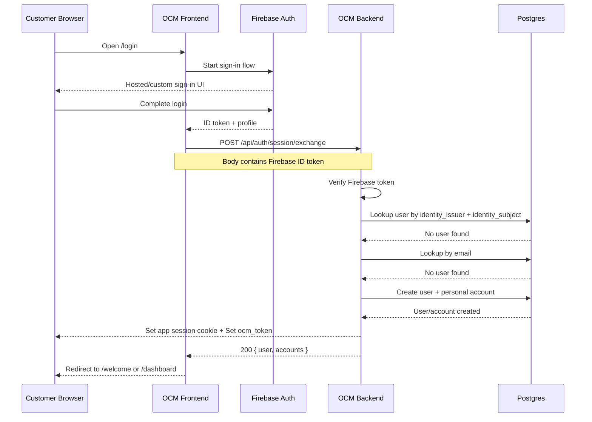
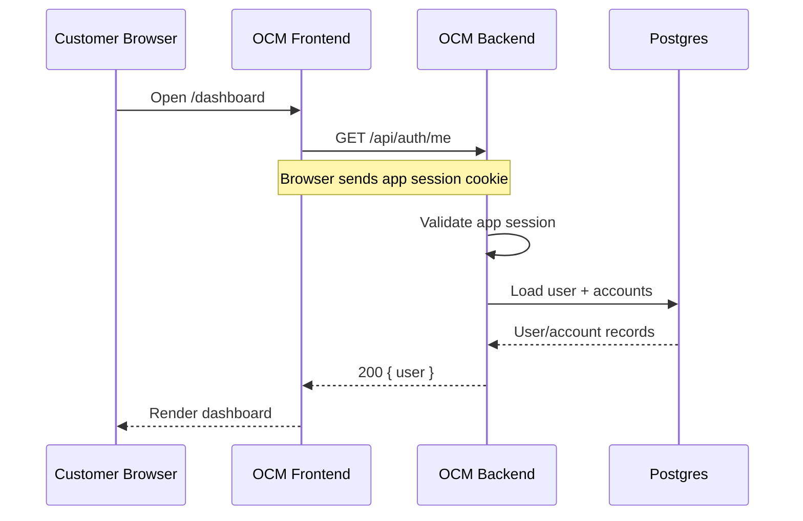
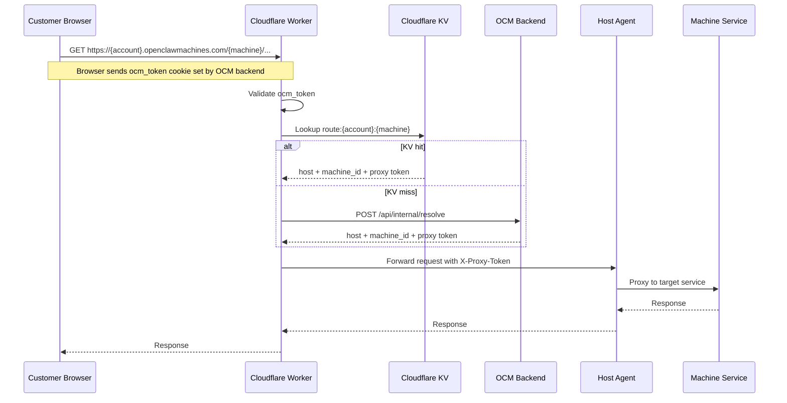
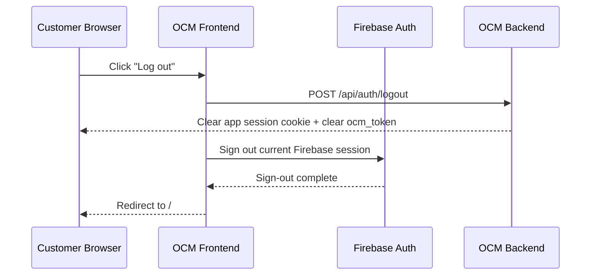
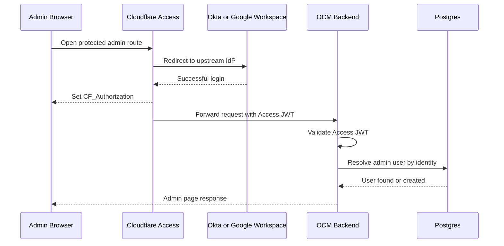
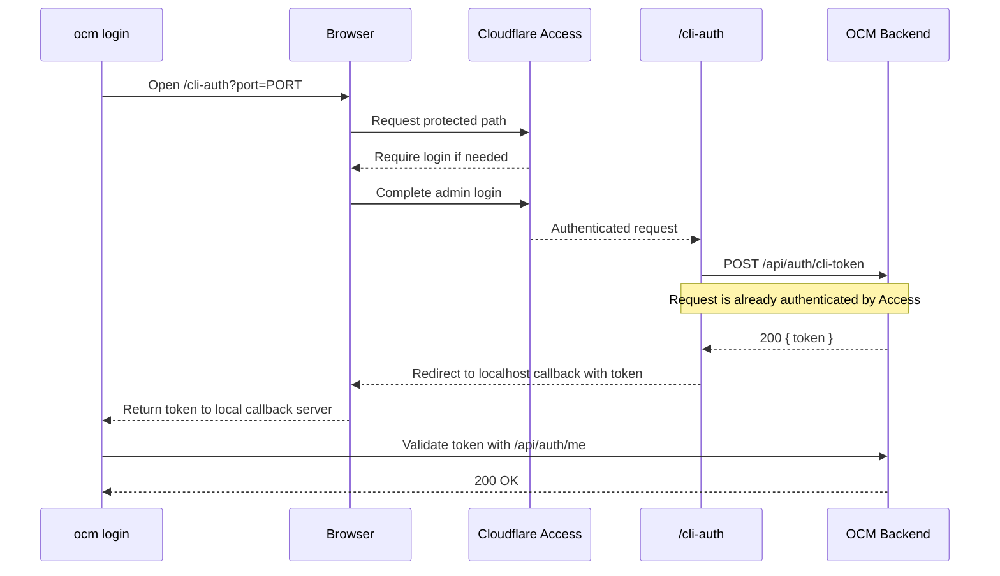

# Authentication Sequence Diagrams

Date: 2026-03-26
Status: Proposed

This document separates the authentication flows from the broader design discussion in [docs/design/2026-03-26-login-architecture-cloudflare-okta-firebase.md](./design/2026-03-26-login-architecture-cloudflare-okta-firebase.md).

It shows:

- `Current state`: Cloudflare Access as the customer-facing browser gate
- `Target state`: Firebase for customer auth, Cloudflare retained for admin/internal surfaces

## Current State

### Current Flow 1: Customer browser login via Cloudflare Access

### Current Flow 2: Current CLI login via Cloudflare Access

### Current Flow 3: Current machine-route access

## Target State

### Target Flow 1: First-time customer login via Firebase

### Target Flow 2: Returning customer request with existing session

### Target Flow 3: Customer machine-route access after Firebase login

### Target Flow 4: Customer logout

### Target Flow 5: Admin or internal user login via Cloudflare Access

### Target Flow 6: Admin CLI login through Cloudflare path

## Current vs Target Delta

### What changes

- customer login moves from `Cloudflare Access` to `Firebase`
- OCM backend becomes the explicit session exchange boundary
- OCM app session becomes first-party and app-managed
- user identity storage should move from `cf_sub` to provider-neutral identity keys

### What stays the same

- `ocm_token` remains the Worker-facing token
- Worker route resolution remains KV plus `/api/internal/resolve`
- per-machine proxy tokens remain unchanged
- Cloudflare still protects admin/internal routes and infrastructure surfaces
