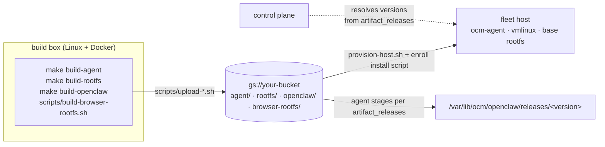

# Building the Components

Every piece of the public core can be built from this repo on a Linux box with
Docker. This page is the component-by-component build manual: what each piece
is, how to build it, what comes out, how it's distributed, and who consumes it.

**Distribution is GCS-first.** The rootfs image is multiple GB — over GitHub's
2 GB release-asset cap — so a **GCS bucket you control is the canonical
artifact channel** ([#21](https://github.com/mathaix/OpenClawMachines/issues/21)).
Every `upload-*.sh` script below writes to the same bucket layout, and hosts
pull from it via `OCM_ARTIFACT_BUCKET` and the `*_GCS_MANIFEST` variables.



## The bucket layout

```
gs://your-bucket/
├── agent/
│   ├── agent-<version>              # the ocm-agent binary
│   ├── manifest-<version>.json      # sha256 + url, pinned via AGENT_GCS_MANIFEST
│   └── manifest.json                # "latest" pointer
├── rootfs/
│   ├── rootfs-<version>.ext4.zst    # machine rootfs, zstd-compressed
│   ├── manifest-<version>.json      # pinned via ROOTFS_GCS_MANIFEST
│   └── manifest.json                # "latest" pointer
├── openclaw/releases/<version>/     # version is v-prefixed, e.g. v2026.5.28-r4
│   ├── openclaw-<version>-linux-amd64.tar.zst
│   └── manifest.json                # templated via OPENCLAW_GCS_MANIFEST
├── browser-rootfs/
│   ├── browser-rootfs-<version>.ext4.zst
│   └── manifest-<version>.json      # + manifest.json latest pointer
└── kernel-browser-rootfs/
    └── manifest.json                # browser-VM guest kernel (provision-host.sh)
```

The `upload-*.sh` scripts default to the project's bucket — set
`GCS_BUCKET=your-bucket` when running them.

Each manifest records the artifact's URL, SHA-256, and size; consumers verify
the hash after download. The control plane additionally records one row per
published version in the **`artifact_releases`** table — that row is how the
version resolver (`FF_RUNTIME_VERSION_RESOLVER=1`) decides what new machines
get.

---

## 1 · Control plane

**What:** the Go API server — accounts, machines, hosts, placement, lifecycle,
host enrollment, backups, durable workflows — plus the web UI and the edge
Worker.

| Piece | Build | Output | Runs |
|---|---|---|---|
| API server | `make build-server` | `backend/server` | wherever you operate the control plane, behind HTTPS |
| Web UI | `cd frontend && npm ci && npm run build` | `frontend/dist/` | served by your web tier (the dev server proxies `/api`) |
| Edge Worker | `cd worker && npx wrangler deploy` | deployed Worker + KV binding | Cloudflare (stage-2 deployments only) |

The control plane is **not** distributed through the bucket — you build and run
it directly. Schema migrations run with `make local-migrate` (or
`scripts/run-migrations.sh` against your `DATABASE_URL`).

## 2 · Host agent (`ocm-agent`)

**What:** the worker daemon on every fleet host. Boots, supervises, and reaps
Firecracker microVMs; manages bridge/TAP networking; stages the copy-on-write
base rootfs; and serves the host-side proxies (control `:9090`, workspace proxy
`:9091`).

```bash
make build-agent                      # cross-compiles → backend/agent-linux
bash scripts/upload-agent.sh          # sha256 + gs://bucket/agent/ + manifests
```

The upload script prints the `AGENT_GCS_MANIFEST=gs://…` value to set on the
control plane; the enroll install script downloads the binary from it,
verifies the hash, and installs it to `/usr/local/bin/ocm-agent` with a
systemd unit.

## 3 · LLM proxy

**What:** the per-host model-traffic proxy that VMs call at
`192.168.100.1:4000` (the bridge gateway). One place for provider keys and
BYO-key support, with per-machine usage tracking — and the place to point at
your own locally served models.

**There is nothing separate to build**: the proxy is the `apiproxy` package
*inside* `ocm-agent` and starts with it. Configuration is data, not code —
provider credentials are stored encrypted per account/machine by the control
plane and injected at VM start. (You'll see it called the *AI gateway* in
[architecture.md](architecture.md#ai-gateway-litellm--per-host).)

## 4 · OpenClaw runtime

**What:** the runtime the agents actually run — `bin/openclaw`, compiled JS,
bundled plugins, flat `node_modules` — packaged as a versioned `.tar.zst`. At
boot the host agent attaches the staged release read-only into the VM at
`/ocm-runtime`.

```bash
make build-openclaw     # scripts/build-openclaw-runtime.sh — Docker + zstd,
                        # npm flat install (pnpm links don't survive tar)
# → /var/lib/ocm/openclaw-artifacts/openclaw-<version>-linux-amd64.tar.zst
```

Distribute and activate:

1. Upload the tarball + a `manifest.json` to
   `gs://your-bucket/openclaw/releases/<version>/`.
2. Register the release:
   `INSERT INTO artifact_releases (kind,version,channel,url,sha256) VALUES ('openclaw', …)`.
3. Set `OPENCLAW_GCS_MANIFEST='gs://your-bucket/openclaw/releases/{version}/manifest.json'`
   on the control plane — `{version}` is filled from the resolved release.

New/restarted machines pick the version up automatically — this is the
[runtime-upgrade flow](getting-started.md#runtime-upgrades) in stage 3.

## 5 · Machine rootfs (+ guest kernel)

**What:** the ext4 image every machine boots — Ubuntu base with the OpenClaw
gateway, Playwright, and the in-VM binaries (`authproxy`, `ocmptyd`,
`ocm-secrets`) injected from the build host's `/usr/local/bin`. The rootfs
build hard-requires those binaries to be installed first — one target does
both the builds and the install:

```bash
make install-vm-binaries     # builds authproxy/ocm-secrets/ocmptyd and
                             # sudo-installs them to /usr/local/bin
make build-rootfs            # scripts/build-rootfs.sh — Docker, mkfs.ext4, bsdtar
# → /var/lib/ocm/images/rootfs.ext4
bash scripts/upload-rootfs.sh   # zstd-compress + manifest → gs://bucket/rootfs/
```

Hosts consume it via `ROOTFS_GCS_MANIFEST` (the agent stages a shared
`.base-rootfs.ext4` on the XFS reflink mount; each VM's disk is a cheap
copy-on-write clone). The **guest kernel** (`vmlinux`) is the one piece not
built here — bring a Firecracker-compatible kernel (see the
[Firecracker docs](https://github.com/firecracker-microvm/firecracker/blob/main/docs/getting-started.md))
and upload it to the bucket `provision-host.sh` pulls from.

## 6 · Browser runtime

**What:** the browser companion VM image — Alpine + headful Chromium with CDP
on `:9222` and the live view — paired 1:1 with machines at runtime.

```bash
bash scripts/build-kernel-browser-rootfs.sh   # browser-VM guest kernel
bash scripts/build-browser-rootfs.sh          # Alpine+Chromium ext4 (Docker, mkfs.ext4, bsdtar)
bash scripts/upload-browser-rootfs.sh         # zst + manifest → gs://bucket/browser-rootfs/
bash scripts/upload-kernel-browser-rootfs.sh
```

## 7 · The release pipeline

[`release-artifacts.yml`](../.github/workflows/release-artifacts.yml) builds
and publishes the **small Go binaries** (`ocm-agent`, `authproxy`,
`ocm-secrets` + manifest) to a GitHub Release on every `v*` tag — a convenience
channel for the pieces under the 2 GB cap. The big images (rootfs, browser
rootfs, runtime tarballs) stay GCS-only by design.

---

## Quick reference

| Component | Build command | Output | Upload | Consumed via |
|---|---|---|---|---|
| API server | `make build-server` | `backend/server` | — (run it) | — |
| Web UI | `npm run build` (frontend/) | `frontend/dist/` | — (serve it) | — |
| Edge Worker | `npx wrangler deploy` (worker/) | deployed Worker | — | — |
| Host agent | `make build-agent` | `backend/agent-linux` | `upload-agent.sh` | `AGENT_GCS_MANIFEST` |
| LLM proxy | (inside the agent) | — | — | starts with `ocm-agent` |
| In-VM binaries | `make install-vm-binaries` (builds authproxy, ocm-secrets, ocmptyd and installs to `/usr/local/bin`) | `backend/*-linux` → `/usr/local/bin/*` | baked into the rootfs | — |
| OpenClaw runtime | `make build-openclaw` | `openclaw-<ver>.tar.zst` | manual + `artifact_releases` row | `OPENCLAW_GCS_MANIFEST` |
| Machine rootfs | `make build-rootfs` | `/var/lib/ocm/images/rootfs.ext4` | `upload-rootfs.sh` | `ROOTFS_GCS_MANIFEST` |
| Guest kernel | (not built here — Firecracker docs) | `vmlinux` | to your bucket | `provision-host.sh` |
| Browser rootfs + kernel | `build-browser-rootfs.sh`, `build-kernel-browser-rootfs.sh` | `browser-rootfs.ext4`, kernel | `upload-browser-rootfs.sh`, `upload-kernel-browser-rootfs.sh` | agent staging |
