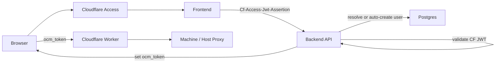
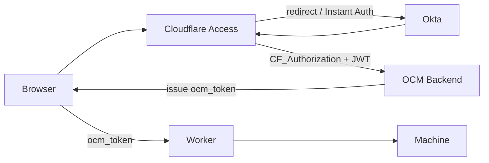
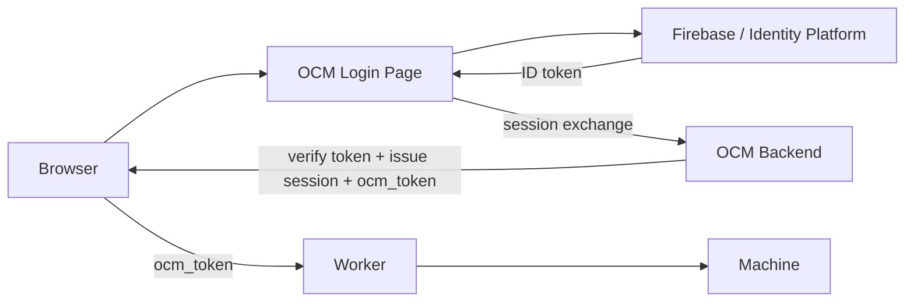
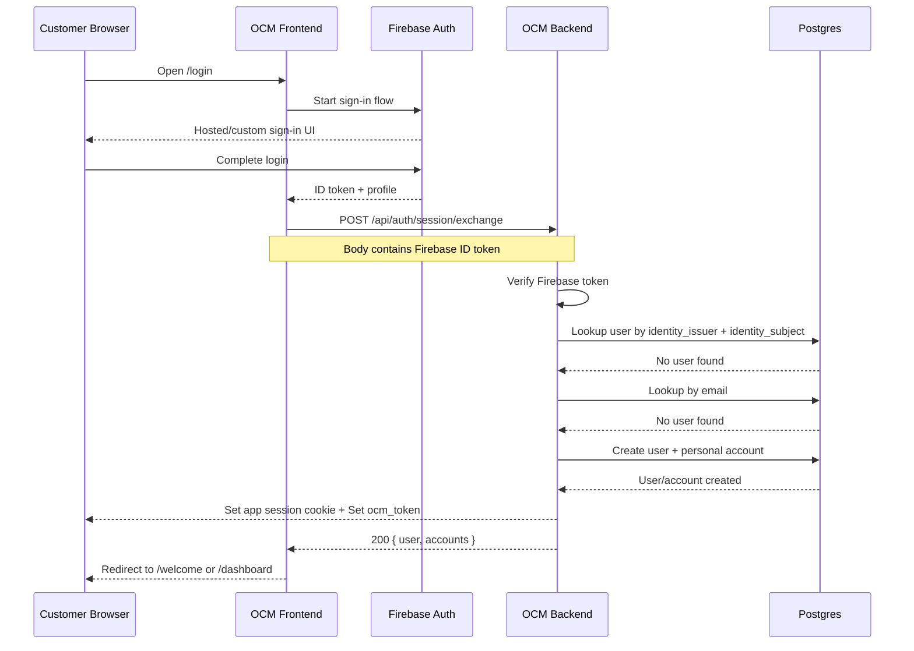
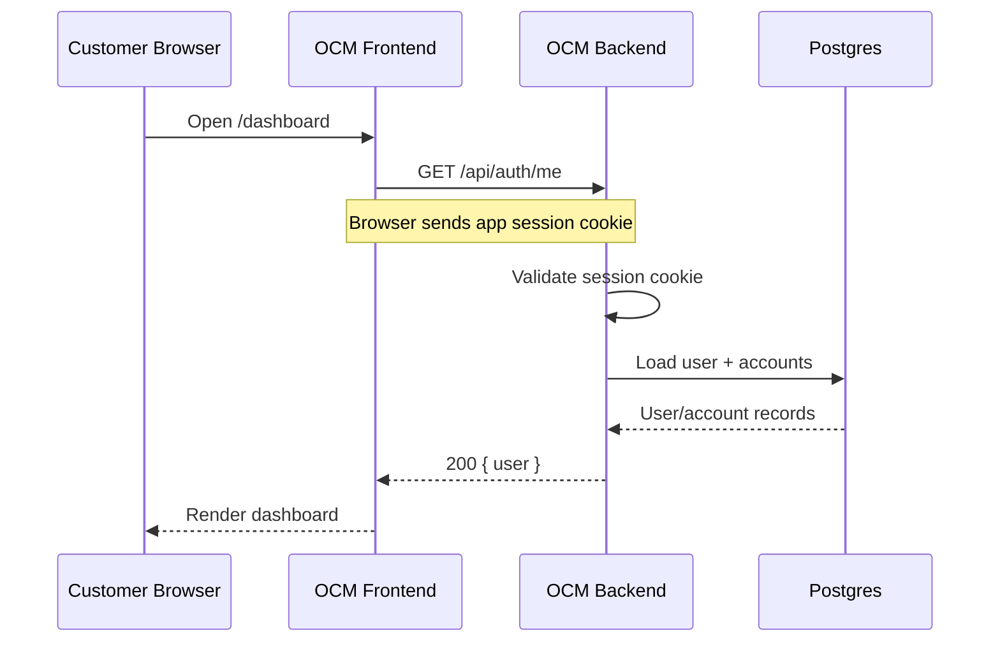
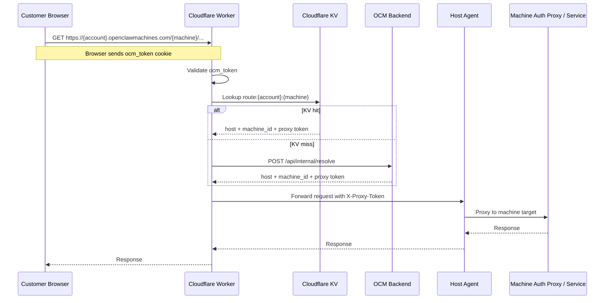
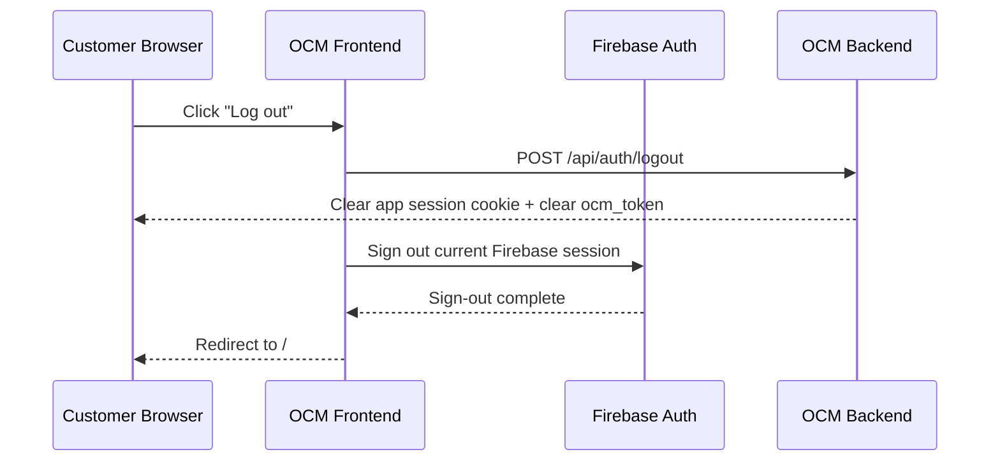
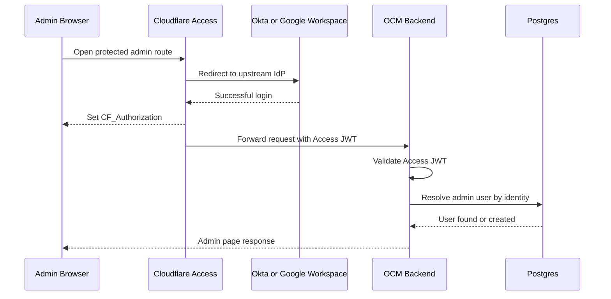
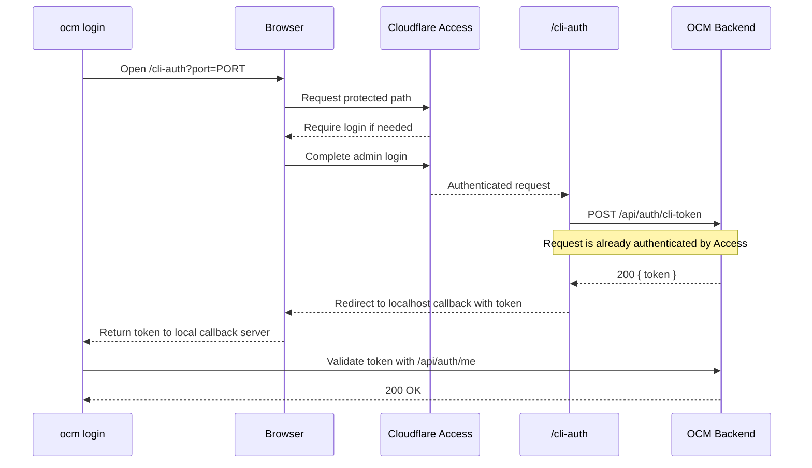

# Login Architecture: Keep Cloudflare, Improve UX with Okta or Firebase

Date: 2026-03-26
Status: Proposed
Recommendation: Use `Okta -> Cloudflare Access -> OCM` for the near-term migration. Treat `Firebase / Identity Platform` as a larger follow-on option only if OCM wants app-managed customer auth and materially lower per-user cost at scale.

## Summary

OpenClaw Machines is already built around `Cloudflare Access` as the browser-facing identity gate:

- the frontend forwards `CF_Authorization` as `Cf-Access-Jwt-Assertion`
- the backend validates the Cloudflare Access JWT, auto-creates or resolves the user, and issues `ocm_token`
- the Worker validates `ocm_token` for account and machine subdomain traffic
- the CLI relies on `/cli-auth` plus `/api/auth/cli-token`

Because of that shape, `Okta` is a natural fit and `Firebase` is not.

- `Okta` can sit behind Cloudflare Access as the upstream IdP with minimal code churn.
- `Firebase Authentication` improves login UX only if OCM moves primary login into the application itself. Keeping Cloudflare Access as the primary user-facing gate while also adding Firebase would either create double-auth or require a custom broker.

## Goals

- Keep Cloudflare for edge protection, Workers, Tunnels, and SSH.
- Improve login UX and enterprise readiness.
- Preserve current account bootstrap behavior and downstream `ocm_token` flow.
- Avoid unnecessary changes to Worker routing and machine auth.
- Leave room for a future provider-agnostic identity model.

## Non-Goals

- Replacing Cloudflare Tunnel or per-VM access.
- Replacing `ocm_token` in the Worker in this phase.
- Designing billing or SCIM synchronization in full implementation detail.

## Current Architecture In This Repo

### Current request path

### Code-level coupling points

- `frontend/src/lib/api.ts`
  - reads `CF_Authorization` from `document.cookie`
  - forwards it as `Cf-Access-Jwt-Assertion` because the cookie is not shared to the API host
- `frontend/src/lib/auth.tsx`
  - assumes Cloudflare Access is the browser login source
- `frontend/src/pages/CliAuth.tsx`
  - depends on `/api/auth/cli-token` after browser auth
- `backend/internal/auth/auth.go`
  - `DualModeMiddleware()` prefers Cloudflare Access JWTs
- `backend/internal/auth/cfaccess.go`
  - validates Cloudflare Access JWTs against Cloudflare JWKS
- `backend/internal/api/server.go`
  - `handleAuthMe()` resolves user by `cf_sub` or email, auto-creates the user/account, then sets `ocm_token`
  - `handleCliToken()` mints the first-party CLI token from a browser-authenticated session
- `worker/jwt.js`
  - validates `ocm_token`, not the Cloudflare Access JWT

### Hard constraints

1. Browser login and machine routing are already split into two session layers:
   - edge session: `CF_Authorization`
   - OCM data-plane session: `ocm_token`
2. The CLI is downstream of browser login, not an independent OAuth client today.
3. The database schema is still Cloudflare-shaped via `users.cf_sub`.
4. Any migration that keeps the Worker model intact should keep `ocm_token` or a close equivalent.

## Decision Matrix

| Dimension | Okta via Cloudflare Access | Firebase / Identity Platform |
|---|---|---|
| Fit with current repo | High | Low |
| Login UX control | Medium | High |
| Cloudflare fit | Native | Partial |
| Worker impact | None | Low if `ocm_token` stays |
| CLI impact | None / minimal | High |
| Enterprise SSO / MFA / SCIM | High | Medium |
| Customer-scale economics | Poor to medium | High |
| Implementation churn | Low | High |

## Option A: Okta Behind Cloudflare Access

### What changes

`Okta` becomes the upstream identity provider. `Cloudflare Access` remains the gate in front of the dashboard, API, SSH, and any other protected applications.

### Why this fits

- The backend keeps validating Cloudflare-issued JWTs.
- The Worker keeps validating `ocm_token`.
- The CLI flow can remain `browser -> /cli-auth -> /api/auth/cli-token`.
- Cloudflare still enforces edge auth before the request reaches origin.
- Okta adds the identity and lifecycle features Cloudflare does not try to own.

### UX implications

This does not require keeping the default generic Cloudflare login chooser.

Cloudflare Access supports:

- `Instant Auth` for single-IdP applications
- login page branding
- multiple IdPs during migration

So the UX can become:

1. user opens `/dashboard`
2. Cloudflare Access immediately redirects to Okta
3. user completes Okta sign-in
4. Cloudflare Access returns to OCM with a valid Access JWT

That is materially better than today's generic Access login experience, while preserving the current security model.

### Recommended implementation shape

#### Phase A1: Make identity storage provider-agnostic

Current schema is tied to `cf_sub`. Even if OCM stays on Cloudflare Access, the next auth change should remove Cloudflare-specific naming from the durable user model.

Add:

- `users.identity_issuer TEXT`
- `users.identity_subject TEXT`
- `users.identity_provider TEXT`

Keep `cf_sub` temporarily during migration, backfill from current data, then migrate reads to `(identity_issuer, identity_subject)`.

Rationale:

- it makes Okta-via-Access and a future Firebase session exchange use the same internal model
- it avoids baking a transport detail (`cf_sub`) into the persistent schema

#### Phase A2: Add optional group and directory mapping

If OCM wants account-role bootstrap or admin mapping from Okta:

- pass group claims from Okta through Cloudflare Access
- ingest them in backend middleware or account sync code
- map approved groups to OCM roles

Optional follow-on:

- use Okta -> Cloudflare SCIM for group sync and deprovisioning
- keep OCM account membership authoritative unless a tighter directory model is needed

### Code impact

Low.

Likely touched areas:

- `backend/internal/auth/cfaccess.go`
  - optional custom claim parsing for groups or profile fields
- `backend/internal/api/server.go`
  - use provider-agnostic identity lookup
- `backend/internal/store/*`
  - add new lookup/update methods for `(issuer, subject)`
- `frontend/src/pages/Login.tsx`
  - can simplify into a clean redirect page
- `frontend/src/lib/auth.tsx`
  - eventually remove some Cloudflare-cookie-clearing retry hacks

Unchanged:

- Worker auth model
- `/api/auth/cli-token`
- `cli/internal/commands/login.go`
- per-machine tunnel auth

### Main benefits

- Lowest implementation risk.
- Best fit for the current architecture.
- Preserves true edge auth before origin.
- Strong enterprise SSO, MFA, directory sync, and deprovisioning story.

### Main drawbacks

- User-facing browser auth is still mediated by Cloudflare Access, not fully app-owned.
- Cost stacks on top of Cloudflare if all end users are Access users.
- Best fit for workforce / B2B admin identities, not mass-market customer auth.

### Cost notes

Public list pricing reviewed on 2026-03-26:

- Cloudflare Access:
  - free plan up to 50 users
  - pay-as-you-go listed at `$7/user/month`
- Okta Workforce Identity:
  - Starter: `$6/user/month`
  - Essentials: `$17/user/month`
- Okta Customer Identity:
  - public pricing starts at `$3k/month`

Implication:

- if OCM expects a relatively small number of admin or team users, this is acceptable
- if OCM expects large customer-user counts, keeping Cloudflare Access in front of every end user becomes the dominant cost driver

## Option B: Firebase / Identity Platform With App-Managed Login

### What changes

OCM moves primary login into the application. `Firebase Authentication` or `Identity Platform` handles the user-facing login UX. The backend verifies Firebase tokens and mints OCM session state.

Cloudflare remains in the stack for:

- DNS
- Workers
- Tunnels
- SSH / infrastructure access
- optionally admin-only Access applications

But Cloudflare Access would no longer be the primary login gate for normal dashboard users.

### Why this is a bigger rewrite

Firebase docs describe the product as an authentication system for your application, using SDKs, hosted UI helpers, custom domains, session cookies, and backend token verification.

That is a good fit for app-managed auth, but not for the current `Cloudflare Access is the primary gate` model.

### Why "Firebase behind Cloudflare Access" is not the recommended design

Cloudflare Access expects an upstream OIDC or SAML identity provider with standard browser redirect and token endpoints.

I did not find a documented Firebase Authentication pattern where Firebase itself is used as the upstream IdP for Cloudflare Access in the same way Okta is.

This is an inference from the official docs:

- Cloudflare documents generic OIDC / SAML IdP integration for Access.
- Google documents Firebase / Identity Platform as the auth system for your app and services.
- Google docs show Firebase consuming or brokering sign-in for your application, not acting as the enterprise IdP in front of Cloudflare Access.

Because of that, the realistic Firebase path is:

- move user login into OCM
- keep Cloudflare Access for operator/admin infrastructure, not for every end-user page

Trying to keep both as primary user-facing gates leads to one of two bad outcomes:

1. double-auth UX
2. a custom OIDC broker that OCM would now own and secure

### Recommended implementation shape

#### Phase B1: Introduce an explicit session exchange endpoint

Add:

- `POST /api/auth/session/exchange`

Flow:

1. frontend obtains Firebase ID token
2. frontend posts it to OCM backend
3. backend verifies token
4. backend resolves or creates user/account
5. backend returns or sets:
   - first-party app session cookie
   - `ocm_token` for Worker-routed machine traffic

#### Phase B2: Replace frontend assumptions about Cloudflare login

Replace:

- `CF_Authorization` cookie reads
- forced reload to trigger Access
- `/login` as a Cloudflare-only holding page

With:

- hosted FirebaseUI or custom login page
- logout that revokes the app session directly

#### Phase B3: Rewrite CLI auth

Current CLI auth is browser-based Cloudflare login followed by `/api/auth/cli-token`.

A Firebase-based model should use one of:

- device flow style login
- PKCE in the CLI with localhost callback
- a browser sign-in page that returns a short-lived OCM exchange code, not the raw IdP token

### Code impact

High.

Likely touched areas:

- `frontend/src/lib/api.ts`
- `frontend/src/lib/auth.tsx`
- `frontend/src/pages/Login.tsx`
- `frontend/src/App.tsx`
- `frontend/src/pages/CliAuth.tsx`
- `backend/internal/auth/*`
- `backend/internal/api/server.go`
- `backend/internal/store/*`
- `cli/internal/commands/login.go`

Worker impact:

- low if `ocm_token` stays the internal machine-routing token
- higher only if OCM also wants to replace the Worker auth model

### Main benefits

- Best login UX control.
- Better fit for customer-facing or consumer-style auth.
- Better economics at high MAU if Cloudflare Access is not used for every end user.
- Good support for hosted/custom UI, email link flows, app-controlled sessions, and multi-tenancy via Identity Platform.

### Main drawbacks

- Largest code and migration surface.
- OCM now owns more of the auth/session boundary.
- Enterprise lifecycle features are weaker than Okta unless OCM builds more directory sync logic itself.
- Requires a deliberate rethink of the CLI auth flow.

### Cost notes

Public pricing reviewed on 2026-03-26:

- Firebase Authentication / Identity Platform Tier 1:
  - first `50,000` monthly active users free
  - then `$0.0055/MAU`
- Identity Platform Tier 2 for `OIDC` and `SAML` federation:
  - first `49` MAUs free
  - then `$0.015/MAU`
- phone / SMS is billed separately

Important implication:

If OCM keeps Cloudflare Access in front of every end user anyway, those Cloudflare per-user costs remain on top of Firebase costs. That removes most of the economic advantage of Firebase.

## Rejected Architecture: Firebase Plus Cloudflare Access As Dual Primary Login Layers

This design should be rejected.

Reasons:

- two user-facing auth systems for the same browser session
- harder logout semantics
- more brittle CLI flow
- more support burden when tokens drift or users are half-signed-in
- no clear documented direct path from Firebase Auth to Cloudflare Access equivalent to Okta

## Recommendation

### Near-term recommendation

Choose `Okta behind Cloudflare Access`.

Reasoning:

- It solves the stated requirement with the least risk.
- It preserves the current security model.
- It keeps CLI, Worker, and tunnel auth nearly unchanged.
- It delivers better UX immediately through Okta branding plus Cloudflare Instant Auth.

### Longer-term recommendation

Only choose `Firebase / Identity Platform` if OCM wants one of these strategic shifts:

- app-managed customer auth
- high-MAU, cost-sensitive user growth
- deeply custom embedded login UX
- eventual mobile/native client login parity

If OCM chooses that path, it should also stop treating Cloudflare Access as the primary end-user gate and reserve Access for admin, SSH, and infrastructure surfaces.

## Proposed Target Design

Even if OCM starts with the Okta path, the codebase should move toward this provider-neutral shape:

### 1. Internal identity abstraction

Persist:

- `identity_issuer`
- `identity_subject`
- `identity_provider`
- `email`

Do not persist provider-specific fields as the main lookup key.

### 2. Explicit session exchange boundary

Create one backend boundary that converts an external identity into OCM session state.

Inputs:

- Cloudflare Access JWT
- future Firebase ID token
- future native OIDC token

Outputs:

- OCM browser session
- `ocm_token`
- optional CLI token

### 3. Preserve downstream machine auth

Keep `ocm_token` as the Worker-facing session token until there is a separate design to unify browser and machine-routing auth.

That keeps this migration scoped and avoids touching the data plane.

## Sequence Diagrams

These diagrams reflect the recommended end state for a customer-facing product:

- customers authenticate with `Firebase / Identity Platform`
- OCM backend exchanges that identity into OCM session state
- `ocm_token` remains the Worker-facing token
- `Cloudflare Access` remains for admin/internal surfaces

For a dedicated current-vs-target auth diagram set, see [docs/auth-sequence-diagrams.md](../auth-sequence-diagrams.md).

### Flow 1: First-time customer login via Firebase

### Flow 2: Returning customer request with existing session

### Flow 3: Customer opens a machine route

### Flow 4: Customer logout

### Flow 5: Admin or internal user login via Cloudflare Access

### Flow 6: Admin CLI login through Cloudflare path

## Phased Plan

### Phase 0: Schema hardening

- add provider-agnostic identity columns
- backfill from `cf_sub`
- update lookup paths in store and API layers

### Phase 1: Recommended path

- configure Okta as the Access IdP
- enable Instant Auth or a branded Access page
- keep `/api/auth/me`, `/api/auth/cli-token`, and `ocm_token`

### Phase 2: Optional enterprise enrichment

- ingest group claims
- map approved groups to OCM admin or account roles
- add SCIM only if real deprovisioning or group sync is required

### Phase 3: Optional future rearchitecture

- add generic `/api/auth/session/exchange`
- support non-Cloudflare identity sources
- decide whether to move end-user auth into the app

## Sources

Reviewed on 2026-03-26. Official sources only.

- Cloudflare Access pricing: <https://www.cloudflare.com/en-ca/sase/products/access/>
- Cloudflare Access login page and Instant Auth: <https://developers.cloudflare.com/learning-paths/clientless-access/customize-ux/login-page/>
- Cloudflare generic OIDC IdP integration: <https://developers.cloudflare.com/cloudflare-one/integrations/identity-providers/generic-oidc/>
- Cloudflare Okta integration and SCIM sync: <https://developers.cloudflare.com/cloudflare-one/integrations/identity-providers/okta/>
- Cloudflare authorization cookie and Access JWT model: <https://developers.cloudflare.com/cloudflare-one/identity/authorization-cookie/>
- FirebaseUI web auth: <https://firebase.google.com/docs/auth/web/firebaseui>
- Firebase session cookies: <https://firebase.google.com/docs/auth/admin/manage-cookies>
- Google Identity Platform concepts: <https://cloud.google.com/identity-platform/docs/concepts-authentication>
- Google Identity Platform pricing: <https://cloud.google.com/identity-platform/pricing>
- Google Identity Platform multi-tenancy: <https://cloud.google.com/identity-platform/docs/multi-tenancy>
- Okta Sign-In Widget: <https://developer.okta.com/docs/concepts/sign-in-widget/>
- Okta pricing: <https://www.okta.com/pricing/>
- Okta Customer Identity: <https://www.okta.com/products/customer-identity/>
