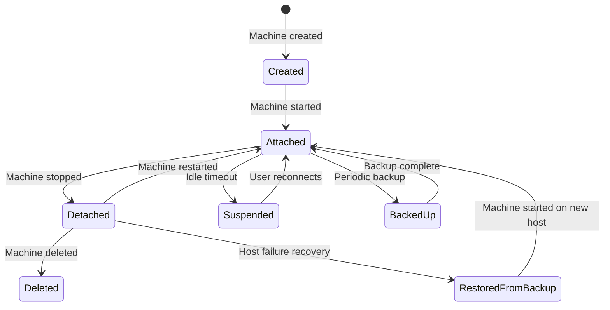
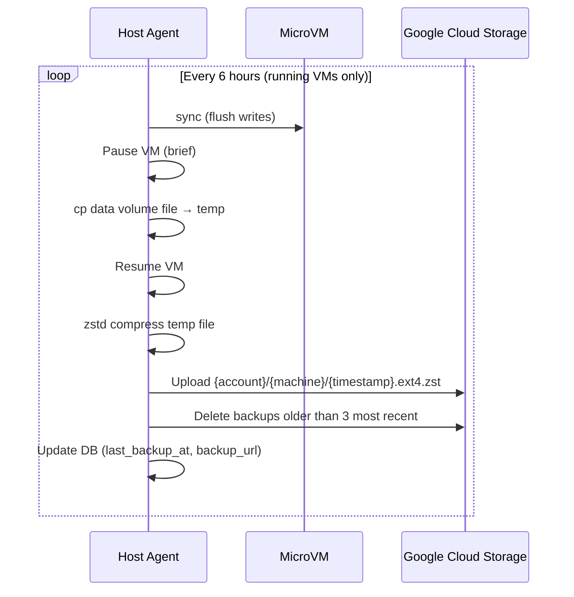
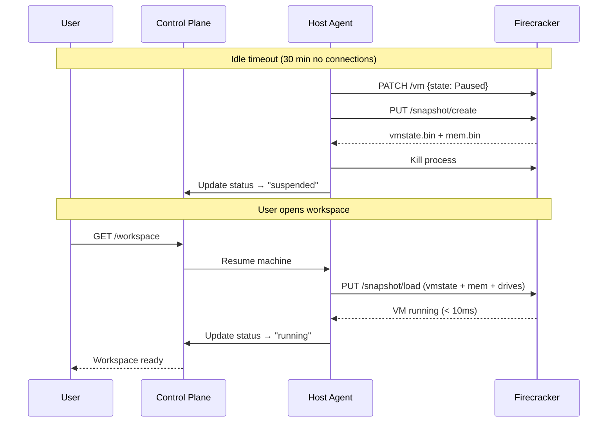
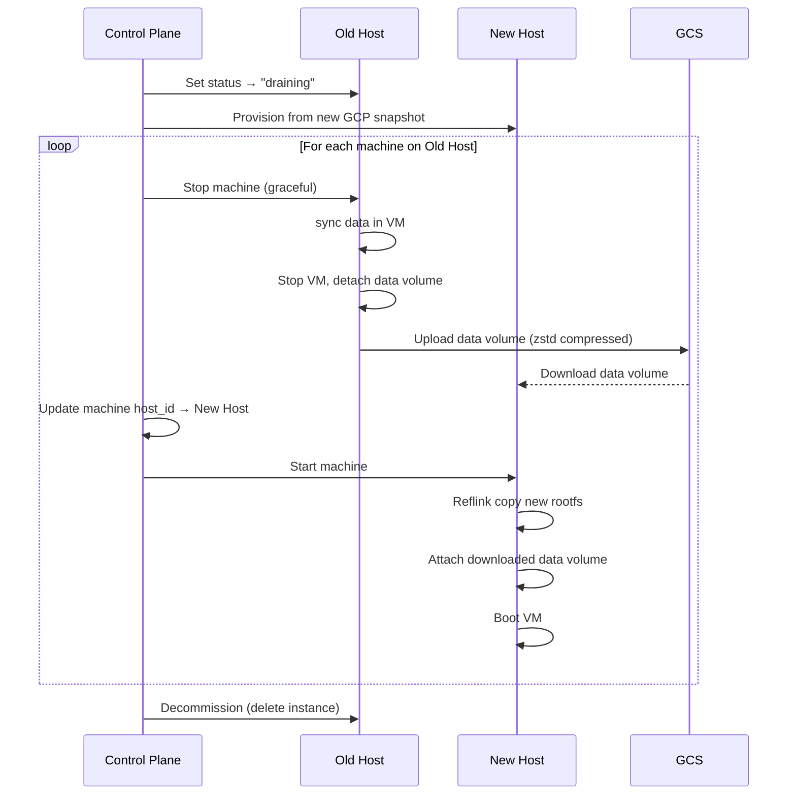
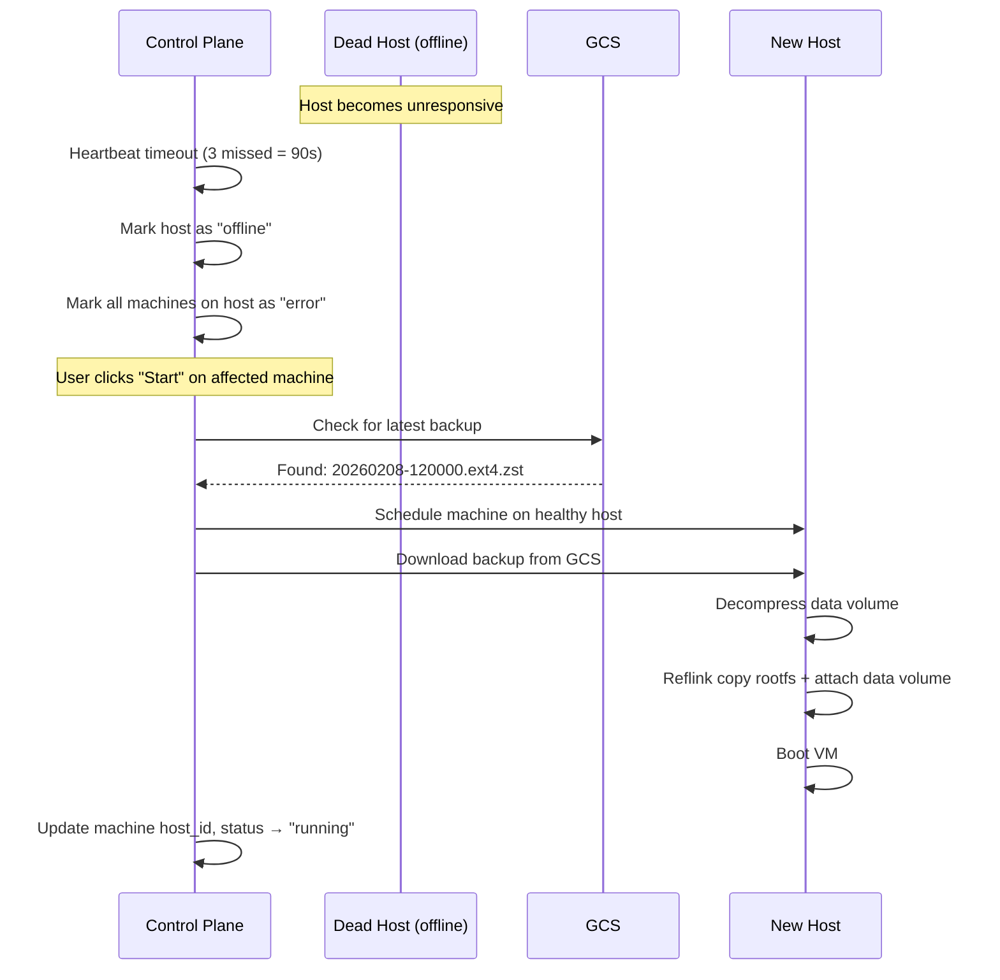
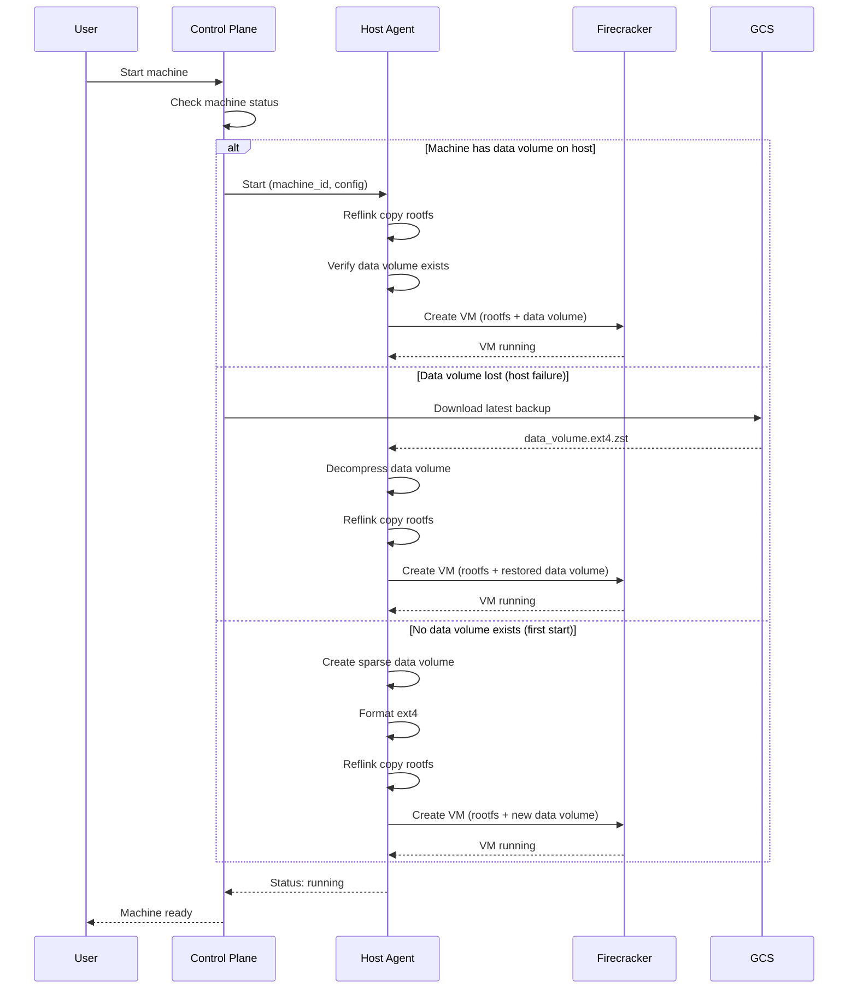
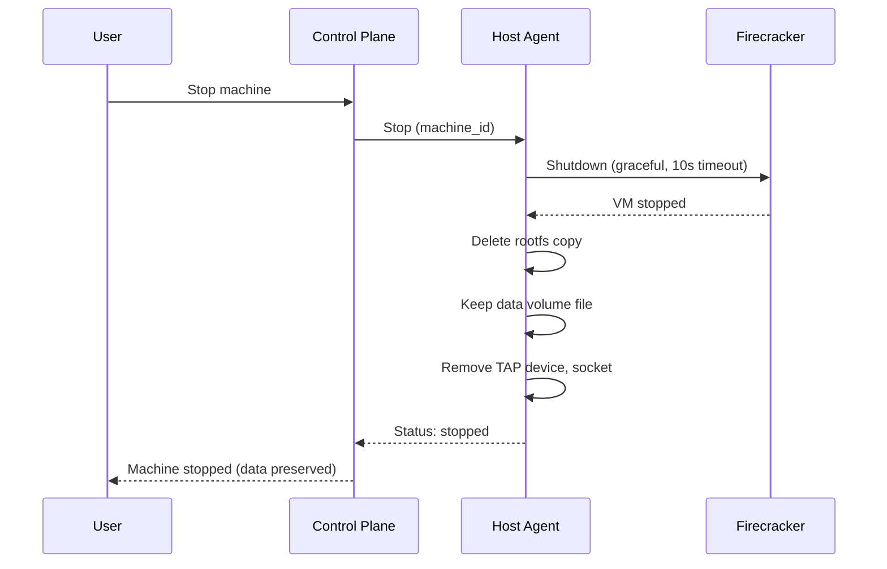
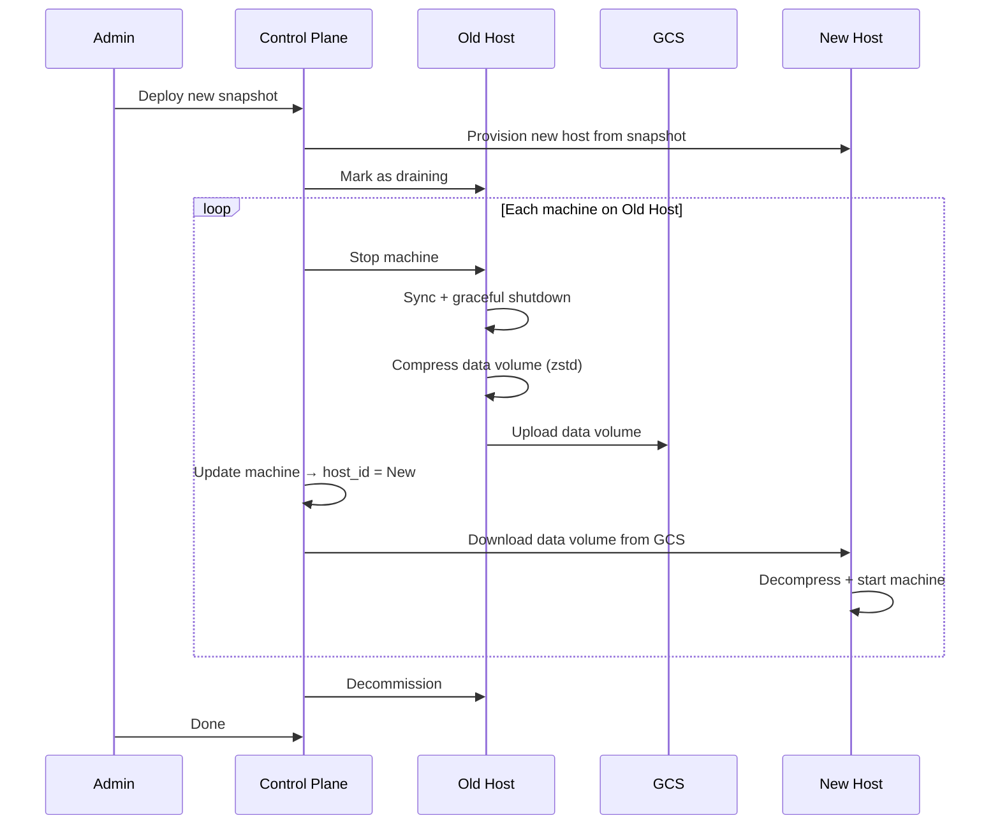

# VM Persistence Model

Design document for how MicroVM data is persisted, backed up, migrated between hosts, and recovered after failure.

---

## Problem Statement

Today, OpenClaw Machines has **zero data persistence**:

| Problem | Current Behavior | Code Reference |
|---------|-----------------|----------------|
| Stop = destroy | `orchestrator.Destroy()` calls `os.Remove(rootfsPath)` — all user data deleted | `firecracker_linux.go:384` |
| No data volume | Everything lives on a single rootfs ext4 (~3GB). No separate partition | `firecracker_linux.go:173-178` (single drive) |
| No snapshots | No Firecracker snapshot/restore. Every start is a cold boot from base image | `firecracker_linux.go:218` (always `machine.Start`) |
| No host failure recovery | `loadState()` kills and cleans up ALL surviving VMs on agent restart | `firecracker_linux.go:437-443` |
| No migration | Machines cannot move between hosts. Tied to wherever scheduler placed them | No migration code exists |
| Host updates destroy everything | New GCP snapshot = new host VMs = all running machines must be recreated | Snapshot skill rebuilds entire host |

A user who installs OpenClaw skills, configures browser profiles, saves files, or builds up agent memory loses **everything** when their machine stops, errors, or the host is updated.

---

## Architecture Overview

```
Before (current):
  Host VM
  +-- /var/lib/ocm/images/rootfs.ext4     (base, shared)
  +-- /var/lib/ocm/vms/{id}.ext4          (reflink copy, deleted on stop)

After (proposed):
  Host VM
  +-- /var/lib/ocm/images/rootfs.ext4     (base, shared, ephemeral)
  +-- /var/lib/ocm/vms/{id}.ext4          (reflink copy, deleted on stop)
  +-- /var/lib/ocm/data/{id}.ext4         (persistent data volume, survives stop)
  +-- /var/lib/ocm/snapshots/{id}/        (Firecracker snapshot files, for suspend)

  GCS (backup)
  +-- gs://ocm-data-volumes/{account}/{machine}/{timestamp}.ext4.zst
```

Three layers of persistence:

1. **Data volumes** — persistent second block device per VM, survives stop/start cycles
2. **GCS backups** — periodic backup of data volumes, survives host failure
3. **Firecracker snapshots** — memory + CPU state for instant resume of idle machines

---

## 1. Separate Data Volume

Each VM gets two block devices:

| Device | Mount | Purpose | Lifecycle |
|--------|-------|---------|-----------|
| `/dev/vda` (rootfs) | `/` | OS, packages, system config | Ephemeral — reflink copy, deleted on stop |
| `/dev/vdb` (data) | `/data` | User files, skills, configs, browser profiles, agent memory | Persistent — survives stop/start |

### Why separate volumes?

- Rootfs can be upgraded (new base image) without touching user data
- Data volume size is independent of rootfs size
- Backups only need to capture the data volume (smaller, faster)
- Failed rootfs doesn't corrupt user data

### Sizing

- **Default:** 5 GB sparse file
- **Configurable:** `data_volume_gb` field on machine creation (grow-only resize supported)
- **Format:** ext4 with 1% reserved blocks (`mkfs.ext4 -m 1`)

**Why sparse files:** A 5GB sparse file on XFS consumes near-zero actual disk until data is written. `truncate -s 5G data.ext4` creates a file that appears as 5GB but uses 0 bytes. As the user writes data, only the written blocks consume real disk space.

### Firecracker configuration

```go
Drives: []models.Drive{
    {
        DriveID:      firecracker.String("rootfs"),
        PathOnHost:   firecracker.String(vmRootfs),
        IsRootDevice: firecracker.Bool(true),
        IsReadOnly:   firecracker.Bool(false),
    },
    {
        DriveID:      firecracker.String("data"),
        PathOnHost:   firecracker.String(dataVolumePath),
        IsRootDevice: firecracker.Bool(false),
        IsReadOnly:   firecracker.Bool(false),
    },
},
```

Firecracker supports up to ~30 block devices. Adding a second drive requires no special configuration — the guest sees it as `/dev/vdb`.

---

## 2. Data Volume Lifecycle



### Event-by-event behavior

| Event | Rootfs | Data Volume | Notes |
|-------|--------|-------------|-------|
| **Machine create** | — | Create sparse ext4 file | `truncate -s {size}G`, `mkfs.ext4 -m 1` |
| **Machine start** | Reflink copy from base | Attach as `/dev/vdb` | Init script mounts at `/data` |
| **Machine stop** | Delete reflink copy | Detach, keep on host disk | Data volume file untouched |
| **Machine restart** | New reflink copy | Re-attach same file | Fresh OS, same data |
| **Machine delete** | — | Delete data volume file | Also delete GCS backups |
| **Host failure** | Lost | Restore from latest GCS backup | Up to 6 hours of data loss |
| **Host upgrade** | Recreated from new base | Migrated to new host | Zero data loss |

---

## 3. Init Script: Mounting the Data Volume

On first boot, the init script detects `/dev/vdb`, formats it if unformatted, and mounts it:

```bash
# In init-openclaw.sh, after existing mounts

# Mount persistent data volume
if [ -b /dev/vdb ]; then
    # First boot: format if no filesystem detected
    if ! blkid /dev/vdb >/dev/null 2>&1; then
        echo "init: formatting data volume..."
        mkfs.ext4 -m 1 -q /dev/vdb
    fi

    mkdir -p /data
    mount /dev/vdb /data

    # Create standard directories on data volume
    mkdir -p /data/home/openclaw
    mkdir -p /data/workspace
    mkdir -p /data/browser-profile

    # Symlink user home to data volume
    # This makes ~/.openclaw/, installed skills, etc. persistent
    rm -rf /home/openclaw
    ln -sf /data/home/openclaw /home/openclaw

    # Symlink workspace
    rm -rf /workspace
    ln -sf /data/workspace /workspace

    echo "init: data volume mounted at /data ($(df -h /data | tail -1 | awk '{print $3}') used)"
else
    echo "init: WARNING - no data volume detected, running without persistence"
fi
```

**What persists automatically via symlinks:**

| Path | Symlinked to | Contents |
|------|-------------|----------|
| `/home/openclaw` | `/data/home/openclaw` | `.openclaw/` (agent state, SQLite), `.local/`, installed skills |
| `/workspace` | `/data/workspace` | User files, projects |
| `/data/browser-profile` | (direct) | Playwright browser sessions, cookies |

**What doesn't persist (by design):**

- System packages (reinstalled from base image)
- `/tmp`, `/run` (tmpfs)
- System configs in `/etc` (rebuilt from init script)
- Process state, open connections (use Firecracker snapshots for these)

---

## 4. Backup Strategy

### Goal

Protect against host failure. Accept up to 6 hours of data loss (RPO = 6h) in exchange for minimal cost and performance impact.

### Mechanism



### Configuration

| Parameter | Value | Rationale |
|-----------|-------|-----------|
| Frequency | Every 6 hours | Balance between data safety and cost |
| Retention | Last 3 backups (18h) | Enough to recover from corruption + host failure |
| Compression | zstd (level 3) | Fast, 2-3x compression on typical ext4 data |
| Storage | GCS Standard | $0.020/GB/mo, sufficient for backup |
| Pause duration | < 1 second | Just long enough to `cp` the file (CoW on XFS) |

### GCS bucket structure

```
gs://ocm-data-volumes/
  {account_id}/
    {machine_id}/
      20260208-120000.ext4.zst    (latest)
      20260208-060000.ext4.zst
      20260208-000000.ext4.zst
```

### Cost estimate

- 5GB data volume, 50% full → ~2.5GB raw → ~1GB compressed
- 3 copies per machine → 3GB per machine
- 100 machines → 300GB = **$6/mo** in GCS storage
- Upload bandwidth: GCS ingress is free within GCP

---

## 5. Firecracker Snapshots (Suspend/Resume)

### Goal

Free host resources (RAM, CPU) for idle machines while providing instant resume when the user returns.

### How Firecracker snapshots work

1. **Pause** the VM via the Firecracker API (`PATCH /vm` with `state: Paused`)
2. **Create snapshot** via `PUT /snapshot/create` — writes memory state + device state to files
3. **Kill** the Firecracker process — frees all host resources
4. **Resume** later via `PUT /snapshot/load` — restores VM in < 10ms

Snapshot files:
- `vmstate.bin` — CPU registers, device state (~1 MB)
- `mem.bin` — full memory contents (= configured memory size, e.g. 2GB)
- Block devices stay in place (already on disk)

### Lifecycle



### Configuration

| Parameter | Value | Notes |
|-----------|-------|-------|
| Idle timeout | 30 minutes | No active WebSocket/terminal connections |
| Snapshot location | `/var/lib/ocm/snapshots/{id}/` | On host disk (XFS scratch) |
| Resume time | < 10ms | Firecracker documented performance |
| Memory footprint when suspended | 0 (process killed) | Only disk space for snapshot files |

### Oversubscription

A host with 16GB RAM and 2GB per machine:
- **Without suspend:** 8 machines max
- **With suspend:** 20+ machines (most suspended), 8 active at any time

Suspended machines consume only disk space (memory snapshot + data volume), not RAM or CPU.

### What snapshots do NOT provide

- **Host failure recovery** — snapshot files are on host disk, lost if host dies
- **Host migration** — memory snapshots are host-specific (CPU model dependent)
- **Long-term state** — use data volumes + GCS backups for durable persistence

---

## 6. Host Upgrades (Rolling Migration)

When deploying a new GCP snapshot (new agent binary, new rootfs, kernel updates):



### Drain mode

Add a `draining` flag to the hosts table:

- **Scheduler:** Skip hosts where `draining = true` for new machine placements
- **Existing machines:** Continue running on draining host until migrated
- **Migration order:** Migrate stopped machines first (no downtime), then running machines

### Migration via GCS (not direct SCP)

Using GCS as an intermediary instead of `gcloud compute scp` between hosts:

- GCS handles retries, resumable uploads, integrity checks
- No need for SSH keys between host VMs
- Same mechanism as backup/restore, less code to maintain
- Slightly slower (upload + download vs. direct copy), but more reliable

### Downtime per machine during migration

| Step | Duration | Notes |
|------|----------|-------|
| Graceful stop | ~5s | Sync + shutdown |
| Compress + upload data volume | 30-120s | Depends on data size |
| Download on new host | 20-60s | GCS to same-region VM |
| Boot on new host | ~5s | Reflink copy + Firecracker boot |
| **Total** | **~1-3 minutes** | Per machine |

For machines that are already stopped: only the data transfer step applies (~30-120s, invisible to user).

---

## 7. Host Failure Recovery

When a host VM dies unexpectedly (hardware failure, preemption, kernel panic):



### Failure detection

The control plane already polls host agents for heartbeats. Add:

- **Heartbeat interval:** 30 seconds (existing)
- **Failure threshold:** 3 missed heartbeats (90 seconds)
- **Action:** Mark host `status = 'offline'`, mark all machines as `status = 'error'`

### Recovery modes

| Scenario | Data Loss | User Action Required |
|----------|-----------|---------------------|
| Latest backup exists (< 6h old) | Up to 6 hours | Click "Start" → auto-recovers |
| No backup exists (new machine) | Everything | Click "Start" → starts fresh |
| Machine was suspended (snapshot on dead host) | Snapshot lost, data volume from backup | Click "Start" → resumes from backup, not snapshot |

### Automatic vs. manual recovery

Start with **manual recovery** (user clicks "Start"):
- Simpler to implement
- User is aware of the recovery event
- No surprise costs from auto-recovery

Future: automatic recovery for machines flagged as "always on" (e.g., monitoring agents, cron-based agents).

---

## 8. Disk Space Planning

### Per-host budget

| Component | Size | Actual Disk | Notes |
|-----------|------|-------------|-------|
| Boot disk | 30 GB | 30 GB | OS, agent binary, kernel, Docker |
| Scratch disk (XFS) | 200 GB | 200 GB | All VM data below |
| Base rootfs | 3 GB | 3 GB | Single copy, shared via reflink |
| Per-VM rootfs (×10) | 3 GB apparent | < 1 GB total | CoW reflink, only divergent blocks use space |
| Per-VM data volume (×10) | 5 GB apparent | ~15 GB total | Sparse, assume 30% avg utilization |
| Per-VM snapshot (×6 suspended) | 2 GB each | 12 GB | Only for suspended VMs |
| Backup staging (temp) | 5 GB | 5 GB | Compressed copy during upload |
| **Total** | | **~36 GB** | Out of 200 GB scratch |

**Capacity:** A 200 GB scratch disk comfortably handles **20 machines** with room for growth.

### Monitoring

The agent should report disk utilization metrics:
- Total scratch disk usage (%)
- Per-machine data volume actual size (not apparent)
- Number of active vs. suspended VMs
- Backup queue depth

The control plane should refuse new machine placements when scratch disk > 80% utilized.

### Sparse file management

```bash
# Create 5GB sparse data volume (0 bytes actual)
truncate -s 5G /var/lib/ocm/data/{machine_id}.ext4
mkfs.ext4 -m 1 -q /var/lib/ocm/data/{machine_id}.ext4

# Check actual disk usage vs. apparent size
du -sh /var/lib/ocm/data/{machine_id}.ext4    # actual
du -sh --apparent-size /var/lib/ocm/data/{machine_id}.ext4  # apparent

# Grow data volume (online resize possible with ext4)
truncate -s 10G /var/lib/ocm/data/{machine_id}.ext4
resize2fs /var/lib/ocm/data/{machine_id}.ext4
```

---

## 9. Database Schema Changes

### New columns on `machines` table

```sql
ALTER TABLE machines ADD COLUMN data_volume_gb INT NOT NULL DEFAULT 5;
ALTER TABLE machines ADD COLUMN last_backup_at TIMESTAMPTZ;
ALTER TABLE machines ADD COLUMN backup_url TEXT;
```

- `data_volume_gb` — user-configurable size (default 5, grow-only)
- `last_backup_at` — timestamp of last successful GCS backup
- `backup_url` — GCS URL of latest backup (for recovery)

### New machine statuses

Current: `stopped`, `provisioning`, `running`, `error`

Add:
- **`suspended`** — VM paused via Firecracker snapshot, data preserved on host. Resumes in < 10ms.
- **`migrating`** — data volume being transferred to new host during upgrade.

### New columns on `hosts` table

```sql
ALTER TABLE hosts ADD COLUMN draining BOOLEAN NOT NULL DEFAULT false;
```

- `draining` — when `true`, scheduler skips this host for new placements. Existing machines continue until migrated.

### Migration file

```sql
-- 00X_persistence.sql

-- Data volume tracking
ALTER TABLE machines ADD COLUMN data_volume_gb INT NOT NULL DEFAULT 5;
ALTER TABLE machines ADD COLUMN last_backup_at TIMESTAMPTZ;
ALTER TABLE machines ADD COLUMN backup_url TEXT;

-- Host drain mode
ALTER TABLE hosts ADD COLUMN draining BOOLEAN NOT NULL DEFAULT false;

-- Index for finding machines that need backup
CREATE INDEX idx_machines_backup ON machines (host_id, status)
    WHERE status = 'running' AND last_backup_at < NOW() - INTERVAL '6 hours';
```

---

## 10. Orchestrator Changes (Overview)

Not implementation-ready code — just an outline of the changes needed in `firecracker_linux.go`:

### Create

```
1. Create sparse data volume file (truncate + mkfs.ext4)
2. Reflink copy rootfs (existing)
3. Add data volume as second drive in Firecracker config
4. Start VM (existing)
```

### Stop (new — currently only Destroy exists)

```
1. Graceful shutdown VM (existing shutdown logic)
2. Delete rootfs copy (existing)
3. Keep data volume file on disk
4. Remove TAP, socket (existing)
5. Save state with data volume path
```

### Start (for stopped machine with existing data volume)

```
1. Reflink copy rootfs (existing)
2. Verify data volume file exists
3. Configure Firecracker with both drives
4. Start VM
```

### Destroy (modified)

```
1. Graceful shutdown VM (existing)
2. Delete rootfs copy (existing)
3. Delete data volume file (NEW)
4. Delete GCS backups (NEW, async)
5. Clean up TAP, socket (existing)
```

### Suspend (new)

```
1. Pause VM (PATCH /vm state=Paused)
2. Create Firecracker snapshot (PUT /snapshot/create)
3. Kill Firecracker process
4. Keep rootfs + data volume + snapshot files on disk
5. Update status → "suspended"
```

### Resume (new)

```
1. Load Firecracker snapshot (PUT /snapshot/load)
2. Resume VM
3. Update status → "running"
```

### Backup (new background goroutine)

```
Every 6 hours for each running VM:
1. Execute sync inside VM (via SSH or vsock)
2. Pause VM briefly
3. cp --reflink=auto data volume → staging area
4. Resume VM
5. zstd compress staged file
6. Upload to GCS
7. Update DB (last_backup_at, backup_url)
8. Delete old backups (keep 3)
9. Clean up staging file
```

---

## 11. Sequence Diagrams

### Machine Start (with persistence)



### Machine Stop (preserving data)



### Host Upgrade (rolling migration)



---

## Open Questions

1. **vsock vs. SSH for in-VM commands** — backup needs to run `sync` inside the VM before snapshotting. vsock (Firecracker-native) is cleaner than SSH but requires a vsock agent in the guest. Initial implementation could use SSH via the bridge network.

2. **Snapshot compatibility across kernel versions** — Firecracker snapshots are tied to the host kernel and Firecracker version. Snapshots created on one host may not restore on a host with a different kernel. This limits suspend/resume to same-host only (which is the current design).

3. **Data volume encryption** — should data volumes be encrypted at rest? The host's scratch disk could use dm-crypt/LUKS, which would encrypt all data volumes transparently. Per-VM encryption adds complexity but provides stronger isolation.

4. **Automatic recovery for "always on" machines** — cron-based agents and monitoring bots should auto-recover from host failure without user intervention. This requires a background reconciliation loop in the control plane.

5. **Billing for suspended machines** — suspended machines consume disk but not compute. Should they be billed differently? Suggestion: reduced rate (e.g., 20% of running rate) to incentivize suspension over keeping idle machines running.
