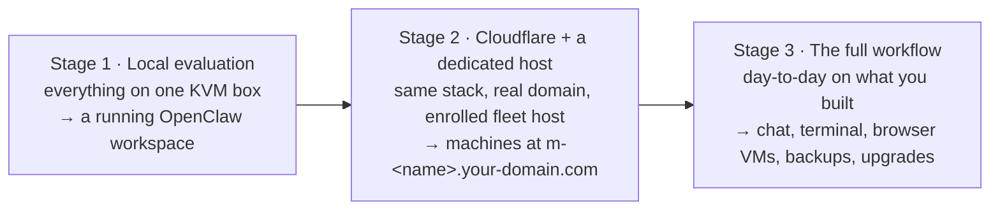
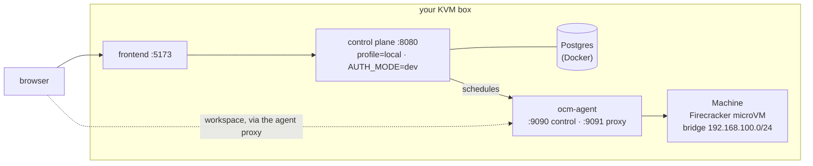
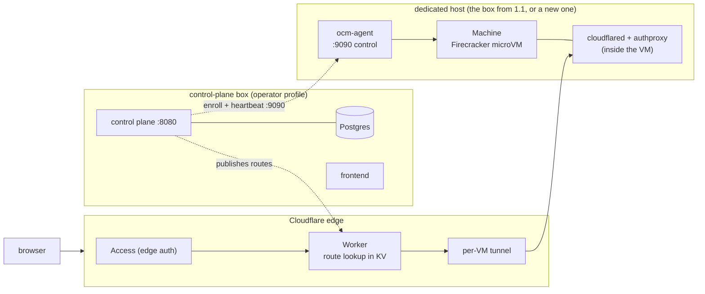
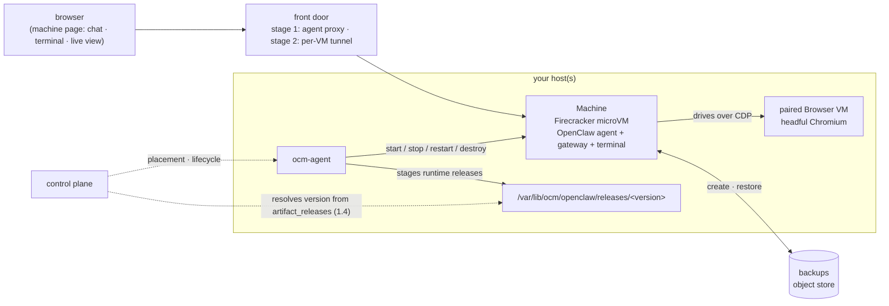

# Getting Started

One stack, grown in **three stages — each ends with something working**, and
each builds on the last:



| Stage | You have | You'll end with |
|---|---|---|
| [1 — Local evaluation](#stage-1--local-evaluation) | One KVM-capable Linux box (we show how to get one) | The full stack and a **running OpenClaw workspace** in a real Firecracker microVM — no Cloudflare, no domain |
| [2 — Cloudflare + a dedicated host](#stage-2--cloudflare--a-dedicated-host) | A Cloudflare account + a domain + one KVM-capable Linux host | The production-shaped deployment: an enrolled fleet host, machines reachable at **`m-<name>.your-domain.com`** |
| [3 — The full workflow](#stage-3--the-full-workflow) | A stack from stage 1 or 2 | Day-to-day fluency: machines, browser VMs, lifecycle, backups, runtime upgrades |

Stage 1 and stage 2 are independent — you can evaluate locally without ever
touching Cloudflare, or go straight to stage 2. Stage 3 works against either.

> **Where the commands run:** Stage 1 runs on one **KVM-capable Linux host**,
> not on the laptop from which you are reading this guide. Here, “local” means
> that the control plane, frontend, and worker share that one Linux host. GCP is
> only the worked provisioning example; an AWS bare-metal instance, a dedicated
> server, or your own KVM Linux machine works too. A cloud host incurs compute
> charges while running and storage charges until its disks are deleted.

---

## Stage 1 — Local evaluation

**You have:** one KVM-capable Linux box.
**You'll end with:** the entire stack — control plane, frontend, and a
Firecracker worker — on that box, and a **running OpenClaw workspace** in a
real microVM, provisioned by clicking through the web UI. No Cloudflare: the
workspace is reached through the local agent proxy.

**Stage-1 architecture — every component on one box:**



### 1.1 Get a KVM box

Firecracker needs `/dev/kvm` — bare metal, or a VM with **nested
virtualization**. macOS, Windows/WSL, and ordinary cloud VMs won't work. If you
don't already have one:

| Option | What to do | Notes |
|---|---|---|
| **GCP n2** (used in our examples) | `gcloud compute instances create` with `--enable-nested-virtualization` — full command below | n2 supports nested virt out of the box; ~10 minutes to running |
| **AWS** | Any `*.metal` instance (e.g. `c5.metal`), Ubuntu 24.04 | Only metal instances expose KVM |
| **Hetzner** | A dedicated (bare-metal) server, Ubuntu 24.04 | Best price for a permanent host |
| **Your own machine** | Any Linux box/workstation with KVM enabled | `ls /dev/kvm` to check |

The GCP recipe (the same box can later become your stage-2 fleet host):

This assumes the `gcloud` CLI is installed and authenticated, and that
`YOUR_PROJECT` has billing and the Compute Engine API enabled.

> **Charges:** The next command creates a billable `n2-standard-4` VM with a
> 100 GB SSD persistent disk. Compute charges accrue while the VM is running;
> disk and any artifact-storage charges continue until those resources are
> deleted. Use the cleanup command at the end of Stage 1 when finished.

```bash
gcloud compute instances create ocm-eval \
  --project=YOUR_PROJECT --zone=us-central1-b \
  --machine-type=n2-standard-4 \
  --enable-nested-virtualization \
  --image-family=ubuntu-2404-lts-amd64 --image-project=ubuntu-os-cloud \
  --boot-disk-size=100GB --boot-disk-type=pd-ssd
```

Connect to the new host, then run every command in sections 1.2–1.4 inside
that SSH session:

```bash
gcloud compute ssh ocm-eval \
  --project=YOUR_PROJECT --zone=us-central1-b
```

Confirm that the host exposes KVM before installing anything. A fresh image's
login user may not have read/write permission yet; section 1.2 adds that user
to the `kvm` group.

```bash
if test -e /dev/kvm && grep -Eq '(vmx|svm)' /proc/cpuinfo; then
  echo "KVM device and virtualization CPU flags present"
else
  echo "This host does not expose KVM" >&2
  exit 1
fi
ls -l /dev/kvm
```

> If creation fails with `ZONE_RESOURCE_POOL_EXHAUSTED`, that zone is
> temporarily out of `n2` capacity — retry with a different `--zone` (e.g.
> `us-central1-a`, `us-west1-b`) and use that same zone in the SSH and cleanup
> commands below.

### 1.2 Prepare the box

A fresh Ubuntu 24.04 image has none of the developer tools. Install them first:

```bash
sudo apt-get update
# make/docker/git plus the rootfs-build deps (buildx, mkfs.ext4, bsdtar, strings):
sudo apt-get install -y make docker.io docker-buildx git curl jq zstd e2fsprogs libarchive-tools binutils
# Go ≥ 1.25.10 and Node ≥ 20 (adjust for your arch):
curl -sL https://go.dev/dl/go1.26.2.linux-amd64.tar.gz | sudo tar -C /usr/local -xz
echo 'export PATH=$PATH:/usr/local/go/bin' | sudo tee /etc/profile.d/golang.sh
curl -fsSL https://deb.nodesource.com/setup_22.x | sudo bash - && sudo apt-get install -y nodejs
sudo usermod -aG docker,kvm "$USER"   # log out/in for group changes to take effect
```

Disconnect and reconnect so the new `docker` and `kvm` memberships take
effect. For the worked GCP host:

```bash
exit
gcloud compute ssh ocm-eval \
  --project=YOUR_PROJECT --zone=THE_ZONE_YOU_CREATED_IT_IN
test -r /dev/kvm && test -w /dev/kvm && echo "KVM ready"
docker ps >/dev/null && echo "Docker ready"
```

Then clone the repo and check readiness:

```bash
git clone https://github.com/mathaix/OpenClawMachines.git
cd OpenClawMachines
make preflight
```

`make preflight` is read-only: it checks the developer tools (Go ≥ 1.25.10,
Node ≥ 20, Docker), KVM access, Firecracker, and the VM assets, and tells you
exactly what's missing. Two things it will ask for:

- **`firecracker` on PATH and host assets** — first stage a guest kernel, then
  run `scripts/provision-host.sh`, the one-shot installer (Firecracker,
  cloudflared, sysctl tuning, and the **XFS reflink mount** at
  `/var/lib/ocm/vms` — a
  copy-on-write filesystem so each VM's disk is a cheap clone of a shared base
  image):
  ```bash
  # Download the newest kernel tested in Firecracker v1.10 CI. This follows
  # Firecracker's official Getting Started artifact-discovery method.
  ARCH="$(uname -m)"
  FC_VERSION=v1.10.1
  CI_VERSION="${FC_VERSION%.*}"
  KERNEL_KEY="$(curl -fsSL \
    "https://s3.amazonaws.com/spec.ccfc.min/?prefix=firecracker-ci/${CI_VERSION}/${ARCH}/vmlinux-&list-type=2" \
    | grep -oP "(?<=<Key>)(firecracker-ci/${CI_VERSION}/${ARCH}/vmlinux-[0-9]+\.[0-9]+\.[0-9]{1,3})(?=</Key>)" \
    | sort -V | tail -1)"
  test -n "$KERNEL_KEY"
  sudo install -d -m 0755 /var/lib/ocm
  sudo curl -fSL "https://s3.amazonaws.com/spec.ccfc.min/${KERNEL_KEY}" \
    -o /var/lib/ocm/vmlinux
  sudo chmod 0644 /var/lib/ocm/vmlinux

  # The script defaults to a 200 GB VM-state filesystem for fleet hosts.
  # Use 40 GB for this evaluation so the worked 100 GB boot disk retains
  # space for Docker layers, builds, and runtime artifacts.
  sudo OCM_VM_STATE_XFS_SIZE=40G bash scripts/provision-host.sh
  ```
- **VM images** — a guest kernel at `/var/lib/ocm/vmlinux` and a rootfs at
  `/var/lib/ocm/images/rootfs.ext4`.
  - The **kernel** above comes from Firecracker's public CI artifacts. You can
    instead build one per the
    [Firecracker docs](https://github.com/firecracker-microvm/firecracker/blob/main/docs/getting-started.md),
    or put `vmlinux` in your artifact bucket for fleet provisioning.
  - **Build the rootfs from source** — this is the recommended path for local
    evaluation: it bakes in this repo's `scripts/init-openclaw.sh` (which boots
    correctly in the no-tunnel local profile) and needs no artifact bucket.
    Needs Docker **with the buildx plugin** (`docker buildx version`),
    `mkfs.ext4`, and `bsdtar` — all installed in the toolchain step above.
    ```bash
    make install-vm-binaries   # authproxy, ocm-secrets, ocmptyd — baked into the image
    make build-rootfs          # ~10 min; writes /var/lib/ocm/images/rootfs.ext4
    ```
  Pulling a prebuilt rootfs from a bucket you populate is the alternative — see
  the [Artifacts](#artifacts) section (read it once now; everything else refers
  back to it).

### 1.3 Bring the stack up

One script stands up Postgres (Docker), migrations, the control plane (`local`
profile, dev auth — you're auto-logged-in as `dev@localhost`), the frontend,
and then builds, registers, and starts a local Firecracker worker whose first
heartbeat flips the host to `ready`:

```bash
scripts/local-e2e-firecracker.sh up
scripts/local-e2e-firecracker.sh status   # component health + host/machine status
```

On a fresh host, the first `up` also downloads and compiles the control plane's
Go dependencies. If that cold build exceeds the script's 90-second readiness
window, inspect `/tmp/ocm-local-e2e/backend.log` and rerun `up`; the downloaded
dependencies are cached, so the second launch should be fast. A real startup
failure remains visible in that same log.

### 1.4 Boot a machine to a running workspace

The control plane resolves which OpenClaw runtime version a machine gets from
the **`artifact_releases`** table (one row per published artifact version), via
a resolver behind the `FF_RUNTIME_VERSION_RESOLVER=1` flag — the bring-up
script's env sets the flag; what's left is staging a runtime release on the
host and registering its row. The exact steps (extract the runtime tarball
under `/var/lib/ocm/openclaw/releases/<version>`, add its `manifest.json`, and
insert the `artifact_releases` row) follow. The example uses this checkout's
tested OpenClaw pin from `versions.json`; set `OPENCLAW_VERSION` explicitly if
you are intentionally publishing a different operator-controlled version.

```bash
export OPENCLAW_VERSION="$(jq -r '.openclaw' versions.json)"
export RELEASE_VERSION="v${OPENCLAW_VERSION}"
export ARTIFACT="/var/lib/ocm/openclaw-artifacts/openclaw-${RELEASE_VERSION}-linux-amd64.tar.zst"
export RELEASE_DIR="/var/lib/ocm/openclaw/releases/${RELEASE_VERSION}"

bash scripts/build-opik-plugin.sh  # fetches the pinned plugin tarball required by the runtime build
sudo install -d -o "$USER" -g "$USER" -m 0755 /var/lib/ocm/openclaw-artifacts
OPENCLAW_VERSION="$OPENCLAW_VERSION" make build-openclaw
export ARTIFACT_SHA256="$(sha256sum "$ARTIFACT" | awk '{print $1}')"

sudo install -d -m 0755 "$RELEASE_DIR"
zstd -dc "$ARTIFACT" | sudo tar -xf - -C "$RELEASE_DIR"
sudo tee "$RELEASE_DIR/manifest.json" >/dev/null <<EOF
{
  "version": "${RELEASE_VERSION}",
  "channel": "stable",
  "artifact_url": "${ARTIFACT}",
  "compression": "zstd",
  "sha256": "${ARTIFACT_SHA256}",
  "runtime": {
    "entrypoint_relpath": "bin/openclaw",
    "bundled_plugins_relpath": "node_modules/openclaw/dist/extensions"
  }
}
EOF

docker exec -i ocm-postgres psql -v ON_ERROR_STOP=1 -U ocm -d ocm \
  -v version="$RELEASE_VERSION" -v url="$ARTIFACT" -v sha="$ARTIFACT_SHA256" <<'SQL'
INSERT INTO artifact_releases (kind, version, channel, url, sha256)
VALUES ('openclaw', :'version', 'stable', :'url', :'sha')
ON CONFLICT (kind, version) DO UPDATE
SET channel = EXCLUDED.channel, url = EXCLUDED.url, sha256 = EXCLUDED.sha256;
SQL
```

The deeper explanation, including why the runtime is staged separately from
the rootfs, is in
[local-firecracker-e2e.md](local-firecracker-e2e.md#reaching-a-running-workspace-openclaw-gateway-up).

Then open `http://localhost:5173/dashboard` → **New Machine** → choose
**OpenClaw**, a size, and region **External** → **Create**. Creation submits
`auto_start`, so there is no separate Start step. The control plane places the
machine on your local host, and the agent boots a Firecracker microVM
(`allocating → rootfs → network → booting → booted`), and the in-VM gateway
comes up.

Use that exact `localhost:5173` origin for local Workspace testing. The local
data-plane fallback and WebSocket origin checks intentionally key on
`localhost`; `127.0.0.1` or a different forwarded port is not equivalent.

The current automated smoke covers create/auto-start, `running`, stop, and
delete, but intentionally does not open the workspace. Run it with:

```bash
cd frontend && PLAYWRIGHT_BASE_URL=http://localhost:5173 \
  npx playwright test e2e/spot-smoke.spec.ts --project=chromium-dev
```

For the stage checkpoint, open **Workspace** from the running machine and
verify that **Logs** and **Shell** both show `connected`. In Shell, verify the
in-VM gateway itself:

```bash
curl -sf http://127.0.0.1:18789/health >/dev/null && echo GATEWAY_OK
```

Expect `GATEWAY_OK`. In the local profile the header's **Gateway** badge can
still say `unreachable`: that badge uses a data-plane-only health route which
the local control-plane fallback does not expose. Connected logs plus the
shell health check are the Stage-1 proof. This manual check is required until
the full workspace Playwright spec is updated to the current modal and
auto-start UI.

This checkpoint proves that the VM and OpenClaw gateway are running; it does
**not** prove that an AI model is connected. Model credentials, default-model
selection, and a real chat response are the first Stage-3 checkpoint below.

The `chromium-dev` project targets the `AUTH_MODE=dev` stack (no login form,
uses the system Chrome channel); run `npx playwright install chrome` once if
it is not already present.

**Checkpoint — you should see this** (machine `running`, workspace streaming):


That workspace — chat, terminal, logs — is exactly what stage 3 is about.
Tear down anytime with `scripts/local-e2e-firecracker.sh down`.

If you created the worked GCP host and do not intend to reuse it for Stage 2,
delete it to stop compute and boot-disk charges:

```bash
gcloud compute instances delete ocm-eval \
  --project=YOUR_PROJECT --zone=us-central1-b
```

---

## Stage 2 — Cloudflare + a dedicated host

**You have:** a Cloudflare account, a domain (zone) you control, and a
KVM-capable host (the stage-1 box works, or create a fresh one with the same
recipes).
**You'll end with:** the production-shaped deployment — an `operator`-profile
control plane, the Cloudflare data plane, and a dedicated host enrolled into
your fleet. Machines become reachable at `m-<name>.your-domain.com` from
anywhere.

> **You must provision the KVM host.** OCM does not create Stage-2 compute for
> you. Reuse the Stage-1 host or provision a KVM-capable Linux machine before
> enrollment. The GCP commands in 2.3 are one worked example, not a GCP
> requirement, and they create billable resources.

Same stack as stage 1 — what changes is the front door and where the worker
lives:

**Stage-2 architecture — the same components, split apart: Cloudflare becomes
the front door, the worker moves to a dedicated host:**



The host-onboarding path is **the same on every provider** (GCP, AWS, Hetzner,
bare metal): bring a KVM-capable Linux box, install dependencies, **enroll**
it. (One-click auto-provisioning per cloud is tracked in
[#11](https://github.com/mathaix/OpenClawMachines/issues/11).)

### 2.1 Cloudflare: zone, Worker, KV

The data plane uses Cloudflare for edge auth and a **per-VM tunnel**, so each
machine gets its own subdomain without exposing VM services on your host. The
current control plane still needs network access to the agent's authenticated
control API on port `9090`; use a private network when possible, or restrict a
public firewall rule to the control plane's egress CIDR. Never expose the
workspace proxy on `9091` directly. You configure the account-level pieces
**once**; from then on the control plane mints each
machine's tunnel + DNS record and publishes its route to KV automatically on
start (and tears them down on stop) — you never create per-machine tunnels by
hand.

1. A **Cloudflare account** and a **domain (zone)** you control (your
   `DATA_PLANE_DOMAIN`, e.g. `example.com`). Machines get `m-<slug>.example.com`.
   Grab your **Account ID** and **Zone ID** from the zone's Overview page.

2. An **API token** the control plane uses at runtime to manage tunnels, DNS,
   and route KV. Create it at **My Profile → API Tokens → Create Token → Custom
   token** with exactly these permission groups:

   | Permission group | Scope | Used for |
   |---|---|---|
   | **Account · Cloudflare Tunnel · Edit** | your account | create/configure/delete per-VM tunnels |
   | **Account · Workers KV Storage · Edit** | your account | publish/expire machine routes in the `OCM_ROUTES` namespace |
   | **Zone · DNS · Edit** | your zone | create/delete the `m-<slug>` DNS records |
   | **Zone · Zone · Read** | your zone | resolve the zone |

   This token is `CLOUDFLARE_API_TOKEN` (§2.2). (The one-time Worker/KV commands
   below authenticate separately via `wrangler login`; if you'd rather script
   them with a token, that token additionally needs **Account · Workers Scripts ·
   Edit**.)

3. The Worker + KV pieces (log in first with `npx wrangler login`):
   ```bash
   cd worker
   npx wrangler kv namespace create OCM_ROUTES   # route-lookup KV namespace
   ```
   Then edit `worker/wrangler.toml`:
   - replace `replace-with-operator-kv-namespace-id` under the `OCM_ROUTES`
     binding with the returned namespace **id** (use the same id for
     `CLOUDFLARE_KV_NAMESPACE_ID` in §2.2);
   - set `BASE_DOMAIN` to your domain and `FRONTEND_ORIGIN_HOST` /
     `BACKEND_ORIGIN_HOST` to origin hostnames **outside** the Worker route (so
     the Worker's API/resolve fallback doesn't loop back on itself);
   - remove the `SEO_CACHE` KV block and `[browser]` block unless you are also
     deploying the optional hosted-site bot prerenderer. They are not required
     for machine routing. If retained, create a second KV namespace and replace
     `replace-with-operator-seo-cache-id`; Browser Rendering must also be enabled
     for the Cloudflare account.

   set the Worker secrets and deploy:
   ```bash
   npx wrangler secret put JWT_SECRET             # same value as the backend
   npx wrangler secret put CF_SERVICE_TOKEN_ID    # for /internal/resolve
   npx wrangler secret put CF_SERVICE_TOKEN_SECRET
   npx wrangler deploy
   ```
   Finally, attach the Worker to your zone so machine subdomains hit it —
   **Cloudflare dashboard → Workers Routes** (or a `routes` entry), pattern
   `*.<your-domain>/*`. Route entries aren't in `wrangler.toml`.

4. Add **proxied DNS coverage for account hostnames**, such as a proxied
   wildcard record for `*.<your-domain>` on a dedicated data-plane domain, or
   one proxied record per `{account-slug}.<your-domain>`. A Worker route does
   not create DNS: without a matching proxied DNS record the account hostname
   returns `NXDOMAIN` and the Worker never runs. Point the record at an origin
   you control; the Worker route handles matching requests before that origin.
   Do not replace an existing wildcard record without understanding what else
   uses it. The control plane separately creates and deletes the `m-*` and
   `ssh-*` machine records.

**Checkpoint:** confirm the deployed Worker has the same `JWT_SECRET` as the
backend, the `OCM_ROUTES` binding, the intended `BASE_DOMAIN`, and the wildcard
route. Resolve a real account hostname in DNS. An unauthenticated request to it
must be rejected; after a machine starts, its authenticated gateway and
terminal WebSockets must connect through that account hostname.

For **edge authentication** (`AUTH_MODE=cfaccess`) you also create a Cloudflare
Access application over your control-plane/API hostnames — the exact steps
(hostnames to cover, policy, where the AUD tag comes from) and the Firebase
alternative are in
[self-hosted-control-plane.md](self-hosted-control-plane.md#cloudflare).

### 2.2 Configure and run the control plane

```bash
cp docs/self-hosted.env.example .env
```

Required for the host-enrollment + machine flow:

| Variable | What it is |
|---|---|
| `CONTROL_PLANE_PROFILE` | `operator` |
| `DATABASE_URL` | Postgres connection string |
| `BACKEND_URL` | **Public HTTPS URL** of the control plane — the host must reach this |
| `DATA_PLANE_DOMAIN` | Your Cloudflare zone, e.g. `example.com` |
| `AUTH_MODE` | `firebase` or `cfaccess` (or `dev` + `OCM_ALLOW_DEV_AUTH=1` for evaluation) |
| `SECRET_ENCRYPTION_KEY` | Exactly 32 bytes — `openssl rand -hex 16` |
| `FC_AGENT_TOKEN` | Shared control-plane ↔ agent token — `openssl rand -hex 32` |
| `CLOUDFLARE_API_TOKEN` / `CLOUDFLARE_ACCOUNT_ID` / `CLOUDFLARE_ZONE_ID` | from 2.1 |
| `CLOUDFLARE_KV_NAMESPACE_ID` | the `OCM_ROUTES` namespace id from 2.1 |
| `OCM_ADMIN_EMAILS` | comma-separated admin emails (who can manage hosts) |
| `OCM_ARTIFACT_BUCKET` | bucket used by `provision-host.sh` for the guest kernel and browser assets — see [Artifacts](#artifacts) |
| `AGENT_GCS_MANIFEST` | `gs://YOUR-ARTIFACT-BUCKET/agent/manifest.json`; returned to the enrollment installer |
| `ROOTFS_GCS_MANIFEST` | `gs://YOUR-ARTIFACT-BUCKET/rootfs/manifest.json`; returned to the enrolled agent |
| `OPENCLAW_GCS_MANIFEST` | `gs://YOUR-ARTIFACT-BUCKET/openclaw/releases/{version}/manifest.json`; `{version}` is substituted at runtime |
| `WORKSPACE_INTEGRATIONS_API_URL` | optional; leave blank to derive from `BACKEND_URL` |
| `GOOGLE_WORKSPACE_OAUTH_CLIENT_ID` / `GOOGLE_WORKSPACE_OAUTH_CLIENT_SECRET` | optional; set when enabling Google Workspace integrations |

Frontend env (`frontend/.env.local`) must include `VITE_OCM_ADMIN_EMAILS` with
the **same** admin email(s), or the admin UI won't show. (Backend
`OCM_ADMIN_EMAILS` is the real gate; the frontend var only controls UI
visibility.)

Run it — for evaluation, the local helpers:

```bash
make local-postgres   # Dockerized Postgres
make local-migrate    # schema migrations
make backend          # go run ./cmd/server  (:8080)
make frontend         # Vite dev server      (:5173, proxies /api → :8080)
```

For a real deployment, build and run the binary behind HTTPS so `BACKEND_URL`
is publicly reachable: `make build-server && ./backend/server`. Confirm with
`make status` (checks `:8080/health`).

See [control-plane-profiles.md](control-plane-profiles.md) for every variable.

> **Local Vite is only a control-plane check.** On a literal `localhost`
> hostname the frontend intentionally uses its control-plane fallback, even
> when `VITE_DATA_PLANE_DOMAIN` is set. It therefore does not prove the Worker,
> KV, account DNS, or per-machine tunnel. For the Stage-2 checkpoint, use the
> deployed frontend on the operator domain or open the generated account-domain
> machine URL directly.

### 2.3 Create the host

Same acquisition table as [1.1](#11-get-a-kvm-box) — for the worked example, a
GCP n2 named `ocm-host-1`, plus the agent control port:

> **Charges:** The commands below create another billable GCP VM and SSD
> persistent disk, plus a firewall rule. Compute charges accrue while the VM is
> running, and disk charges continue until the disk is deleted. Reuse the
> Stage-1 host if appropriate, or delete unused resources when finished.

```bash
gcloud compute instances create ocm-host-1 \
  --project=YOUR_PROJECT --zone=us-central1-b \
  --machine-type=n2-standard-4 \
  --enable-nested-virtualization \
  --image-family=ubuntu-2404-lts-amd64 --image-project=ubuntu-os-cloud \
  --boot-disk-size=100GB --boot-disk-type=pd-ssd

# the per-VM tunnel is outbound-only, but the control plane health-checks the
# agent on :9090
gcloud compute firewall-rules create ocm-agent-9090 \
  --project=YOUR_PROJECT --network=default \
  --allow=tcp:9090 --target-tags=ocm-agent \
  --source-ranges=YOUR_CONTROL_PLANE_EGRESS_CIDR
gcloud compute instances add-tags ocm-host-1 --tags=ocm-agent \
  --project=YOUR_PROJECT --zone=us-central1-b
```

`YOUR_CONTROL_PLANE_EGRESS_CIDR` must be the narrow public CIDR from which your
control plane calls agents (for a single static IPv4 address, use `/32`). If
the control plane and host share private networking, use the private CIDR and
do not create a public ingress rule. If machine start waits and then returns to
`stopped`, verify that the control-plane host can reach the agent on `:9090`;
host enrollment and heartbeat alone do not prove this control path.

Install the host dependencies (same `provision-host.sh` as stage 1.2):

```bash
gcloud compute scp scripts/provision-host.sh ocm-host-1:~ \
  --project=YOUR_PROJECT --zone=us-central1-b
gcloud compute ssh ocm-host-1 --project=YOUR_PROJECT --zone=us-central1-b --command \
  'sudo OCM_ARTIFACT_BUCKET=gs://YOUR-ARTIFACT-BUCKET OCM_VM_STATE_XFS_SIZE=40G bash ~/provision-host.sh'
```

The 40 GB VM-state filesystem matches this single-host, 100 GB worked example.
For a fleet host, size the boot disk or attach a dedicated XFS volume for your
machine capacity; `provision-host.sh` otherwise defaults to a 200 GB logical
VM-state filesystem.

### 2.4 Enroll it into your fleet

In the UI: log in as an `OCM_ADMIN_EMAILS` admin → **Admin → Hosts → Enroll
Host** → Generate token. The wizard gives you a one-line install command —
run it on the host:

```bash
gcloud compute ssh ocm-host-1 --project=YOUR_PROJECT --zone=us-central1-b --command \
  'curl -sL '"$BACKEND_URL"'/api/agent/install | sudo bash -s -- <TOKEN>'
```

(The same is available over the API at
`POST /api/admin/hosts/enrollment-tokens` if you're scripting; authenticate
the call the same way your `AUTH_MODE` authenticates the UI.)

The install script registers the host, creates the per-host Cloudflare tunnel,
mints the agent token, downloads + verifies the `ocm-agent` binary (from your
artifact source — see [Artifacts](#artifacts)), installs the `ocm-agent`
systemd unit, and starts it.

Two current enrollment details require an operator check:

1. The generated installer's private-GCS agent download currently uses only
   the explicit credential handed back by the control plane; it does **not**
   use a GCE VM's ambient ADC/service-account identity. If it prints `No GCS
   credentials available`, registration and tunnel creation have succeeded but
   the agent binary was not installed. Install the verified artifact yourself,
   then start the unit. For the repository build on an amd64 host:

   ```bash
   make build-agent
   gcloud compute scp backend/agent-linux ocm-host-1:~/ocm-agent \
     --project=YOUR_PROJECT --zone=us-central1-b
   gcloud compute ssh ocm-host-1 --project=YOUR_PROJECT --zone=us-central1-b \
     --command 'sudo install -m 0755 ~/ocm-agent /usr/local/bin/ocm-agent; sudo systemctl enable --now ocm-agent'
   ```

   Use the published manifest SHA-256 when installing a release artifact
   rather than a local build.

2. Put the operator data-plane domain in the enrolled agent's environment. It
   is required by the agent's WebSocket origin validation:

   ```bash
   gcloud compute ssh ocm-host-1 --project=YOUR_PROJECT --zone=us-central1-b --command \
     'sudo sed -i "/^DATA_PLANE_DOMAIN=/d" /etc/ocm-agent/agent.env; echo "DATA_PLANE_DOMAIN=your-domain.com" | sudo tee -a /etc/ocm-agent/agent.env >/dev/null; sudo systemctl restart ocm-agent'
   ```

**Checkpoint** — the host appears in **Admin → Hosts** as `ready` within ~60s,
with its capacity bars and heartbeat visible. Start a machine too: `ready`
proves registration and heartbeat, while a running machine plus a routed
terminal WebSocket proves the `:9090`, tunnel, DNS, Worker, and origin paths:


On the host, if anything looks off:

```bash
gcloud compute ssh ocm-host-1 --project=YOUR_PROJECT --zone=us-central1-b --command \
  'systemctl status ocm-agent --no-pager; journalctl -u ocm-agent -n 30 --no-pager'
```

Create a machine from the dashboard and it boots on this host — reachable at
`m-<name>.your-domain.com` through Cloudflare Access and the per-VM tunnel.

---

## Stage 3 — The full workflow

**You have:** a running stack — either the stage-1 box (dashboard at
`http://localhost:5173`, machines via the local agent proxy) or the stage-2
deployment (your domain, machines at `m-<name>.your-domain.com`).
**You'll end with:** day-to-day fluency. Machine use and lifecycle behave the
same in both; URLs and optional services such as backups differ by deployment
configuration.

**Stage-3 architecture — the same stack you deployed, with the day-to-day
flows layered on top:**



### Create and use machines

1. Open the dashboard and log in. First login auto-creates your user + a
   personal account (in `dev` auth mode you're logged in as `DEV_USER_EMAIL`
   automatically — that's how the stage-1 stack runs).
2. **New Machine** → name and size → create. The control plane places it on a
   `ready` host — the local worker from stage 1.3, or the host you enrolled in
   2.4 — and boots the microVM.
3. The machine page is the workspace you first saw at the stage-1 checkpoint:
   - **Web chat** with the OpenClaw agent (the in-VM gateway). Chat needs both
     a provider credential and a saved default model; the model catalog alone
     is not a connection. Connect a key on the machine's **Model** tab (or via
     `PUT /accounts/{id}/machines/{mid}/credentials/{provider}`), then use
     **Configure models** to set the default. Without a usable credential the
     gateway logs `no API key configured for provider`.
   - **Live terminal** (ttyd) inside the VM.
   - **Browser VM** — pair a separate account-scoped microVM running headful
     Chromium; the agent drives it over CDP while you watch the live view.
     Browser VMs have their own lifecycle, so one can be created ahead of time
     and re-used across machine restarts. This is optional and requires
     `BROWSER_ROOTFS_GCS_MANIFEST` (and its published version) on the control
     plane and enrolled agent. Without that artifact, **Launch browser here**
     reports that the browser manifest is required.
   - **Workspace integrations / native MCP** — connect GitHub, Google
     Workspace, OpenAPI, GraphQL, or remote-MCP tools once on the workspace's
     **Integrations** page. Each machine in that workspace gets the built-in
     `ocm` MCP server and can discover tools with `ocm.search_tools`, inspect
     schemas with `ocm.describe_tool`, and execute with `ocm.call_tool`.

#### Checkpoint: connect a model and prove chat

1. Open the running machine's **Model** tab.
2. Choose one credential path:
   - Under **Bring Your Own API Key**, connect Anthropic, OpenAI, Google, or
     OpenRouter. The credential is encrypted and scoped to this machine.
   - Or, if the operator configured `NEBIUS_API_KEY` on the control plane,
     select one of the built-in Nebius platform models. Merely seeing those
     catalog entries does not mean the operator key is configured.
3. Select **Configure models**, set a default from the credential's provider,
   and choose **Save & apply**.
4. Open **Chat**. On the first local connection, OpenClaw may ask you to trust
   the generated `ws://localhost:5173/api/.../gateway/` URL. Verify that it is
   the expected local OCM URL, then choose **Confirm**.
5. Send a short prompt. A real assistant response and a completed run are the
   proof that the model is connected; a saved model name or a healthy gateway
   is not. If it fails, check **Logs** for the provider error.

Provider API calls can incur separate usage charges. For self-hosted platform
models, set `NEBIUS_API_KEY` before starting the control plane (or restart it
after adding the variable). If you do not operate a Nebius account, use a
per-machine BYOK or subscription connection instead.

> **Two workspace panels need extra config in the pure-local (stage-1) path:**
> the **Resources** tab's live CPU/memory charts are sampled from each VM's
> systemd cgroup, so they populate only when the agent runs with the default
> `VM_RUNTIME_OWNER=systemd-unit` (the `local-e2e-firecracker.sh` helper uses
> `direct` for simplicity, which leaves the charts empty); and the **Traces**
> tab (Opik) stays empty until the control plane advertises a trace endpoint
> the VM can reach — set `OPIK_API_URL` (in stage 2 this is derived from
> `PUBLIC_URL`). Both work out of the box in a stage-2 deployment.

### Lifecycle

**Start / stop / restart / destroy** from the machine page (or the API).
Stopping frees host capacity; destroying releases the machine's resources and
its route. Placement respects capacity and your fleet's region/source-image
constraints — with one host (either stage) everything lands there; add more
enrolled hosts (repeat 2.3–2.4) and placement spreads across them.

### Backups

Per-machine backups support **create**, **restore**, **download**, and
**delete** from the machine page or `/api/machines/{id}/backups`, but they are
disabled until object storage and encryption are configured. Set these on the
control plane:

```bash
export BACKUP_MASTER_KEY="$(openssl rand -hex 32)"  # store securely and reuse
export BACKUP_GCS_BUCKET=YOUR_BACKUP_BUCKET
export BACKUP_GCS_PREFIX=backups
```

Set `BACKUP_GCS_BUCKET` and `BACKUP_GCS_PREFIX` on every enrolled agent as
well; agents do not receive or need the master key. The control plane and
agents need GCS access through Application Default Credentials or
`GCS_SERVICE_ACCOUNT_KEY`. For an already-enrolled systemd agent, add its
bucket variables to `/etc/ocm-agent/agent.env` and restart `ocm-agent`. A
machine must have been started once, must be stopped, and must have backups
enabled before creating a backup. Server-side retention keeps the latest three
backups per machine. The stage-1 helper does not configure a backup bucket, so
backups are unavailable there by default. Treat a failed create in that state
as expected configuration feedback, not proof that backup storage works; the
checkpoint is a completed backup followed by a successful restore.

### Runtime upgrades

The OpenClaw runtime inside VMs is **artifact-driven** — the same
`artifact_releases` mechanism you touched in stage 1.4: hosts stage runtime
releases, the control plane records one row per version, and the resolver
picks the version for each new/restarted machine. Publishing a newer release
makes it available fleet-wide without rebuilding hosts. See
[ci-release.md](ci-release.md) for the release lanes.

---

## Artifacts

Three artifacts make a host able to boot machines, plus one the machines run:

| Artifact | Lands on the host at | Fetched by | Build it yourself | Download |
|---|---|---|---|---|
| `ocm-agent` (worker binary) | `/usr/local/bin/ocm-agent` | the enroll install script (2.4) | `make build-agent` → `backend/agent-linux` *(verified)* | `AGENT_GCS_MANIFEST` |
| Guest kernel `vmlinux` | `/var/lib/ocm/vmlinux` | `provision-host.sh` | a Firecracker-compatible kernel — see the [Firecracker docs](https://github.com/firecracker-microvm/firecracker/blob/main/docs/getting-started.md) | your `OCM_ARTIFACT_BUCKET` |
| Rootfs `rootfs.ext4` | staged by the agent as a shared `.base-rootfs.ext4` on the reflink mount (each VM disk is a copy-on-write clone) | the **agent**, via `ROOTFS_GCS_MANIFEST` (`provision-host.sh` fetches only the kernel and browser-VM assets) | `make build-rootfs` (Docker + `mkfs.ext4` + `bsdtar`; run `make install-vm-binaries` first) | `ROOTFS_GCS_MANIFEST` |
| OpenClaw runtime release | `/var/lib/ocm/openclaw/releases/<version>` | the agent, from the version resolved via `artifact_releases` (stage 1.4) | `make build-openclaw` (`scripts/build-openclaw-runtime.sh`) | your bucket via `OPENCLAW_GCS_MANIFEST` |

**Where downloads come from: a GCS bucket you control.** `OCM_ARTIFACT_BUCKET`
selects the bucket used by `provision-host.sh`; the control plane does not
derive the agent, rootfs, or OpenClaw manifest variables from it. Set
`AGENT_GCS_MANIFEST`, `ROOTFS_GCS_MANIFEST`, and `OPENCLAW_GCS_MANIFEST`
explicitly as shown in section 2.2. The rootfs is
multiple GB — over GitHub's 2 GB release-asset cap — so a **GCS bucket is the
canonical artifact channel**
([#21](https://github.com/mathaix/OpenClawMachines/issues/21)). The flow is:
build each component (one command each), upload it with its `scripts/upload-*.sh`
(the agent and rootfs each have one; the kernel and OpenClaw runtime release are
uploaded manually — see [building.md](building.md)), and set
`OCM_ARTIFACT_BUCKET=gs://your-bucket` everywhere this guide uses it. Each
upload writes the artifact plus a `manifest.json` into a standard bucket
layout. Rootfs manifests hash the uncompressed image; OpenClaw runtime
manifests hash the `.tar.zst` artifact itself. The provision and enroll scripts
pull and hash-verify from your bucket via the host's service account.

The component-by-component build manual — every build command, output, upload
script, and the bucket layout — is **[building.md](building.md)**. (The code
also has a GitHub-Releases fallback URL for the small binaries, but no release
has been cut yet; treat the bucket as the real channel.)

> **Building from source is authoritative for self-hosting.** The prebuilt
> artifacts in the project's own bucket are cut by the maintainers' release
> pipeline and can lag this repository. In particular, a rootfs published before
> the no-tunnel init fix **panics on a local/self-hosted (no-tunnel) boot**
> (`[FATAL] tunnel_token is empty`). `make build-rootfs` from this repo bakes in
> the current `scripts/init-openclaw.sh` and boots cleanly in every profile — so
> for local evaluation, build the rootfs (see [1.2](#12-prepare-the-box)) rather
> than pulling a prebuilt one.

---

## Where to go next

- [User guide](user-guide.md) — **using** a machine day-to-day: model setup, chat, terminal, browser VM, files, logs, traces, backups, troubleshooting
- [Workspace integrations and native MCP](workspace-integrations-mcp.md) — connect external tools once per workspace and expose them to agents through the OCM MCP facade
- [Building the components](building.md) — every component's build, the upload scripts, and the bucket layout
- [Local Firecracker E2E](local-firecracker-e2e.md) — stage 1 in full depth, including everything `local-e2e-firecracker.sh` does
- [Architecture](architecture.md) — data plane, routing, tunnels, lifecycle design
- [Tech stack](tech-stack.md) — the five layers, client to sandbox
- [Control plane profiles](control-plane-profiles.md) — `local` / `operator` / `hosted`
- [Self-hosted control plane](self-hosted-control-plane.md) — Cloudflare + auth prerequisites
- [Host enrollment](host-enrollment.md) — the enrollment path in depth
- [Local + BYO-host setup](local-setup.md)
