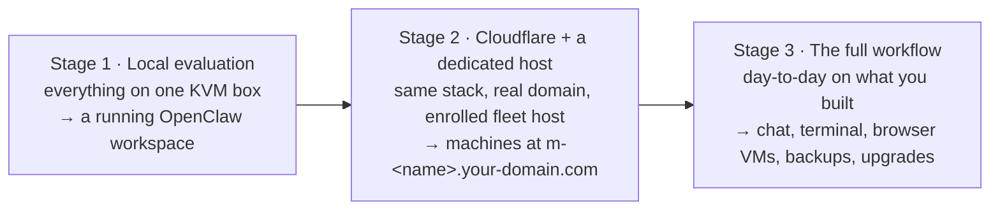
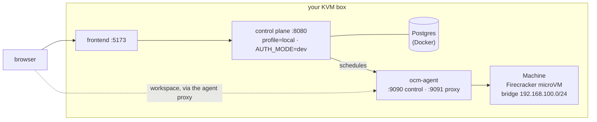
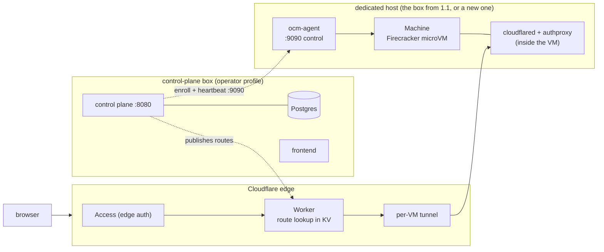
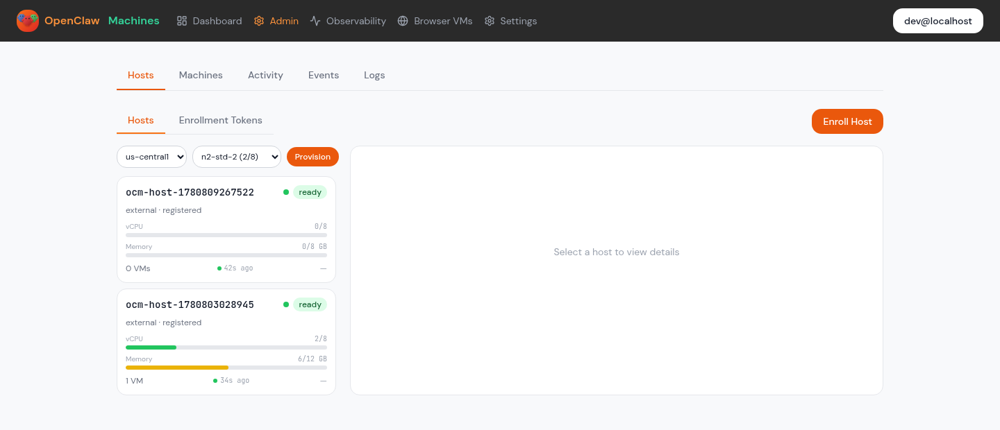
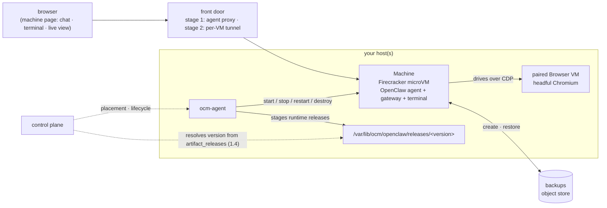

# Getting Started

One stack, grown in **three stages — each ends with something working**, and
each builds on the last:



| Stage | You have | You'll end with |
|---|---|---|
| [1 — Local evaluation](#stage-1--local-evaluation) | One KVM-capable Linux box (we show how to get one) | The full stack and a **running OpenClaw workspace** in a real Firecracker microVM — no Cloudflare, no domain |
| [2 — Cloudflare + a dedicated host](#stage-2--cloudflare--a-dedicated-host) | A Cloudflare account + a domain | The production-shaped deployment: an enrolled fleet host, machines reachable at **`m-<name>.your-domain.com`** |
| [3 — The full workflow](#stage-3--the-full-workflow) | A stack from stage 1 or 2 | Day-to-day fluency: machines, browser VMs, lifecycle, backups, runtime upgrades |

Stage 1 and stage 2 are independent — you can evaluate locally without ever
touching Cloudflare, or go straight to stage 2. Stage 3 works against either.

---

## Stage 1 — Local evaluation

**You have:** one KVM-capable Linux box.
**You'll end with:** the entire stack — control plane, frontend, and a
Firecracker worker — on that box, and a **running OpenClaw workspace** in a
real microVM, provisioned by clicking through the web UI. No Cloudflare: the
workspace is reached through the local agent proxy.

**Stage-1 architecture — every component on one box:**



### 1.1 Get a KVM box

Firecracker needs `/dev/kvm` — bare metal, or a VM with **nested
virtualization**. macOS, Windows/WSL, and ordinary cloud VMs won't work. If you
don't already have one:

| Option | What to do | Notes |
|---|---|---|
| **GCP n2** (used in our examples) | `gcloud compute instances create` with `--enable-nested-virtualization` — full command below | n2 supports nested virt out of the box; ~10 minutes to running |
| **AWS** | Any `*.metal` instance (e.g. `c5.metal`), Ubuntu 24.04 | Only metal instances expose KVM |
| **Hetzner** | A dedicated (bare-metal) server, Ubuntu 24.04 | Best price for a permanent host |
| **Your own machine** | Any Linux box/workstation with KVM enabled | `ls /dev/kvm` to check |

The GCP recipe (the same box can later become your stage-2 fleet host):

```bash
gcloud compute instances create ocm-eval \
  --project=YOUR_PROJECT --zone=us-central1-b \
  --machine-type=n2-standard-4 \
  --enable-nested-virtualization \
  --image-family=ubuntu-2404-lts-amd64 --image-project=ubuntu-os-cloud \
  --boot-disk-size=100GB --boot-disk-type=pd-ssd
```

### 1.2 Prepare the box

On the box, clone the repo and check readiness:

```bash
git clone https://github.com/mathaix/OpenClawMachines.git
cd OpenClawMachines
make preflight
```

`make preflight` is read-only: it checks the developer tools (Go ≥ 1.25.10,
Node ≥ 20, Docker), KVM access, Firecracker, and the VM assets, and tells you
exactly what's missing. Two things it will ask for:

- **`firecracker` on PATH and host assets** — `scripts/provision-host.sh` is
  the one-shot installer (Firecracker, guest kernel, cloudflared, sysctl
  tuning, and the **XFS reflink mount** at `/var/lib/ocm/vms` — a
  copy-on-write filesystem so each VM's disk is a cheap clone of a shared base
  image):
  ```bash
  sudo OCM_ARTIFACT_BUCKET=gs://YOUR-ARTIFACT-BUCKET bash scripts/provision-host.sh
  ```
- **VM images** — a guest kernel at `/var/lib/ocm/vmlinux` and a rootfs at
  `/var/lib/ocm/images/rootfs.ext4`. Where these come from (build them
  yourself, or pull from a bucket you populate) is the [Artifacts](#artifacts)
  section — read it once now; everything else refers back to it.

### 1.3 Bring the stack up

One script stands up Postgres (Docker), migrations, the control plane (`local`
profile, dev auth — you're auto-logged-in as `dev@localhost`), the frontend,
and then builds, registers, and starts a local Firecracker worker whose first
heartbeat flips the host to `ready`:

```bash
scripts/local-e2e-firecracker.sh up
scripts/local-e2e-firecracker.sh status   # component health + host/machine status
```

### 1.4 Boot a machine to a running workspace

The control plane resolves which OpenClaw runtime version a machine gets from
the **`artifact_releases`** table (one row per published artifact version), via
a resolver behind the `FF_RUNTIME_VERSION_RESOLVER=1` flag — the bring-up
script's env sets the flag; what's left is staging a runtime release on the
host and registering its row. The exact steps (extract the runtime tarball
under `/var/lib/ocm/openclaw/releases/<version>`, add its `manifest.json`,
insert the `artifact_releases` row) are documented step-by-step in
[local-firecracker-e2e.md](local-firecracker-e2e.md#reaching-a-running-workspace-openclaw-gateway-up).

Then open `http://localhost:5173/dashboard` → **New Machine → Basic, region
External → Create → Start**. The control plane places the machine on your
local host, the agent boots a Firecracker microVM
(`allocating → rootfs → network → booting → booted`), and the in-VM gateway
comes up. Or drive the same flow headlessly:

```bash
cd frontend && PLAYWRIGHT_BASE_URL=http://localhost:5173 \
  npx playwright test e2e/machine-lifecycle.spec.ts
```

**Checkpoint — you should see this** (machine `running`, workspace streaming):


That workspace — chat, terminal, logs — is exactly what stage 3 is about.
Tear down anytime with `scripts/local-e2e-firecracker.sh down`.

---

## Stage 2 — Cloudflare + a dedicated host

**You have:** a Cloudflare account, a domain (zone) you control, and a
KVM-capable host (the stage-1 box works, or create a fresh one with the same
recipes).
**You'll end with:** the production-shaped deployment — an `operator`-profile
control plane, the Cloudflare data plane, and a dedicated host enrolled into
your fleet. Machines become reachable at `m-<name>.your-domain.com` from
anywhere.

Same stack as stage 1 — what changes is the front door and where the worker
lives:

**Stage-2 architecture — the same components, split apart: Cloudflare becomes
the front door, the worker moves to a dedicated host:**



The host-onboarding path is **the same on every provider** (GCP, AWS, Hetzner,
bare metal): bring a KVM-capable Linux box, install dependencies, **enroll**
it. (One-click auto-provisioning per cloud is tracked in
[#11](https://github.com/mathaix/OpenClawMachines/issues/11).)

### 2.1 Cloudflare: zone, Worker, KV

The data plane uses Cloudflare for edge auth and a **per-VM tunnel**, so each
machine gets its own subdomain with no inbound ports on your host. You need:

1. A **Cloudflare account** and a **domain (zone)** you control (your
   `DATA_PLANE_DOMAIN`, e.g. `example.com`). Machines get `m-<slug>.example.com`.
2. An **API token** with permissions to manage that zone's DNS + Tunnels, plus
   your **Account ID** and **Zone ID** (domain overview page).
3. The Worker + KV pieces (log in first with `npx wrangler login`):
   ```bash
   cd worker
   npx wrangler kv namespace create OCM_ROUTES   # route-lookup KV namespace
   npx wrangler deploy                           # the edge Worker
   ```

See [self-hosted-control-plane.md](self-hosted-control-plane.md) for the full
Cloudflare + auth prerequisites.

### 2.2 Configure and run the control plane

```bash
cp docs/self-hosted.env.example .env
```

Required for the host-enrollment + machine flow:

| Variable | What it is |
|---|---|
| `CONTROL_PLANE_PROFILE` | `operator` |
| `DATABASE_URL` | Postgres connection string |
| `BACKEND_URL` | **Public HTTPS URL** of the control plane — the host must reach this |
| `DATA_PLANE_DOMAIN` | Your Cloudflare zone, e.g. `example.com` |
| `AUTH_MODE` | `firebase` or `cfaccess` (or `dev` + `OCM_ALLOW_DEV_AUTH=1` for evaluation) |
| `SECRET_ENCRYPTION_KEY` | Exactly 32 bytes — `openssl rand -hex 16` |
| `FC_AGENT_TOKEN` | Shared control-plane ↔ agent token — `openssl rand -hex 32` |
| `CLOUDFLARE_API_TOKEN` / `CLOUDFLARE_ACCOUNT_ID` / `CLOUDFLARE_ZONE_ID` | from 2.1 |
| `CLOUDFLARE_KV_NAMESPACE_ID` | the `OCM_ROUTES` namespace id from 2.1 |
| `OCM_ADMIN_EMAILS` | comma-separated admin emails (who can manage hosts) |
| `OCM_ARTIFACT_BUCKET` | the bucket hosts pull artifacts from — see [Artifacts](#artifacts) |

Frontend env (`frontend/.env.local`) must include `VITE_OCM_ADMIN_EMAILS` with
the **same** admin email(s), or the admin UI won't show. (Backend
`OCM_ADMIN_EMAILS` is the real gate; the frontend var only controls UI
visibility.)

Run it — for evaluation, the local helpers:

```bash
make local-postgres   # Dockerized Postgres
make local-migrate    # schema migrations
make backend          # go run ./cmd/server  (:8080)
make frontend         # Vite dev server      (:5173, proxies /api → :8080)
```

For a real deployment, build and run the binary behind HTTPS so `BACKEND_URL`
is publicly reachable: `make build-server && ./backend/server`. Confirm with
`make status` (checks `:8080/health`).

See [control-plane-profiles.md](control-plane-profiles.md) for every variable.

### 2.3 Create the host

Same acquisition table as [1.1](#11-get-a-kvm-box) — for the worked example, a
GCP n2 named `ocm-host-1`, plus the agent control port:

```bash
gcloud compute instances create ocm-host-1 \
  --project=YOUR_PROJECT --zone=us-central1-b \
  --machine-type=n2-standard-4 \
  --enable-nested-virtualization \
  --image-family=ubuntu-2404-lts-amd64 --image-project=ubuntu-os-cloud \
  --boot-disk-size=100GB --boot-disk-type=pd-ssd

# the per-VM tunnel is outbound-only, but the control plane health-checks the
# agent on :9090
gcloud compute firewall-rules create ocm-agent-9090 \
  --allow=tcp:9090 --target-tags=ocm-agent --network=default
gcloud compute instances add-tags ocm-host-1 --tags=ocm-agent --zone=us-central1-b
```

Install the host dependencies (same `provision-host.sh` as stage 1.2):

```bash
gcloud compute scp scripts/provision-host.sh ocm-host-1:~ --zone=us-central1-b
gcloud compute ssh ocm-host-1 --zone=us-central1-b --command \
  'sudo OCM_ARTIFACT_BUCKET=gs://YOUR-ARTIFACT-BUCKET bash ~/provision-host.sh'
```

### 2.4 Enroll it into your fleet

In the UI: log in as an `OCM_ADMIN_EMAILS` admin → **Admin → Hosts → Enroll
Host** → Generate token. The wizard gives you a one-line install command —
run it on the host:

```bash
gcloud compute ssh ocm-host-1 --zone=us-central1-b --command \
  'curl -sL '"$BACKEND_URL"'/api/agent/install | sudo bash -s -- <TOKEN>'
```

(The same is available over the API at
`POST /api/admin/hosts/enrollment-tokens` if you're scripting; authenticate
the call the same way your `AUTH_MODE` authenticates the UI.)

The install script registers the host, creates the per-host Cloudflare tunnel,
mints the agent token, downloads + verifies the `ocm-agent` binary (from your
artifact source — see [Artifacts](#artifacts)), installs the `ocm-agent`
systemd unit, and starts it.

**Checkpoint** — the host appears in **Admin → Hosts** as `ready` within ~60s,
with its capacity bars and heartbeat visible:



On the host, if anything looks off:

```bash
gcloud compute ssh ocm-host-1 --zone=us-central1-b --command \
  'systemctl status ocm-agent --no-pager; journalctl -u ocm-agent -n 30 --no-pager'
```

Create a machine from the dashboard and it boots on this host — reachable at
`m-<name>.your-domain.com` through Cloudflare Access and the per-VM tunnel.

---

## Stage 3 — The full workflow

**You have:** a running stack — either the stage-1 box (dashboard at
`http://localhost:5173`, machines via the local agent proxy) or the stage-2
deployment (your domain, machines at `m-<name>.your-domain.com`).
**You'll end with:** day-to-day fluency. Everything below behaves identically
in both; only the URLs differ.

**Stage-3 architecture — the same stack you deployed, with the day-to-day
flows layered on top:**



### Create and use machines

1. Open the dashboard and log in. First login auto-creates your user + a
   personal account (in `dev` auth mode you're logged in as `DEV_USER_EMAIL`
   automatically — that's how the stage-1 stack runs).
2. **New Machine** → name and size → create. The control plane places it on a
   `ready` host — the local worker from stage 1.3, or the host you enrolled in
   2.4 — and boots the microVM.
3. The machine page is the workspace you first saw at the stage-1 checkpoint:
   - **Web chat** with the OpenClaw agent (the in-VM gateway).
   - **Live terminal** (ttyd) inside the VM.
   - **Browser VM** — pair a separate account-scoped microVM running headful
     Chromium; the agent drives it over CDP while you watch the live view.
     Browser VMs have their own lifecycle, so one can be created ahead of time
     and re-used across machine restarts.

### Lifecycle

**Start / stop / restart / destroy** from the machine page (or the API).
Stopping frees host capacity; destroying releases the machine's resources and
its route. Placement respects capacity and your fleet's region/source-image
constraints — with one host (either stage) everything lands there; add more
enrolled hosts (repeat 2.3–2.4) and placement spreads across them.

### Backups

Per-machine backups are built in: **create**, **restore**, **download**, and
**delete** from the machine page or
`/api/machines/{id}/backups`. Retention is enforced server-side.

### Runtime upgrades

The OpenClaw runtime inside VMs is **artifact-driven** — the same
`artifact_releases` mechanism you touched in stage 1.4: hosts stage runtime
releases, the control plane records one row per version, and the resolver
picks the version for each new/restarted machine. Publishing a newer release
makes it available fleet-wide without rebuilding hosts. See
[ci-release.md](ci-release.md) for the release lanes.

---

## Artifacts

Three artifacts make a host able to boot machines, plus one the machines run:

| Artifact | Lands on the host at | Fetched by | Build it yourself | Download |
|---|---|---|---|---|
| `ocm-agent` (worker binary) | `/usr/local/bin/ocm-agent` | the enroll install script (2.4) | `make build-agent` → `backend/agent-linux` *(verified)* | your `OCM_ARTIFACT_BUCKET` |
| Guest kernel `vmlinux` | `/var/lib/ocm/vmlinux` | `provision-host.sh` | a Firecracker-compatible kernel — see the [Firecracker docs](https://github.com/firecracker-microvm/firecracker/blob/main/docs/getting-started.md) | your `OCM_ARTIFACT_BUCKET` |
| Rootfs `rootfs.ext4` | staged by the agent as a shared `.base-rootfs.ext4` on the reflink mount (each VM disk is a copy-on-write clone) | the **agent**, via `ROOTFS_GCS_MANIFEST` (`provision-host.sh` fetches only the kernel and browser-VM assets) | `make build-rootfs` (Docker + `mkfs.ext4` + `bsdtar`; run `make install-vm-binaries` first) | your `OCM_ARTIFACT_BUCKET` |
| OpenClaw runtime release | `/var/lib/ocm/openclaw/releases/<version>` | the agent, from the version resolved via `artifact_releases` (stage 1.4) | `make build-openclaw` (`scripts/build-openclaw-runtime.sh`) | your bucket via `OPENCLAW_GCS_MANIFEST` |

**Where downloads come from: a GCS bucket you control.** The rootfs is
multiple GB — over GitHub's 2 GB release-asset cap — so a **GCS bucket is the
canonical artifact channel**
([#21](https://github.com/mathaix/OpenClawMachines/issues/21)). The flow is:
build each component (one command each), upload with the matching
`scripts/upload-*.sh` (each writes the artifact + a SHA-256 manifest into a
standard bucket layout), and set `OCM_ARTIFACT_BUCKET=gs://your-bucket`
everywhere this guide uses it — the provision and enroll scripts then pull and
hash-verify from your bucket via the host's service account.

The component-by-component build manual — every build command, output, upload
script, and the bucket layout — is **[building.md](building.md)**. (The code
also has a GitHub-Releases fallback URL for the small binaries, but no release
has been cut yet; treat the bucket as the real channel.)

---

## Where to go next

- [Building the components](building.md) — every component's build, the upload scripts, and the bucket layout
- [Local Firecracker E2E](local-firecracker-e2e.md) — stage 1 in full depth, including everything `local-e2e-firecracker.sh` does
- [Architecture](architecture.md) — data plane, routing, tunnels, lifecycle design
- [Tech stack](tech-stack.md) — the five layers, client to sandbox
- [Control plane profiles](control-plane-profiles.md) — `local` / `operator` / `hosted`
- [Self-hosted control plane](self-hosted-control-plane.md) — Cloudflare + auth prerequisites
- [Host enrollment](host-enrollment.md) — the enrollment path in depth
- [Local + BYO-host setup](local-setup.md)
