# Sequence Diagrams

Detailed sequence diagrams for every major system flow in OpenClaw Machines.

---

## 1. Authentication (Email/Password)

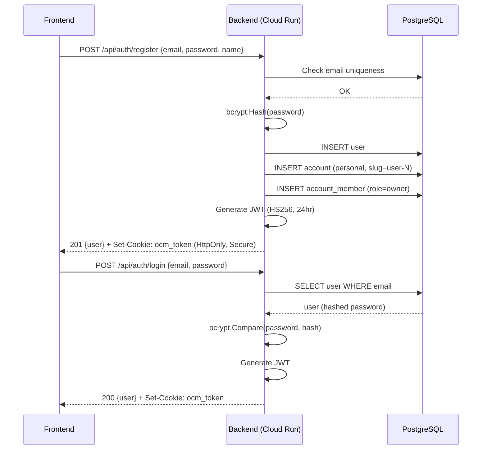
```mermaid
sequenceDiagram
    participant F as Frontend
    participant B as Backend (Cloud Run)
    participant DB as PostgreSQL

    F->>B: POST /api/auth/register {email, password, name}
    B->>DB: Check email uniqueness
    DB-->>B: OK
    B->>B: bcrypt.Hash(password)
    B->>DB: INSERT user
    B->>DB: INSERT account (personal, slug=user-N)
    B->>DB: INSERT account_member (role=owner)
    B->>B: Generate JWT (HS256, 24hr)
    B-->>F: 201 {user} + Set-Cookie: ocm_token (HttpOnly, Secure)

    F->>B: POST /api/auth/login {email, password}
    B->>DB: SELECT user WHERE email
    DB-->>B: user (hashed password)
    B->>B: bcrypt.Compare(password, hash)
    B->>B: Generate JWT
    B-->>F: 200 {user} + Set-Cookie: ocm_token
```

## 2. Authentication (OAuth — Google/GitHub)

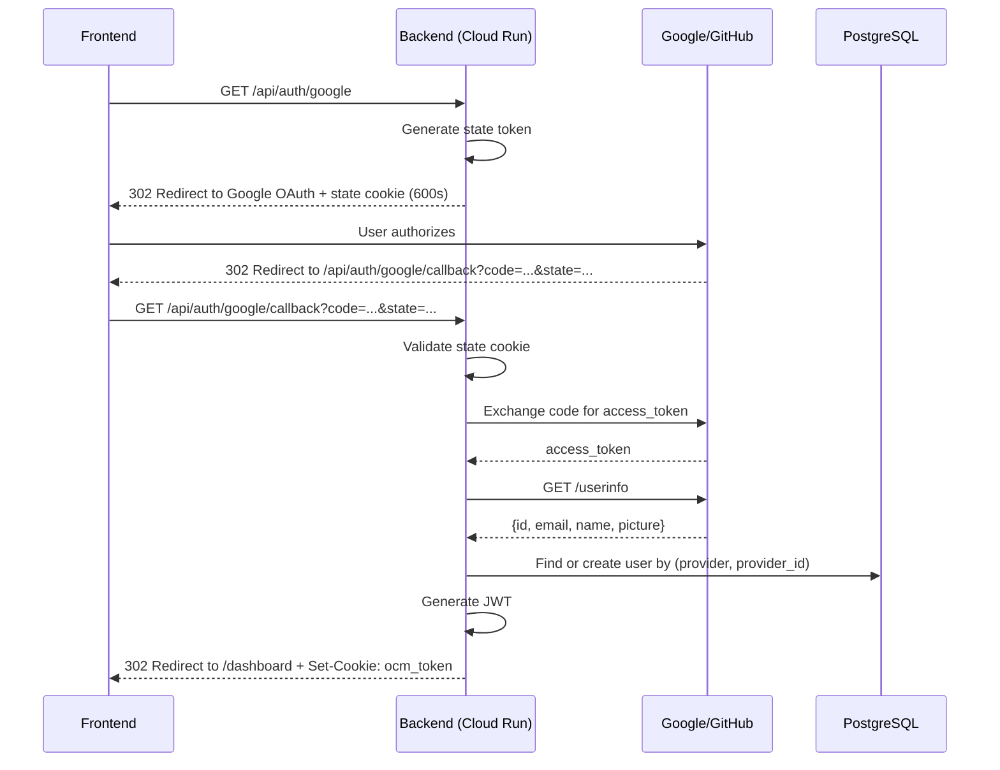
```mermaid
sequenceDiagram
    participant F as Frontend
    participant B as Backend (Cloud Run)
    participant OAuth as Google/GitHub
    participant DB as PostgreSQL

    F->>B: GET /api/auth/google
    B->>B: Generate state token
    B-->>F: 302 Redirect to Google OAuth + state cookie (600s)

    F->>OAuth: User authorizes
    OAuth-->>F: 302 Redirect to /api/auth/google/callback?code=...&state=...

    F->>B: GET /api/auth/google/callback?code=...&state=...
    B->>B: Validate state cookie
    B->>OAuth: Exchange code for access_token
    OAuth-->>B: access_token
    B->>OAuth: GET /userinfo
    OAuth-->>B: {id, email, name, picture}
    B->>DB: Find or create user by (provider, provider_id)
    B->>B: Generate JWT
    B-->>F: 302 Redirect to /dashboard + Set-Cookie: ocm_token
```

## 3. Machine Creation

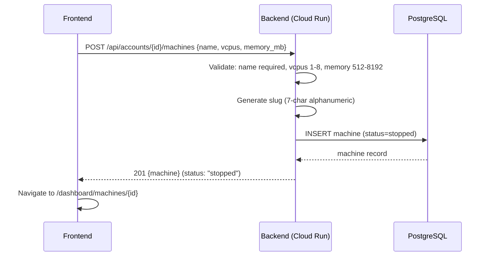
```mermaid
sequenceDiagram
    participant F as Frontend
    participant B as Backend (Cloud Run)
    participant DB as PostgreSQL

    F->>B: POST /api/accounts/{id}/machines {name, vcpus, memory_mb}
    B->>B: Validate: name required, vcpus 1-8, memory 512-8192
    B->>B: Generate slug (7-char alphanumeric)
    B->>DB: INSERT machine (status=stopped)
    DB-->>B: machine record
    B-->>F: 201 {machine} (status: "stopped")
    F->>F: Navigate to /dashboard/machines/{id}
```

## 4. Machine Start + Provisioning (Full Flow)

This is the most complex flow. It spans 5 components and involves secret decryption, capacity scheduling, VM creation, metadata delivery, and route registration.

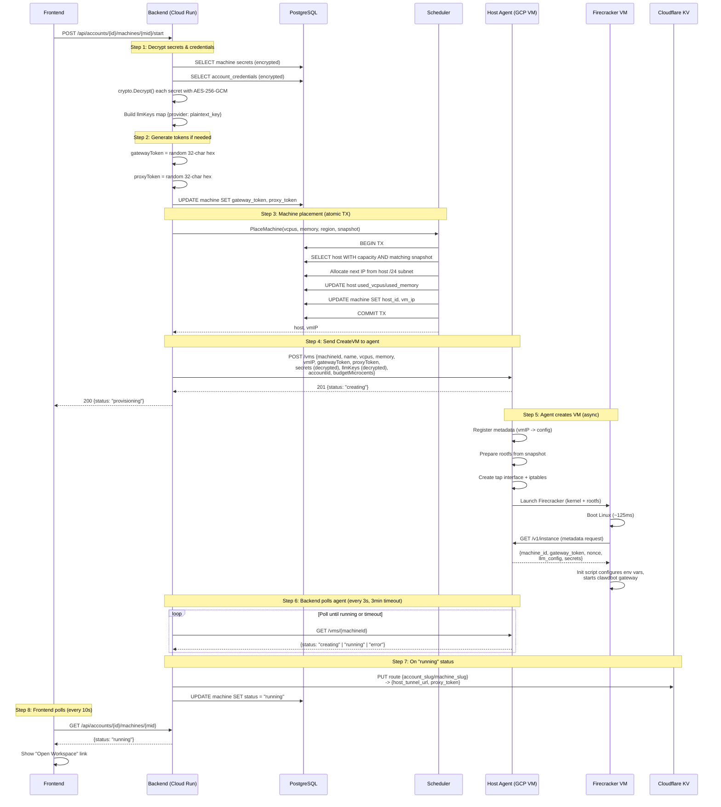
```mermaid
sequenceDiagram
    participant F as Frontend
    participant B as Backend (Cloud Run)
    participant DB as PostgreSQL
    participant S as Scheduler
    participant A as Host Agent (GCP VM)
    participant FC as Firecracker VM
    participant CF as Cloudflare KV

    F->>B: POST /api/accounts/{id}/machines/{mid}/start

    Note over B: Step 1: Decrypt secrets & credentials
    B->>DB: SELECT machine secrets (encrypted)
    B->>DB: SELECT account_credentials (encrypted)
    B->>B: crypto.Decrypt() each secret with AES-256-GCM
    B->>B: Build llmKeys map {provider: plaintext_key}

    Note over B: Step 2: Generate tokens if needed
    B->>B: gatewayToken = random 32-char hex
    B->>B: proxyToken = random 32-char hex
    B->>DB: UPDATE machine SET gateway_token, proxy_token

    Note over B,S: Step 3: Machine placement (atomic TX)
    B->>S: PlaceMachine(vcpus, memory, region, snapshot)
    S->>DB: BEGIN TX
    S->>DB: SELECT host WITH capacity AND matching snapshot
    S->>DB: Allocate next IP from host /24 subnet
    S->>DB: UPDATE host used_vcpus/used_memory
    S->>DB: UPDATE machine SET host_id, vm_ip
    S->>DB: COMMIT TX
    S-->>B: host, vmIP

    Note over B,A: Step 4: Send CreateVM to agent
    B->>A: POST /vms {machineId, name, vcpus, memory,<br/>vmIP, gatewayToken, proxyToken,<br/>secrets (decrypted), llmKeys (decrypted),<br/>accountId, budgetMicrocents}
    A-->>B: 201 {status: "creating"}
    B-->>F: 200 {status: "provisioning"}

    Note over A,FC: Step 5: Agent creates VM (async)
    A->>A: Register metadata (vmIP -> config)
    A->>A: Prepare rootfs from snapshot
    A->>A: Create tap interface + iptables
    A->>FC: Launch Firecracker (kernel + rootfs)
    FC->>FC: Boot Linux (~125ms)
    FC->>A: GET /v1/instance (metadata request)
    A-->>FC: {machine_id, gateway_token, nonce,<br/>llm_config, secrets}
    FC->>FC: Init script configures env vars,<br/>starts clawdbot gateway

    Note over B,A: Step 6: Backend polls agent (every 3s, 3min timeout)
    loop Poll until running or timeout
        B->>A: GET /vms/{machineId}
        A-->>B: {status: "creating" | "running" | "error"}
    end

    Note over B,CF: Step 7: On "running" status
    B->>CF: PUT route {account_slug/machine_slug}<br/>-> {host_tunnel_url, proxy_token}
    B->>DB: UPDATE machine SET status = "running"

    Note over F: Step 8: Frontend polls (every 10s)
    F->>B: GET /api/accounts/{id}/machines/{mid}
    B-->>F: {status: "running"}
    F->>F: Show "Open Workspace" link
```

## 5. LLM API Proxy (Request from VM to Provider)

VMs never see real API keys. They use a nonce as their "key" and all requests go through the host's API proxy which injects real credentials.

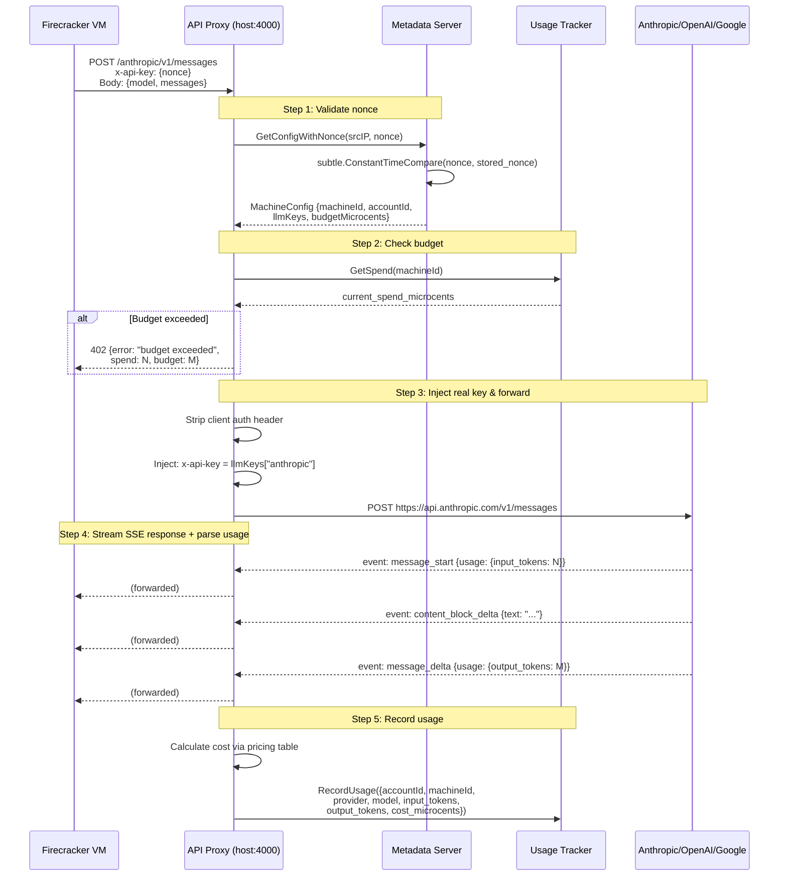
```mermaid
sequenceDiagram
    participant VM as Firecracker VM
    participant P as API Proxy (host:4000)
    participant M as Metadata Server
    participant U as Usage Tracker
    participant API as Anthropic/OpenAI/Google

    VM->>P: POST /anthropic/v1/messages<br/>x-api-key: {nonce}<br/>Body: {model, messages}

    Note over P,M: Step 1: Validate nonce
    P->>M: GetConfigWithNonce(srcIP, nonce)
    M->>M: subtle.ConstantTimeCompare(nonce, stored_nonce)
    M-->>P: MachineConfig {machineId, accountId,<br/>llmKeys, budgetMicrocents}

    Note over P,U: Step 2: Check budget
    P->>U: GetSpend(machineId)
    U-->>P: current_spend_microcents
    alt Budget exceeded
        P-->>VM: 402 {error: "budget exceeded",<br/>spend: N, budget: M}
    end

    Note over P,API: Step 3: Inject real key & forward
    P->>P: Strip client auth header
    P->>P: Inject: x-api-key = llmKeys["anthropic"]
    P->>API: POST https://api.anthropic.com/v1/messages

    Note over P,VM: Step 4: Stream SSE response + parse usage
    API-->>P: event: message_start {usage: {input_tokens: N}}
    P-->>VM: (forwarded)
    API-->>P: event: content_block_delta {text: "..."}
    P-->>VM: (forwarded)
    API-->>P: event: message_delta {usage: {output_tokens: M}}
    P-->>VM: (forwarded)

    Note over P,U: Step 5: Record usage
    P->>P: Calculate cost via pricing table
    P->>U: RecordUsage({accountId, machineId,<br/>provider, model, input_tokens,<br/>output_tokens, cost_microcents})
```

## 6. Workspace Connection (Terminal WebSocket)

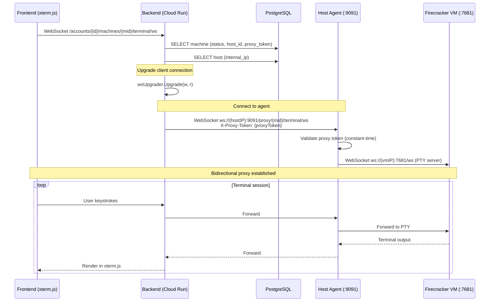
```mermaid
sequenceDiagram
    participant F as Frontend (xterm.js)
    participant B as Backend (Cloud Run)
    participant DB as PostgreSQL
    participant A as Host Agent (:9091)
    participant VM as Firecracker VM (:7681)

    F->>B: WebSocket /accounts/{id}/machines/{mid}/terminal/ws
    B->>DB: SELECT machine (status, host_id, proxy_token)
    B->>DB: SELECT host (internal_ip)

    Note over B: Upgrade client connection
    B->>B: wsUpgrader.Upgrade(w, r)

    Note over B,A: Connect to agent
    B->>A: WebSocket ws://{hostIP}:9091/proxy/{mid}/terminal/ws<br/>X-Proxy-Token: {proxyToken}
    A->>A: Validate proxy token (constant-time)
    A->>VM: WebSocket ws://{vmIP}:7681/ws (PTY server)

    Note over F,VM: Bidirectional proxy established
    loop Terminal session
        F->>B: User keystrokes
        B->>A: Forward
        A->>VM: Forward to PTY
        VM-->>A: Terminal output
        A-->>B: Forward
        B-->>F: Render in xterm.js
    end
```

## 7. Workspace Connection (Logs SSE)

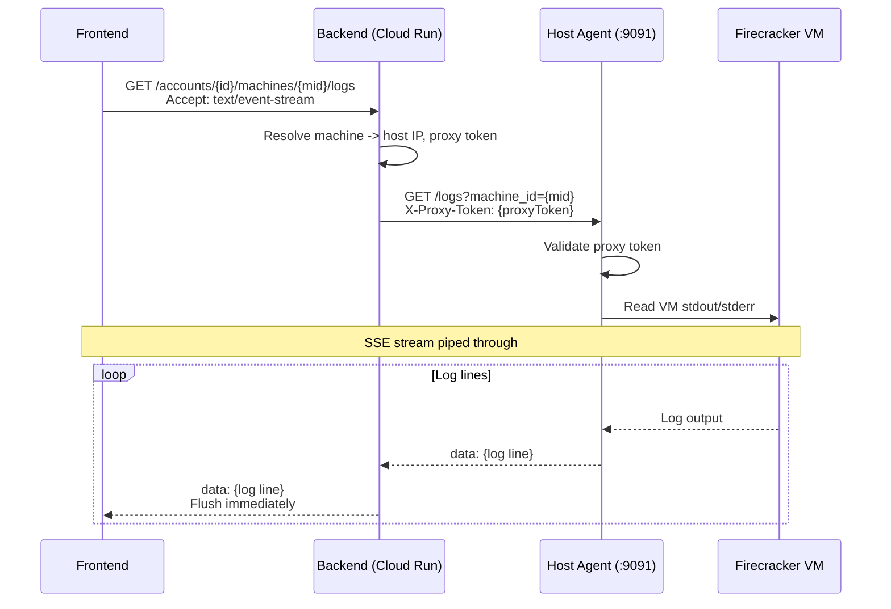
```mermaid
sequenceDiagram
    participant F as Frontend
    participant B as Backend (Cloud Run)
    participant A as Host Agent (:9091)
    participant VM as Firecracker VM

    F->>B: GET /accounts/{id}/machines/{mid}/logs<br/>Accept: text/event-stream
    B->>B: Resolve machine -> host IP, proxy token
    B->>A: GET /logs?machine_id={mid}<br/>X-Proxy-Token: {proxyToken}
    A->>A: Validate proxy token
    A->>VM: Read VM stdout/stderr

    Note over F,VM: SSE stream piped through
    loop Log lines
        VM-->>A: Log output
        A-->>B: data: {log line}
        B-->>F: data: {log line}<br/>Flush immediately
    end
```

## 8. Provisioning Progress (SSE)

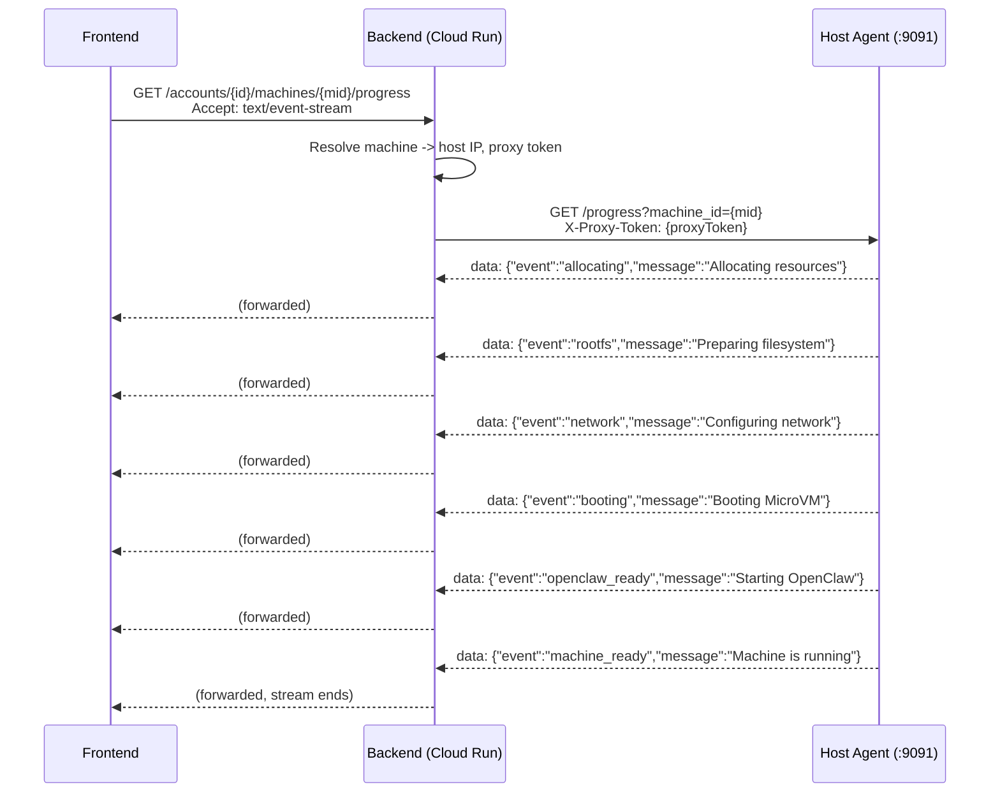
```mermaid
sequenceDiagram
    participant F as Frontend
    participant B as Backend (Cloud Run)
    participant A as Host Agent (:9091)

    F->>B: GET /accounts/{id}/machines/{mid}/progress<br/>Accept: text/event-stream
    B->>B: Resolve machine -> host IP, proxy token
    B->>A: GET /progress?machine_id={mid}<br/>X-Proxy-Token: {proxyToken}

    A-->>B: data: {"event":"allocating","message":"Allocating resources"}
    B-->>F: (forwarded)
    A-->>B: data: {"event":"rootfs","message":"Preparing filesystem"}
    B-->>F: (forwarded)
    A-->>B: data: {"event":"network","message":"Configuring network"}
    B-->>F: (forwarded)
    A-->>B: data: {"event":"booting","message":"Booting MicroVM"}
    B-->>F: (forwarded)
    A-->>B: data: {"event":"openclaw_ready","message":"Starting OpenClaw"}
    B-->>F: (forwarded)
    A-->>B: data: {"event":"machine_ready","message":"Machine is running"}
    B-->>F: (forwarded, stream ends)
```

## 9. Machine Stop

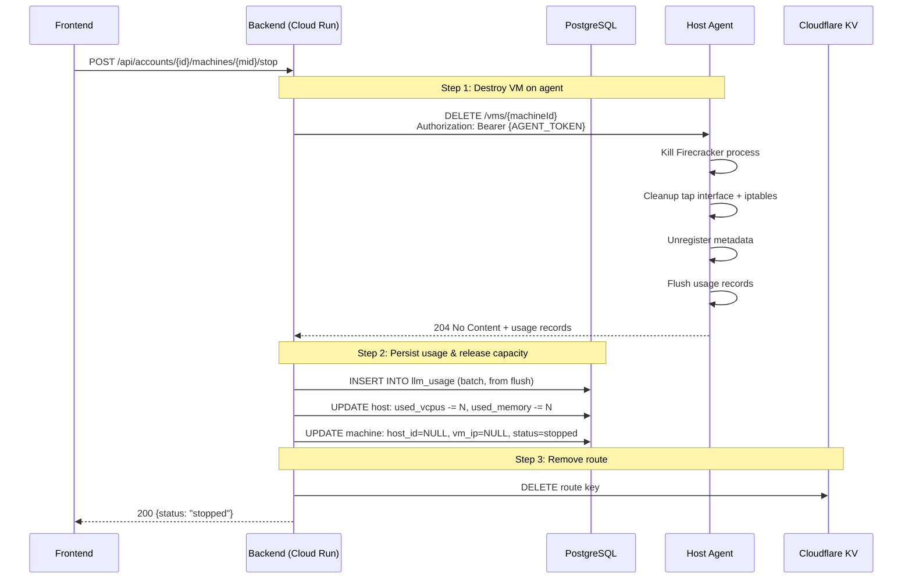
```mermaid
sequenceDiagram
    participant F as Frontend
    participant B as Backend (Cloud Run)
    participant DB as PostgreSQL
    participant A as Host Agent
    participant CF as Cloudflare KV

    F->>B: POST /api/accounts/{id}/machines/{mid}/stop

    Note over B,A: Step 1: Destroy VM on agent
    B->>A: DELETE /vms/{machineId}<br/>Authorization: Bearer {AGENT_TOKEN}
    A->>A: Kill Firecracker process
    A->>A: Cleanup tap interface + iptables
    A->>A: Unregister metadata
    A->>A: Flush usage records
    A-->>B: 204 No Content + usage records

    Note over B,DB: Step 2: Persist usage & release capacity
    B->>DB: INSERT INTO llm_usage (batch, from flush)
    B->>DB: UPDATE host: used_vcpus -= N, used_memory -= N
    B->>DB: UPDATE machine: host_id=NULL, vm_ip=NULL, status=stopped

    Note over B,CF: Step 3: Remove route
    B->>CF: DELETE route key

    B-->>F: 200 {status: "stopped"}
```

## 10. Machine Delete

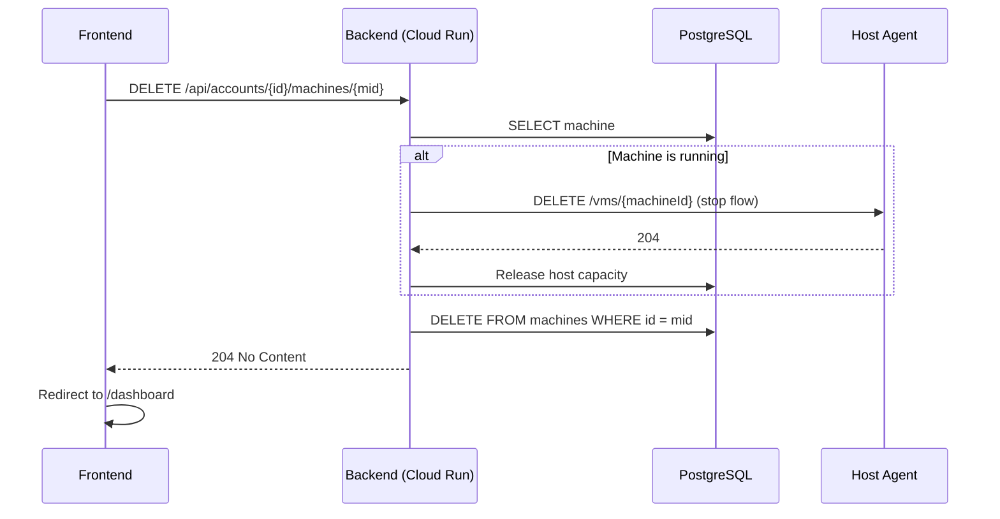
```mermaid
sequenceDiagram
    participant F as Frontend
    participant B as Backend (Cloud Run)
    participant DB as PostgreSQL
    participant A as Host Agent

    F->>B: DELETE /api/accounts/{id}/machines/{mid}
    B->>DB: SELECT machine
    alt Machine is running
        B->>A: DELETE /vms/{machineId} (stop flow)
        A-->>B: 204
        B->>DB: Release host capacity
    end
    B->>DB: DELETE FROM machines WHERE id = mid
    B-->>F: 204 No Content
    F->>F: Redirect to /dashboard
```

## 11. Credential Management

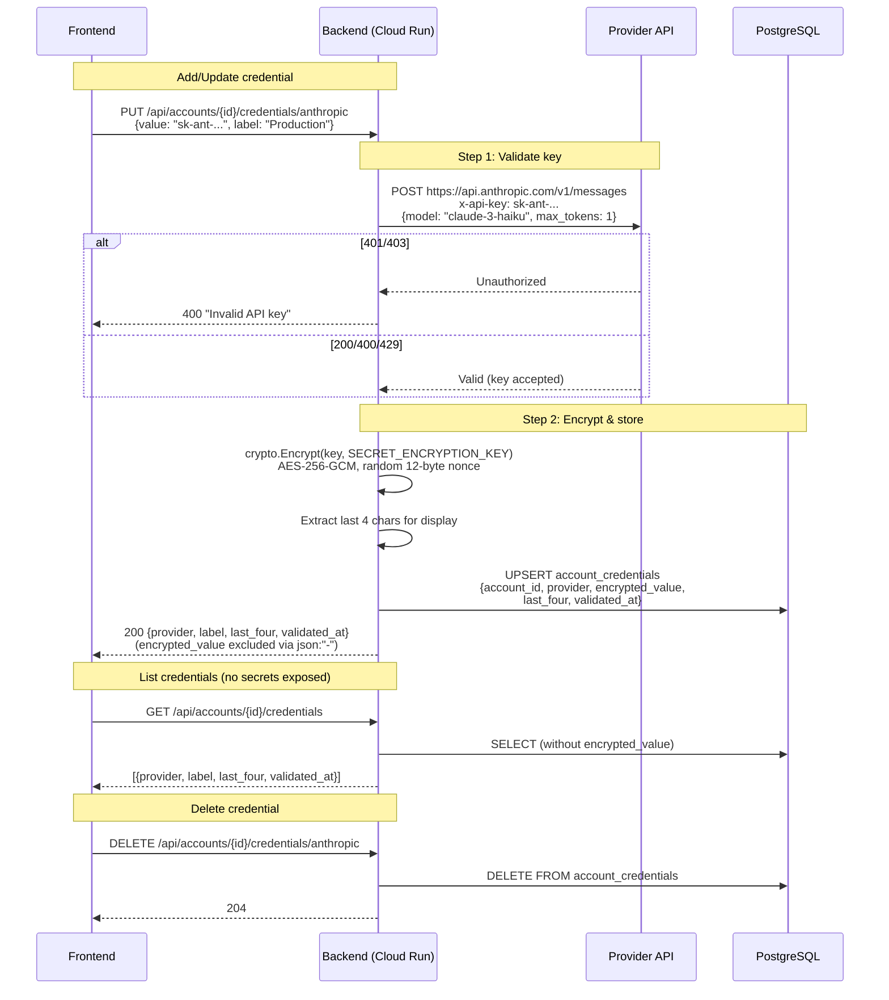
```mermaid
sequenceDiagram
    participant F as Frontend
    participant B as Backend (Cloud Run)
    participant API as Provider API
    participant DB as PostgreSQL

    Note over F,B: Add/Update credential
    F->>B: PUT /api/accounts/{id}/credentials/anthropic<br/>{value: "sk-ant-...", label: "Production"}

    Note over B,API: Step 1: Validate key
    B->>API: POST https://api.anthropic.com/v1/messages<br/>x-api-key: sk-ant-...<br/>{model: "claude-3-haiku", max_tokens: 1}
    alt 401/403
        API-->>B: Unauthorized
        B-->>F: 400 "Invalid API key"
    else 200/400/429
        API-->>B: Valid (key accepted)
    end

    Note over B,DB: Step 2: Encrypt & store
    B->>B: crypto.Encrypt(key, SECRET_ENCRYPTION_KEY)<br/>AES-256-GCM, random 12-byte nonce
    B->>B: Extract last 4 chars for display
    B->>DB: UPSERT account_credentials<br/>{account_id, provider, encrypted_value,<br/>last_four, validated_at}
    B-->>F: 200 {provider, label, last_four, validated_at}<br/>(encrypted_value excluded via json:"-")

    Note over F,B: List credentials (no secrets exposed)
    F->>B: GET /api/accounts/{id}/credentials
    B->>DB: SELECT (without encrypted_value)
    B-->>F: [{provider, label, last_four, validated_at}]

    Note over F,B: Delete credential
    F->>B: DELETE /api/accounts/{id}/credentials/anthropic
    B->>DB: DELETE FROM account_credentials
    B-->>F: 204
```

## 12. Budget Enforcement

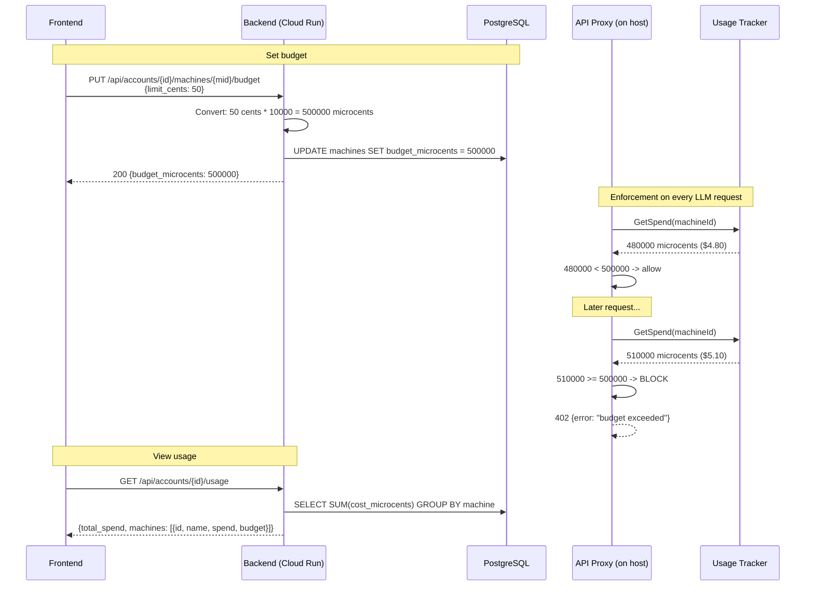
```mermaid
sequenceDiagram
    participant F as Frontend
    participant B as Backend (Cloud Run)
    participant DB as PostgreSQL
    participant P as API Proxy (on host)
    participant U as Usage Tracker

    Note over F,DB: Set budget
    F->>B: PUT /api/accounts/{id}/machines/{mid}/budget<br/>{limit_cents: 50}
    B->>B: Convert: 50 cents * 10000 = 500000 microcents
    B->>DB: UPDATE machines SET budget_microcents = 500000
    B-->>F: 200 {budget_microcents: 500000}

    Note over P,U: Enforcement on every LLM request
    P->>U: GetSpend(machineId)
    U-->>P: 480000 microcents ($4.80)
    P->>P: 480000 < 500000 -> allow

    Note over P: Later request...
    P->>U: GetSpend(machineId)
    U-->>P: 510000 microcents ($5.10)
    P->>P: 510000 >= 500000 -> BLOCK
    P-->>P: 402 {error: "budget exceeded"}

    Note over F,B: View usage
    F->>B: GET /api/accounts/{id}/usage
    B->>DB: SELECT SUM(cost_microcents) GROUP BY machine
    B-->>F: {total_spend, machines: [{id, name, spend, budget}]}
```

## 13. Cloudflare Worker Routing (Data Plane)

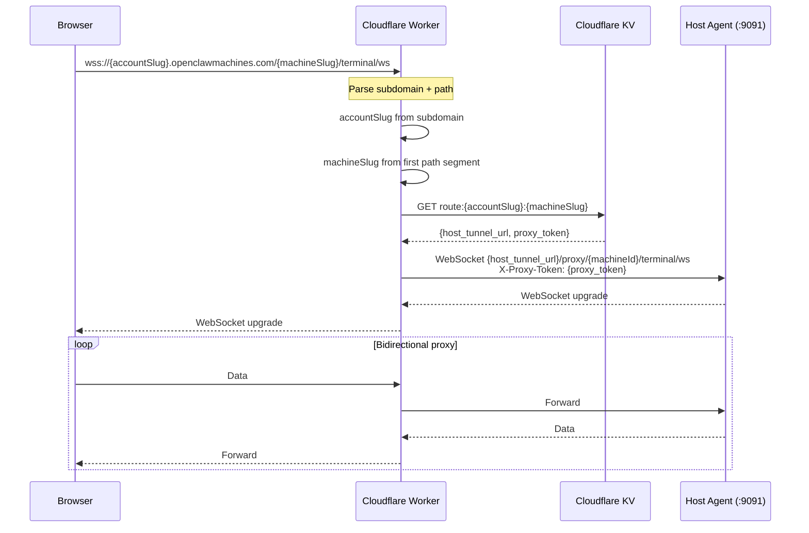
```mermaid
sequenceDiagram
    participant Browser as Browser
    participant CF as Cloudflare Worker
    participant KV as Cloudflare KV
    participant A as Host Agent (:9091)

    Browser->>CF: wss://{accountSlug}.openclawmachines.com/{machineSlug}/terminal/ws

    Note over CF: Parse subdomain + path
    CF->>CF: accountSlug from subdomain
    CF->>CF: machineSlug from first path segment

    CF->>KV: GET route:{accountSlug}:{machineSlug}
    KV-->>CF: {host_tunnel_url, proxy_token}

    CF->>A: WebSocket {host_tunnel_url}/proxy/{machineId}/terminal/ws<br/>X-Proxy-Token: {proxy_token}
    A-->>CF: WebSocket upgrade
    CF-->>Browser: WebSocket upgrade

    loop Bidirectional proxy
        Browser->>CF: Data
        CF->>A: Forward
        A-->>CF: Data
        CF-->>Browser: Forward
    end
```

---

## Security Boundaries Summary

```
                    Internet
                       |
              [Cloudflare CDN/WAF]
                       |
         HTTPS (TLS) + CORS validation
                       |
              [Backend - Cloud Run]
                       |
            JWT auth + Account membership
                       |
         Bearer token (AGENT_TOKEN)
                       |
              [Host Agent - GCP VM]
                       |
            Proxy token (per-machine)
                       |
              [Firecracker MicroVM]
                       |
            Nonce auth (metadata nonce)
                       |
              [API Proxy -> Provider]
                       |
            Real API key (injected by proxy)
```

Each layer has its own authentication mechanism. Real API keys are only ever present in the Backend (encrypted at rest) and the Host Agent's API Proxy (in memory, during request forwarding). VMs never see real keys.

---

## 14. Gateway Dashboard Loading

Full sequence from user clicking the "Gateway" tab to seeing the OpenClaw SPA rendered inside an iframe.

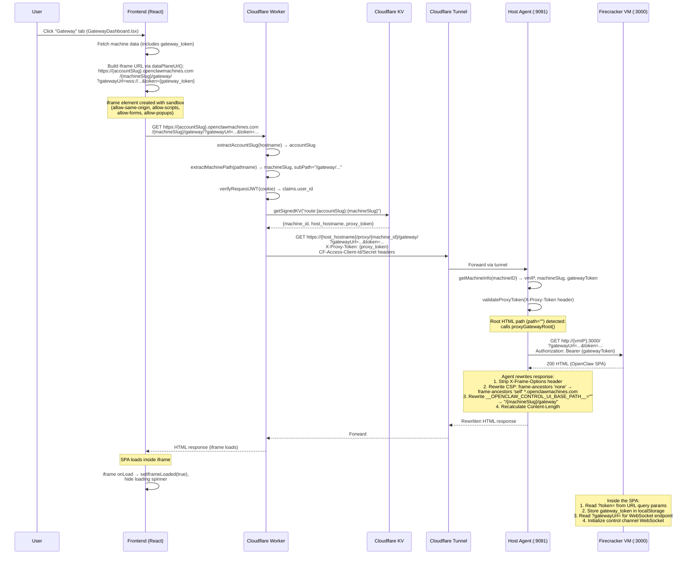
```mermaid
sequenceDiagram
    participant U as User
    participant F as Frontend (React)
    participant W as Cloudflare Worker
    participant KV as Cloudflare KV
    participant CF as Cloudflare Tunnel
    participant A as Host Agent (:9091)
    participant VM as Firecracker VM (:3000)

    U->>F: Click "Gateway" tab (GatewayDashboard.tsx)
    F->>F: Fetch machine data (includes gateway_token)
    F->>F: Build iframe URL via dataPlaneUrl():<br/>https://{accountSlug}.openclawmachines.com<br/>/{machineSlug}/gateway/<br/>?gatewayUrl=wss://...&token={gateway_token}

    Note over F: iframe element created with sandbox<br/>(allow-same-origin, allow-scripts,<br/>allow-forms, allow-popups)

    F->>W: GET https://{accountSlug}.openclawmachines.com<br/>/{machineSlug}/gateway/?gatewayUrl=...&token=...
    W->>W: extractAccountSlug(hostname) → accountSlug
    W->>W: extractMachinePath(pathname) → machineSlug, subPath="/gateway/..."
    W->>W: verifyRequestJWT(cookie) → claims.user_id

    W->>KV: getSignedKV("route:{accountSlug}:{machineSlug}")
    KV-->>W: {machine_id, host_hostname, proxy_token}

    W->>CF: GET https://{host_hostname}/proxy/{machine_id}/gateway/<br/>?gatewayUrl=...&token=...<br/>X-Proxy-Token: {proxy_token}<br/>CF-Access-Client-Id/Secret headers
    CF->>A: Forward via tunnel

    A->>A: getMachineInfo(machineID) → vmIP, machineSlug, gatewayToken
    A->>A: validateProxyToken(X-Proxy-Token header)

    Note over A: Root HTML path (path="") detected:<br/>calls proxyGatewayRoot()

    A->>VM: GET http://{vmIP}:3000/<br/>?gatewayUrl=...&token=...<br/>Authorization: Bearer {gatewayToken}
    VM-->>A: 200 HTML (OpenClaw SPA)

    Note over A: Agent rewrites response:<br/>1. Strip X-Frame-Options header<br/>2. Rewrite CSP: frame-ancestors 'none' →<br/>   frame-ancestors 'self' *.openclawmachines.com<br/>3. Rewrite __OPENCLAW_CONTROL_UI_BASE_PATH__=""<br/>   → "/{machineSlug}/gateway"<br/>4. Recalculate Content-Length

    A-->>CF: Rewritten HTML response
    CF-->>W: Forward
    W-->>F: HTML response (iframe loads)

    Note over F: SPA loads inside iframe
    F->>F: iframe onLoad → setIframeLoaded(true),<br/>hide loading spinner

    Note over VM: Inside the SPA:<br/>1. Read ?token= from URL query params<br/>2. Store gateway_token in localStorage<br/>3. Read ?gatewayUrl= for WebSocket endpoint<br/>4. Initialize control channel WebSocket
```

## 15. Gateway WebSocket Challenge-Response

The full authentication handshake for the OpenClaw gateway WebSocket control channel. The SPA opens a WebSocket through the proxy chain and completes a challenge-response protocol.

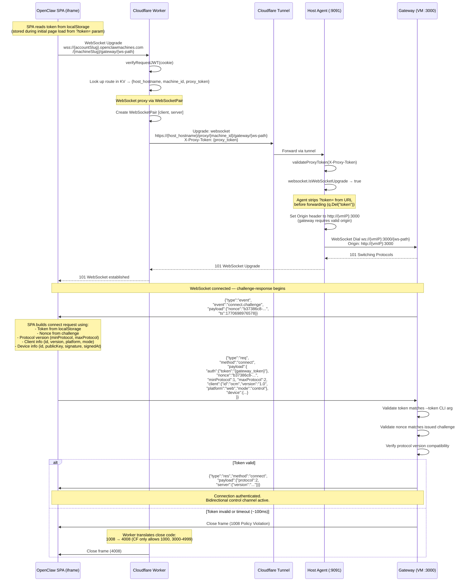
```mermaid
sequenceDiagram
    participant SPA as OpenClaw SPA (iframe)
    participant W as Cloudflare Worker
    participant CF as Cloudflare Tunnel
    participant A as Host Agent (:9091)
    participant GW as Gateway (VM :3000)

    Note over SPA: SPA reads token from localStorage<br/>(stored during initial page load from ?token= param)

    SPA->>W: WebSocket Upgrade<br/>wss://{accountSlug}.openclawmachines.com<br/>/{machineSlug}/gateway/{ws-path}
    W->>W: verifyRequestJWT(cookie)
    W->>W: Look up route in KV → {host_hostname, machine_id, proxy_token}

    Note over W: WebSocket proxy via WebSocketPair
    W->>W: Create WebSocketPair [client, server]
    W->>CF: Upgrade: websocket<br/>https://{host_hostname}/proxy/{machine_id}/gateway/{ws-path}<br/>X-Proxy-Token: {proxy_token}
    CF->>A: Forward via tunnel

    A->>A: validateProxyToken(X-Proxy-Token)
    A->>A: websocket.IsWebSocketUpgrade → true

    Note over A: Agent strips ?token= from URL<br/>before forwarding (q.Del("token"))

    A->>A: Set Origin header to http://{vmIP}:3000<br/>(gateway requires valid origin)
    A->>GW: WebSocket Dial ws://{vmIP}:3000/{ws-path}<br/>Origin: http://{vmIP}:3000
    GW-->>A: 101 Switching Protocols
    A-->>W: 101 WebSocket Upgrade
    W-->>SPA: 101 WebSocket established

    Note over SPA,GW: WebSocket connected — challenge-response begins

    GW->>SPA: {"type":"event",<br/>"event":"connect.challenge",<br/>"payload":{"nonce":"b37386c8-...",<br/>"ts":1770698976578}}

    Note over SPA: SPA builds connect request using:<br/>- Token from localStorage<br/>- Nonce from challenge<br/>- Protocol version (minProtocol, maxProtocol)<br/>- Client info (id, version, platform, mode)<br/>- Device info (id, publicKey, signature, signedAt)

    SPA->>GW: {"type":"req",<br/>"method":"connect",<br/>"payload":{<br/>  "auth":{"token":"{gateway_token}"},<br/>  "nonce":"b37386c8-...",<br/>  "minProtocol":1, "maxProtocol":2,<br/>  "client":{"id":"ocm","version":"1.0",<br/>    "platform":"web","mode":"control"},<br/>  "device":{...}<br/>}}

    GW->>GW: Validate token matches --token CLI arg
    GW->>GW: Validate nonce matches issued challenge
    GW->>GW: Verify protocol version compatibility

    alt Token valid
        GW->>SPA: {"type":"res","method":"connect",<br/>"payload":{"protocol":2,<br/>"server":{"version":"..."}}}
        Note over SPA,GW: Connection authenticated.<br/>Bidirectional control channel active.
    else Token invalid or timeout (~100ms)
        GW->>SPA: Close frame (1008 Policy Violation)
        Note over W: Worker translates close code:<br/>1008 → 4008 (CF only allows 1000, 3000-4999)
        W->>SPA: Close frame (4008)
    end
```

## 16. Terminal WebSocket Connection

Full flow from Terminal.tsx opening a WebSocket through the entire proxy chain to the PTY server inside the VM.

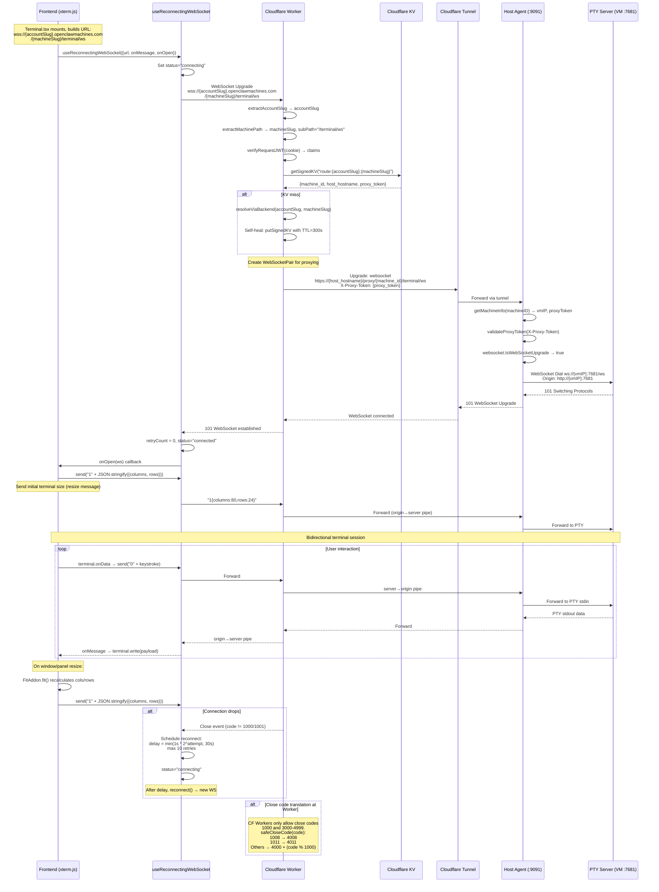
```mermaid
sequenceDiagram
    participant F as Frontend (xterm.js)
    participant RWS as useReconnectingWebSocket
    participant W as Cloudflare Worker
    participant KV as Cloudflare KV
    participant CF as Cloudflare Tunnel
    participant A as Host Agent (:9091)
    participant VM as PTY Server (VM :7681)

    Note over F: Terminal.tsx mounts, builds URL:<br/>wss://{accountSlug}.openclawmachines.com<br/>/{machineSlug}/terminal/ws

    F->>RWS: useReconnectingWebSocket({url, onMessage, onOpen})
    RWS->>RWS: Set status="connecting"

    RWS->>W: WebSocket Upgrade<br/>wss://{accountSlug}.openclawmachines.com<br/>/{machineSlug}/terminal/ws

    W->>W: extractAccountSlug → accountSlug
    W->>W: extractMachinePath → machineSlug, subPath="/terminal/ws"
    W->>W: verifyRequestJWT(cookie) → claims

    W->>KV: getSignedKV("route:{accountSlug}:{machineSlug}")
    KV-->>W: {machine_id, host_hostname, proxy_token}

    alt KV miss
        W->>W: resolveViaBackend(accountSlug, machineSlug)
        W->>W: Self-heal: putSignedKV with TTL=300s
    end

    Note over W: Create WebSocketPair for proxying
    W->>CF: Upgrade: websocket<br/>https://{host_hostname}/proxy/{machine_id}/terminal/ws<br/>X-Proxy-Token: {proxy_token}
    CF->>A: Forward via tunnel

    A->>A: getMachineInfo(machineID) → vmIP, proxyToken
    A->>A: validateProxyToken(X-Proxy-Token)
    A->>A: websocket.IsWebSocketUpgrade → true

    A->>VM: WebSocket Dial ws://{vmIP}:7681/ws<br/>Origin: http://{vmIP}:7681
    VM-->>A: 101 Switching Protocols
    A-->>CF: 101 WebSocket Upgrade
    CF-->>W: WebSocket connected
    W-->>RWS: 101 WebSocket established

    RWS->>RWS: retryCount = 0, status="connected"
    RWS->>F: onOpen(ws) callback

    F->>RWS: send("1" + JSON.stringify({columns, rows}))
    Note over F: Send initial terminal size (resize message)

    RWS->>W: "1{columns:80,rows:24}"
    W->>A: Forward (origin→server pipe)
    A->>VM: Forward to PTY

    Note over F,VM: Bidirectional terminal session

    loop User interaction
        F->>RWS: terminal.onData → send("0" + keystroke)
        RWS->>W: Forward
        W->>A: server→origin pipe
        A->>VM: Forward to PTY stdin

        VM-->>A: PTY stdout data
        A-->>W: Forward
        W-->>RWS: origin→server pipe
        RWS-->>F: onMessage → terminal.write(payload)
    end

    Note over F: On window/panel resize:
    F->>F: FitAddon.fit() recalculates cols/rows
    F->>RWS: send("1" + JSON.stringify({columns, rows}))

    alt Connection drops
        W-->>RWS: Close event (code != 1000/1001)
        RWS->>RWS: Schedule reconnect:<br/>delay = min(1s * 2^attempt, 30s)<br/>max 10 retries
        RWS->>RWS: status="connecting"
        Note over RWS: After delay, reconnect() → new WS
    end

    alt Close code translation at Worker
        Note over W: CF Workers only allow close codes<br/>1000 and 3000-4999.<br/>safeCloseCode(code):<br/>  1008 → 4008<br/>  1011 → 4011<br/>  Others → 4000 + (code % 1000)
    end
```

## 17. WebSocket Keepalive and Timeout

How the ping/pong mechanism prevents idle connection drops across the proxy chain, with separate handling at the Agent and Backend (Cloud Run) layers.

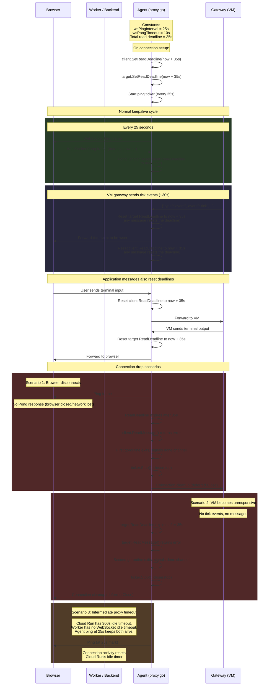
```mermaid
sequenceDiagram
    participant B as Browser
    participant W as Worker / Backend
    participant A as Agent (proxy.go)
    participant VM as Gateway (VM)

    Note over A: Constants:<br/>wsPingInterval = 25s<br/>wsPongTimeout = 10s<br/>Total read deadline = 35s

    Note over A: On connection setup:
    A->>A: client.SetReadDeadline(now + 35s)
    A->>A: target.SetReadDeadline(now + 35s)
    A->>A: Start ping ticker (every 25s)

    Note over B,VM: Normal keepalive cycle

    rect rgb(40, 60, 40)
        Note over B,VM: Every 25 seconds
        A->>B: WebSocket Ping frame
        B-->>A: WebSocket Pong frame (auto by browser)
        A->>A: PongHandler: reset client ReadDeadline<br/>to now + 35s
    end

    rect rgb(40, 40, 60)
        Note over B,VM: VM gateway sends tick events (~30s)
        VM->>A: {"type":"event","event":"tick",...}
        A->>A: Reset target ReadDeadline to now + 35s<br/>(any message resets the deadline)
        A->>B: Forward tick event to browser
        A->>A: Reset client ReadDeadline to now + 35s<br/>(any message resets the deadline)
    end

    Note over B,VM: Application messages also reset deadlines

    B->>A: User sends terminal input
    A->>A: Reset client ReadDeadline to now + 35s
    A->>VM: Forward to VM

    VM->>A: VM sends terminal output
    A->>A: Reset target ReadDeadline to now + 35s
    A->>B: Forward to browser

    Note over B,VM: Connection drop scenarios

    rect rgb(80, 40, 40)
        Note over B: Scenario 1: Browser disconnects
        A->>B: Ping frame
        Note over B: No Pong response (browser closed/network lost)
        A->>A: ReadDeadline expires after 35s
        A->>A: client.ReadMessage() returns error
        A->>A: First goroutine exits, signals done channel
        A->>A: ticker.Stop(), close(stop)
        A->>VM: Connection cleanup (deferred Close)
    end

    rect rgb(80, 40, 40)
        Note over VM: Scenario 2: VM becomes unresponsive
        Note over VM: No tick events, no messages
        A->>A: target ReadDeadline expires after 35s
        A->>A: target.ReadMessage() returns error
        A->>A: Second goroutine exits, signals done channel
        A->>A: ticker.Stop(), close(stop)
        A->>B: Connection cleanup (deferred Close)
    end

    rect rgb(80, 60, 40)
        Note over W: Scenario 3: Intermediate proxy timeout
        Note over W: Cloud Run has 300s idle timeout.<br/>Worker has no WebSocket idle timeout.<br/>Agent ping at 25s keeps both alive.
        A->>B: Ping (at 25s mark)
        Note over W: Connection activity resets<br/>Cloud Run's idle timer
    end
```

## 18. Machine Provisioning with Auto-Start

Updated provisioning flow showing the create+start path, including `auto_start` option, secret decryption, credential inheritance, Firecracker VM boot, init script execution, and SSE progress events flowing back to the frontend.

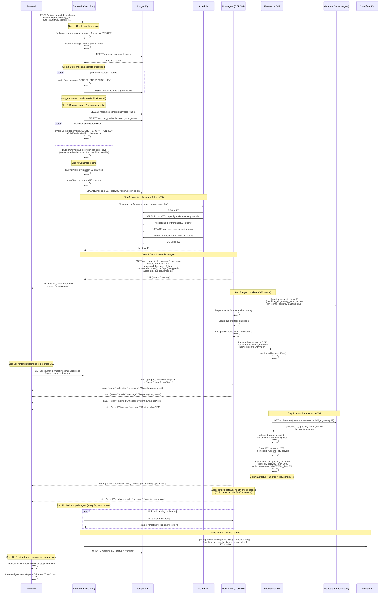
```mermaid
sequenceDiagram
    participant F as Frontend
    participant B as Backend (Cloud Run)
    participant DB as PostgreSQL
    participant S as Scheduler
    participant A as Host Agent (GCP VM)
    participant FC as Firecracker VM
    participant MS as Metadata Server (Agent)
    participant CF as Cloudflare KV

    F->>B: POST /api/accounts/{id}/machines<br/>{name, vcpus, memory_mb,<br/>auto_start: true, secrets: {...}}

    Note over B: Step 1: Create machine record
    B->>B: Validate: name required, vcpus 1-8, memory 512-8192
    B->>B: Generate slug (7-char alphanumeric)
    B->>DB: INSERT machine (status=stopped)
    DB-->>B: machine record

    Note over B: Step 2: Store machine secrets (if provided)
    loop For each secret in request
        B->>B: crypto.Encrypt(value, SECRET_ENCRYPTION_KEY)
        B->>DB: INSERT machine_secret (encrypted)
    end

    Note over B: auto_start=true → call startMachineInternal()

    Note over B: Step 3: Decrypt secrets & merge credentials
    B->>DB: SELECT machine secrets (encrypted_value)
    B->>DB: SELECT account_credentials (encrypted_value)
    loop For each secret/credential
        B->>B: crypto.Decrypt(encrypted, SECRET_ENCRYPTION_KEY)<br/>AES-256-GCM with 12-byte nonce
    end
    B->>B: Build llmKeys map {provider: plaintext_key}<br/>(account credentials used if no machine override)

    Note over B: Step 4: Generate tokens
    B->>B: gatewayToken = random 32-char hex
    B->>B: proxyToken = random 32-char hex
    B->>DB: UPDATE machine SET gateway_token, proxy_token

    Note over B,S: Step 5: Machine placement (atomic TX)
    B->>S: PlaceMachine(vcpus, memory, region, snapshot)
    S->>DB: BEGIN TX
    S->>DB: SELECT host WITH capacity AND matching snapshot
    S->>DB: Allocate next IP from host /24 subnet
    S->>DB: UPDATE host used_vcpus/used_memory
    S->>DB: UPDATE machine SET host_id, vm_ip
    S->>DB: COMMIT TX
    S-->>B: host, vmIP

    Note over B,A: Step 6: Send CreateVM to agent
    B->>A: POST /vms {machineId, machineSlug, name,<br/>vcpus, memory, vmIP,<br/>gatewayToken, proxyToken,<br/>secrets (decrypted), llmKeys (decrypted),<br/>accountId, budgetMicrocents}
    A-->>B: 201 {status: "creating"}

    B-->>F: 201 {machine, start_error: null}<br/>(status: "provisioning")

    Note over A,FC: Step 7: Agent provisions VM (async)

    A->>MS: Register metadata for vmIP:<br/>{machine_id, gateway_token, nonce,<br/>llm_config, secrets, machine_slug}
    A->>A: Prepare rootfs from snapshot overlay
    A->>A: Create tap interface on bridge
    A->>A: Add iptables rules for VM networking

    A->>FC: Launch Firecracker via SDK<br/>(kernel, rootfs, vcpus, memory,<br/>network config with vmIP)
    FC->>FC: Linux kernel boot (~125ms)

    Note over F: Step 8: Frontend subscribes to progress SSE
    F->>B: GET /accounts/{id}/machines/{mid}/progress<br/>Accept: text/event-stream
    B->>A: GET /progress?machine_id={mid}<br/>X-Proxy-Token: {proxyToken}

    A-->>F: data: {"event":"allocating","message":"Allocating resources"}
    A-->>F: data: {"event":"rootfs","message":"Preparing filesystem"}
    A-->>F: data: {"event":"network","message":"Configuring network"}
    A-->>F: data: {"event":"booting","message":"Booting MicroVM"}

    Note over FC,MS: Step 9: Init script runs inside VM
    FC->>MS: GET /v1/instance (metadata request via bridge gateway IP)
    MS-->>FC: {machine_id, gateway_token, nonce,<br/>llm_config, secrets}
    FC->>FC: Init script: parse metadata,<br/>set env vars, write config files

    FC->>FC: Start PTY server on :7681<br/>(/usr/local/bin/agent --pty-server)
    FC->>FC: Start OpenClaw gateway on :3000<br/>(openclaw gateway --port 3000<br/>--bind lan --token $GATEWAY_TOKEN)

    Note over FC: Gateway startup (~55s for Node.js modules)

    A-->>F: data: {"event":"openclaw_ready","message":"Starting OpenClaw"}

    Note over A: Agent detects gateway health check passes<br/>(TCP connect to VM:3000 succeeds)

    A-->>F: data: {"event":"machine_ready","message":"Machine is running"}

    Note over B: Step 10: Backend polls agent (every 3s, 3min timeout)
    loop Poll until running or timeout
        B->>A: GET /vms/{machineId}
        A-->>B: {status: "creating" | "running" | "error"}
    end

    Note over B,CF: Step 11: On "running" status
    B->>CF: putSignedKV("route:{accountSlug}:{machineSlug}",<br/>{machine_id, host_hostname, proxy_token},<br/>TTL=300s)
    B->>DB: UPDATE machine SET status = "running"

    Note over F: Step 12: Frontend receives machine_ready event
    F->>F: ProvisioningProgress shows all steps complete
    F->>F: Auto-navigate to workspace OR show "Open" button
```
