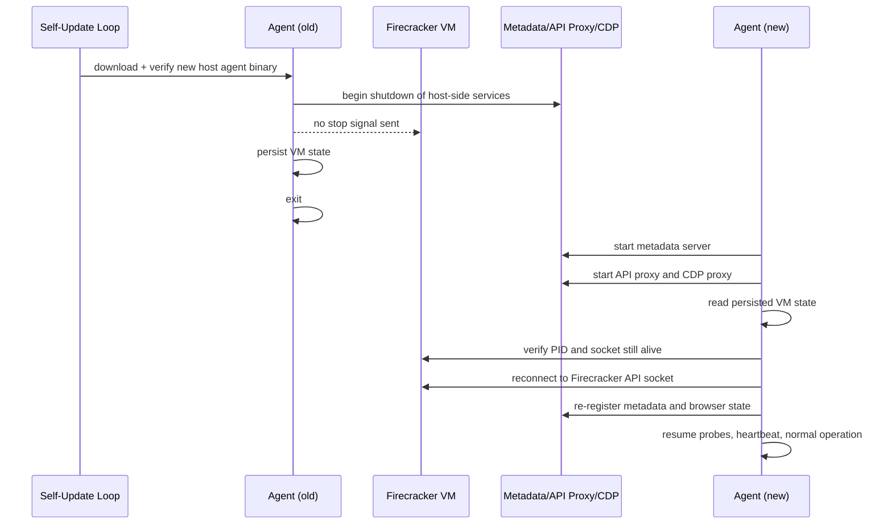
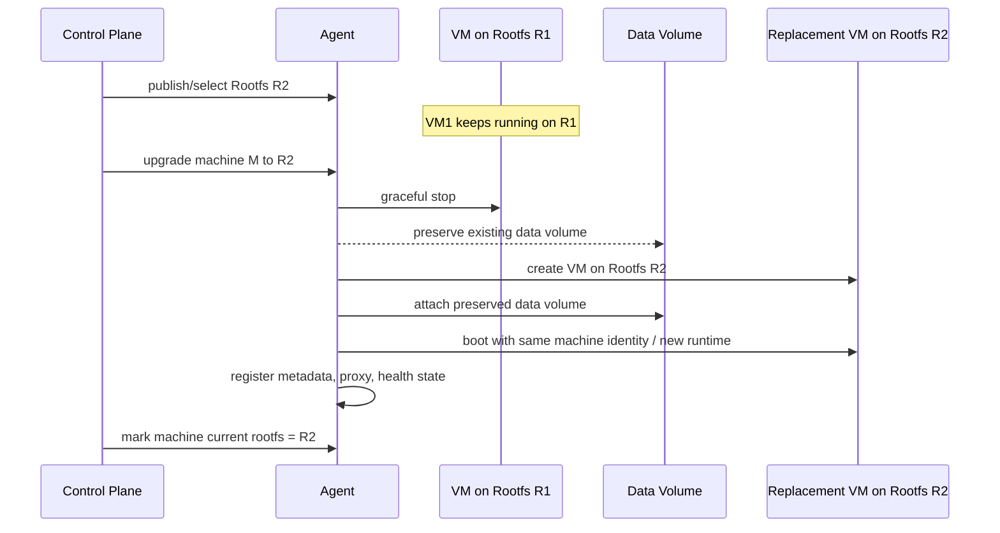
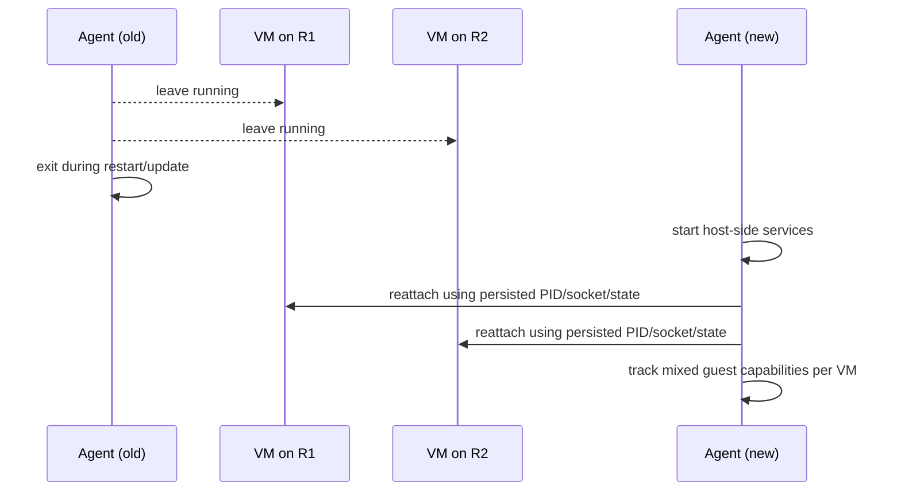

# PTY Decoupling and Agent Graceful Restart

**Date:** 2026-04-08
**Status:** Proposed
**Scope:** DR-401/402 (PTY decoupling) and DR-501/502 (non-disruptive agent restarts)

## Problem

The host-side agent binary serves two roles: it runs on the host as the VM orchestrator and control API, and the same binary runs inside guest VMs as the PTY server (`agent --pty-server`). This coupling creates two problems:

1. **Guest PTY is tied to the host agent binary.** Any PTY-only change requires shipping a new guest runtime, but the PTY implementation currently lives in the same binary and source tree as the host orchestrator.

2. **Agent self-updates kill running VMs.** The self-update loop waits for zero running VMs before restarting. Manual update triggers gracefully stop all VMs first. There is no way to update the host agent without disrupting active user sessions.

In the target architecture, rootfs selection is also more granular: a host may run VMs on different rootfs versions at the same time. That changes rollout strategy:

- agent restart must not imply guest rootfs change
- rootfs upgrades must be reasoned about per VM
- mixed guest versions on one host are expected, not exceptional

## Decision

Two changes, implemented independently but designed to work together:

**Phase 4 — Guest PTY Extraction:** Extract the guest PTY server into a dedicated `ocmptyd` binary. Build and inject it into the guest rootfs alongside the agent. The init script starts `ocmptyd` instead of `agent --pty-server`. No protocol or port changes.

This is **not** full PTY artifact decoupling. It is a guest/runtime boundary cleanup plus **VM-level release decoupling**: PTY behavior follows the VM's rootfs version rather than the host agent binary version.

**Phase 5 — Graceful Restart with VM Reattachment:** Keep a single host-side agent process. Make it capable of restarting without killing running VMs. On startup, reconstruct in-memory host state for still-running VMs: verify persisted PIDs are alive, reconnect to Firecracker API sockets, re-register metadata, rebuild proxy/health state, and resume normal operation.

The host agent restart path and the guest rootfs upgrade path are separate concerns:

- **Agent restart** preserves running VMs exactly as they are.
- **Rootfs upgrade** does not mutate a running VM. It only takes effect when a VM is recreated onto a newer rootfs.
- **Mixed rootfs versions on one host are supported** and expected.

### Definitions

- **Agent update:** Replace and restart the host-side `agent` binary. This updates the host control plane only: orchestrator, metadata server, API proxy, CDP proxy, heartbeat, and self-update logic.
- **Rootfs update:** Publish a new guest rootfs artifact version so future VM boots can use it.
- **VM upgrade:** Move one specific machine from its current rootfs to a new rootfs by recreating it on the new image while preserving its data volume.

After this design:

- Agent update does **not** imply guest rootfs change.
- Rootfs update does **not** mutate already-running VMs.
- VM upgrade is the explicit operation that changes a machine's rootfs version.

## Alternatives Considered

### Full Supervisor Process (Rejected)

A separate `vm-supervisor` process owns Firecracker lifecycle. The control-agent becomes stateless and talks to the supervisor over Unix socket IPC.

Rejected because:

- It adds a second local authority for VM lifecycle without removing the need for restart recovery.
- Metadata reconstruction, proxy reconstruction, health probes, and control-plane heartbeat still belong to the agent after restart.
- It introduces an IPC protocol, split error handling, and state ownership handoff for create/stop/destroy/list/drain/recovery flows.
- Firecracker VMs already survive parent process death, so reattachment can be built directly into the existing single-process model.

### Lightweight Supervisor Shim (Rejected)

A minimal process (~200 lines) holds Firecracker child PIDs and manages TAP devices. Control-agent queries the shim on restart.

Rejected because:

- The shim still becomes critical infrastructure that must not crash.
- It creates split ownership of PIDs, TAP devices, and persisted state.
- It does not materially reduce the recovery work compared with direct reattachment.

## Phase 4: Guest PTY Extraction

### Current State

The PTY server is compiled into the `agent` binary via `backend/cmd/agent/ptyserver.go` (~780 lines). It is activated by the `--pty-server` flag. Inside guest VMs, the init script starts it as:

```
/usr/local/bin/agent --pty-server >> /var/log/pty-server.log 2>&1 &
```

The PTY server exposes five capabilities on port 7681:

| Endpoint | Purpose |
|----------|---------|
| `/ws`, `/` | WebSocket terminal sessions with reconnect support |
| `/health` | Gateway health status (reads `/run/ocm-gateway-status`) |
| `/restart-gateway` | Signals gateway restart via `/tmp/.ocm-restart-gateway` |
| `/exec` | Whitelisted openclaw subcommand execution + codex-auth OAuth |
| `/write-file` | Writes allowed files to `~/.openclaw/` |

The orchestrator health-checks VMs by connecting to port 7681 and reading the `/health` endpoint.

### Target State

A new binary `ocmptyd` contains all five capabilities. It is a standalone Go binary with no dependency on the agent's orchestrator, config, selfupdate, or agentapi packages.

```
backend/cmd/ocmptyd/main.go      — entry point, flag parsing, HTTP server setup
backend/cmd/ocmptyd/pty.go       — session manager, WebSocket handler
backend/cmd/ocmptyd/exec.go      — /exec endpoint
backend/cmd/ocmptyd/writefile.go — /write-file endpoint
backend/cmd/ocmptyd/health.go    — /health and /restart-gateway endpoints
```

The codex-auth handlers move with the exec endpoint since they are guest-only OAuth flows.

### Delivery

`ocmptyd` is delivered as part of the guest rootfs for the VM that boots it:

1. `make build-ocmptyd` compiles `backend/cmd/ocmptyd` to `backend/ocmptyd-linux` (static, `CGO_ENABLED=0`).
2. `make build-rootfs` depends on `build-ocmptyd`.
3. `scripts/build-rootfs.sh` copies `ocmptyd-linux` into the rootfs at `/usr/local/bin/ocmptyd`.
4. The agent binary may still be injected into the rootfs for future guest-side needs, but PTY no longer uses it.

In a mixed-rootfs world, this means:

- Existing VMs keep the `ocmptyd` version baked into the rootfs they already booted.
- New VMs pick up the `ocmptyd` version from the rootfs selected at create time.
- Host agent restarts do not change guest PTY behavior for already-running VMs.

### Init Script Changes

In `scripts/init-openclaw.sh`, replace:

```bash
/usr/local/bin/agent --pty-server >> /var/log/pty-server.log 2>&1 &
```

with:

```bash
/usr/local/bin/ocmptyd >> /var/log/pty-server.log 2>&1 &
```

Both the initial startup block and the crash-recovery restart block must be updated. The PID file path (`/var/run/pty-server.pid`) and log path stay the same.

### What Stays in the Agent

The `--pty-server` flag and `ptyserver.go` are removed from `backend/cmd/agent/`. The `ptyserver_other.go` (non-Linux stub) is also removed. The agent binary becomes host-only code.

### Port and Protocol

No changes. Port 7681, same WebSocket protocol (`0` = I/O, `1` = resize, `s` = session ID, `r` = replay). The orchestrator health probe at `http://{vmIP}:7681/health` works unchanged.

### Testing

- Build `ocmptyd` and verify it starts and serves `/health` on the expected port.
- Integration test: boot a VM with `ocmptyd` in rootfs, connect WebSocket terminal, verify session create/reconnect.
- Verify the orchestrator's `waitForPort(vmIP, 7681)` health check passes with `ocmptyd`.

## Phase 5: Graceful Restart with VM Reattachment

### Current State

On startup, the orchestrator reads `vms.json` via `loadState()`. For each persisted VM it finds, it calls `cleanupOrphanedVM()` which:

1. Kills the Firecracker process (if PID is still alive).
2. Removes TAP device, rootfs copy, socket file.
3. Preserves data volumes.

This means any agent restart (including self-update) destroys all running VMs. The self-update loop works around this by refusing to update while VMs are running (`isIdle()` check), which delays updates indefinitely on busy hosts.

### Target State

On startup, the agent reconstructs host-side state for persisted VMs and **reattaches** to running ones instead of killing them.

For each persisted VM:

1. Check if the PID is still alive (`kill -0 pid`).
2. If dead: clean up ephemeral resources (TAP, rootfs copy, socket) as today. Log and continue.
3. If alive: reconnect to the Firecracker API socket, rebuild in-memory VM state, re-register in the metadata server, rebuild proxy/health state, and resume normal operation.

This recovery happens **after** the metadata server and related host services are started. It is not part of the current `loadState()` cleanup path inside orchestrator construction.

### Reattachment Procedure

For each live persisted VM:

```
1. Verify PID exists:          kill(pid, 0)
2. Verify socket exists:       stat(socketPath)
3. Rebuild Firecracker client: construct a Machine/client wrapper for the existing API socket
4. Rebuild VMInstance:         from persisted state (IP, tap, paths, tokens, versions)
5. Register metadata:         metaSrv.Register(vmIP, machineConfig)
6. Add to in-memory map:      o.vms[machineID] = &runningVM{...}
7. Resume probes/proxies:     health checks, metadata-backed services, browser target state
8. Save state:                o.saveState() (confirms clean recovered state)
```

The Firecracker API socket is the control-plane handle for a reattached VM. Forced cleanup must still use the persisted PID directly when needed; a reattached SDK wrapper should not be assumed to have full child-process ownership semantics.

### Startup Ordering

Recovery cannot happen inside the current orchestrator constructor cleanup path. The startup sequence must become:

1. Set up bridge and NAT.
2. Start metadata server.
3. Start API proxy and CDP proxy.
4. Construct orchestrator without destructive orphan cleanup.
5. Attach metadata registrar to orchestrator.
6. Run a dedicated recovery step that:
   - reads persisted VM state
   - reattaches live VMs
   - cleans up dead VMs
   - re-registers metadata
   - restores browser target and proxy-facing state
7. Start health probes and heartbeat.
8. Start self-update loop.

Concretely, this likely means splitting current startup behavior into:

- `loadPersistedState()` or similar: read-only parse of `vms.json`
- `recoverPersistedVMs(...)`: post-startup recovery / cleanup
- `cleanupStaleTaps()`: still safe after recovery

instead of the current constructor behavior of "load state and kill everything found".

### Extended Persisted State

Current `persistedVM` fields are insufficient for full reattachment. Do **not** persist `metadata.MachineConfig` directly. It is an in-memory serving type with intentionally non-serializable fields.

Instead, introduce a dedicated serializable `persistedMachineState` (name illustrative) that contains:

| Field | Purpose |
|-------|---------|
| `MetadataConfig` | Full metadata registration payload needed to rebuild metadata state |
| `RuntimeSelection` | Rootfs/OpenClaw version info for metadata `/v1/machine` response |
| `CreatedAt` | Original creation timestamp |
| `RootfsVersion` | The rootfs version the VM actually booted with |
| `DesiredRootfsVersion` | Optional target version for future recreate/upgrade workflows |
| `Capabilities` | Guest-reported capability set for mixed-version compatibility |

This persisted state contains sensitive data (secrets, tokens, credentials). The state file must be readable only by root (**mode 0600**). Current implementation writes `vms.json` too broadly and must be tightened before storing additional secrets.

State durability requirements:

- Persisted state must be updated on VM create, reattach, stop/destroy, and any metadata-affecting live config mutation.
- Reattachment must restore the latest applied config, not just the original boot-time config.
- Root-only file permissions are sufficient for this design; encryption at rest is not required for the first implementation.

### Durable Update Requirements

Today, some host-side VM state is mutated only in memory. Under this design, the persisted state layer becomes part of the runtime contract.

The following operations must update persisted state immediately after successful in-memory mutation:

- VM create
- VM create completion / transition to running
- VM stop
- VM destroy
- guest capability update, if tracked dynamically
- metadata-backed config update
- metadata-backed secret update
- metadata-backed LLM key update
- browser companion VM attach / detach state changes
- rootfs version / desired rootfs version changes

Implementation guidance:

- Add a dedicated serialization path that is independent from `metadata.MachineConfig` JSON tags.
- Persist via write-to-temp + atomic rename.
- Enforce `0600` mode on create and rewrite.
- Treat persisted state write failure as a high-severity operational error because it weakens restart recovery guarantees.

### Self-Update Changes

The self-update flow changes from "wait for idle, then restart" to "restart anytime":

**Current flow:**
```
poll manifest → check idle → skip if VMs running → update when idle → restart
```

**New flow:**
```
poll manifest → update binary → restart → reattach to running VMs
```

The `isIdle()` gate in `updater.Run()` is removed. The `handleTriggerUpdate` endpoint no longer calls `orchestrator.Shutdown()` before updating.

### Agent Update Semantics

An **agent update** now means:

1. Download and verify the new host `agent` binary.
2. Restart the host `agent` process.
3. Recreate host-side services:
   - metadata server
   - API proxy
   - CDP proxy
   - cloudflared
   - heartbeat / health probes
4. Reattach to already-running Firecracker VMs.
5. Resume operation with the same running VMs on the same rootfs versions.

What may briefly interrupt during agent update:

- metadata requests from guests
- API proxy requests to `:4000`
- CDP proxy traffic to `:9222`
- external tunnel-backed connections

What should **not** be interrupted at the VM level:

- Firecracker process lifetime
- guest filesystem/data volume
- guest PTY process lifetime
- guest gateway process lifetime

### Shutdown Behavior

The agent's SIGTERM handler changes:

**Current:** Notify control plane → stop all VMs → cleanup → exit.

**New:** Notify control plane → save state (already persisted) → cleanup non-VM resources (cloudflared, API proxy, HTTP servers) → exit. VMs are **not** stopped. They continue running as independent Firecracker processes on their existing rootfs versions.

A new explicit "drain" command is added for when you actually want to stop all VMs before shutting down (e.g., host maintenance):

```
POST /drain   — gracefully stops all VMs, then allows shutdown
```

The existing `POST /vms/{id}/stop` and `DELETE /vms/{id}` remain for individual VM lifecycle.

### Metadata Server Reconstruction

The metadata server holds per-VM config in memory. On reattachment, configs are restored from persisted machine state after the metadata server is started. This means the metadata server is unavailable for 2-3 seconds during agent restart. Guest VMs handle this gracefully:

- The init script's metadata fetch has retry logic.
- Running gateways usually don't re-fetch metadata after boot.
- The PTY server doesn't depend on the metadata server.

The only risk is a VM booting during the restart window. This is mitigated by the control plane detecting agent heartbeat gaps and not scheduling new VMs until the agent is back.

### API Proxy and CDP Proxy

These are reconstructed on startup. The API proxy forwards to the metadata server (which is reconstructed). The CDP proxy re-initializes with the metadata server reference. Any per-VM browser routing state needed after restart must be derivable from persisted machine state.

### Cloudflare Tunnel

Cloudflared is restarted by the agent on startup (already the case today). The tunnel reconnects within seconds. During the gap, WebSocket connections through the tunnel drop and reconnect — the PTY server's session persistence handles this (sessions survive WebSocket disconnects).

### Bridge Network

The bridge and NAT rules persist across agent restarts (they're kernel state). The current startup code runs `bridge.Setup()` which is idempotent, and `TeardownNAT()` + `SetupNAT()` which resets iptables rules cleanly. No changes needed.

### Rootfs Upgrade Model

Rootfs upgrades are **not** performed in place on a running VM.

Rules:

1. A VM's rootfs is pinned at boot.
2. Agent restart preserves the running VM and therefore preserves its rootfs version.
3. A rootfs upgrade takes effect only when a VM is recreated onto a newer rootfs.
4. User state is preserved by reusing the VM's data volume across recreate.
5. Mixed rootfs versions on one host are supported.

Operationally:

- **Existing VMs** keep running on their current rootfs.
- **New VMs** boot with the rootfs version selected at create time.
- **Explicit upgrade** means stop/replace the VM, boot a new one on the new rootfs, and reattach the existing data volume.
- **Rollback** means new VMs stop using the bad rootfs immediately, and affected VMs can be recreated onto the previous version.

This keeps restart recovery simple and makes rollback a normal operation instead of a host-wide event.

### Rootfs Upgrade Semantics

A **rootfs update** and a **VM upgrade** are separate things:

- Rootfs update: publish a new version and make it selectable for future boots.
- VM upgrade: change one machine to that new rootfs by recreating it.

Recommended control-plane model:

1. Publish rootfs version `R2`.
2. Mark `R2` as default for new machines, or target it for a subset of machines.
3. Existing machine on `R1` continues running unchanged.
4. When upgrading that machine:
   - cordon or stop user traffic if needed
   - stop the VM
   - preserve its data volume
   - boot replacement VM on `R2`
   - attach the preserved data volume
   - register fresh metadata and proxy state
5. Mark machine current version as `R2`.

Rollback model:

1. Stop assigning `R2` to new VMs.
2. Recreate affected machines back onto `R1` using their preserved data volumes.

This is intentionally a recreate flow, not a patch-in-place flow.

### Host Responsibilities vs Guest Responsibilities

After this redesign, responsibilities are clearer:

**Host agent responsibilities**

- Firecracker lifecycle
- persisted VM state
- metadata server
- API proxy
- CDP proxy
- health probes
- cloudflared lifecycle
- agent self-update
- VM reattachment after host restart

**Guest rootfs responsibilities**

- PTY server (`ocmptyd`)
- init script behavior
- gateway process
- guest-local runtime environment
- SSH and other guest-local service configuration

The host controls VM lifecycle and recovery. The rootfs controls what software the guest runs after boot.

## Sequence Diagrams

### Agent Update with VM Reattachment



### Rootfs Upgrade by VM Recreate



### Agent Restart While Mixed Rootfs VMs Run



### Mixed-Version Compatibility

Because one host may run multiple VM rootfs versions simultaneously:

- Host-side agent APIs must remain compatible with older guest PTY/runtime versions.
- Guest capabilities should be tracked explicitly per VM.
- New host features that depend on guest support should use capability checks rather than assuming a single guest contract.

### Error Recovery

If reattachment fails for a specific VM (e.g., socket gone, PID alive but unresponsive):

1. Log the failure with details.
2. Fall back to current behavior: kill the process, clean up ephemeral resources.
3. Data volume is preserved — control plane can re-create the machine.

Partial reattachment is fine. If 3 of 4 VMs reattach and 1 fails, the agent operates normally with 3 VMs.

### Testing

- Unit test: persisted state with live PIDs reattaches instead of cleaning up.
- Unit test: persisted state with dead PIDs cleans up as before.
- Unit test: extended persisted state serialization round-trip.
- Unit test: live config mutation updates persisted state.
- Unit test: persisted state file is written with `0600`.
- Unit test: recovery step runs after metadata/proxy startup, not during constructor cleanup.
- Integration test: start VM, restart agent, verify VM is still running and accessible.
- Integration test: start VM, kill Firecracker process, restart agent, verify cleanup.
- Integration test: self-update with running VMs completes without VM disruption.
- Integration test: host restarts with mixed-rootfs VMs and reattaches all supported versions.
- Integration test: agent restart causes brief metadata/proxy interruption but guest processes remain alive.
- Integration test: explicit machine upgrade recreates VM on new rootfs and reattaches existing data volume.

## Implementation Sequence

1. **Phase 5 first**: Extend persisted VM state, add a post-startup reattach/recovery step, remove the `isIdle` gate from self-update, update SIGTERM behavior, add `/drain`, and verify mixed-rootfs VM recovery.
2. **Phase 4 second**: Extract `ocmptyd`, update build pipeline, update init script, and ship as part of guest rootfs releases.
3. **Rootfs lifecycle follow-up**: Add explicit per-VM rootfs version tracking and upgrade/recreate flows if not already present in the broader runtime architecture.

Suggested engineering breakdown for Phase 5:

1. Tighten persisted state writes:
   - introduce dedicated persisted state structs
   - change writes to atomic rename + `0600`
2. Split destructive startup cleanup from read-only state loading.
3. Add post-startup recovery path after metadata/proxy initialization.
4. Persist and recover metadata-backed mutable state.
5. Remove drain-before-update behavior from manual and periodic self-update.
6. Add `/drain` endpoint for explicit maintenance shutdowns.
7. Add mixed-rootfs recovery and compatibility tests.

## Checklist

### Phase 5: Host Restart and Recovery

- [x] Add a dedicated orchestrator recovery entrypoint instead of destructive startup cleanup.
- [x] Move VM recovery to run after metadata/proxy startup and metadata registrar wiring.
- [x] Change persisted state writes to atomic rename.
- [x] Tighten persisted state file permissions to `0600`.
- [x] Persist metadata-backed mutable state needed for restart recovery.
- [x] Remove idle-only gating from periodic self-update.
- [x] Remove implicit VM drain from manual trigger-update.
- [x] Add explicit `POST /drain`.
- [x] Add unit coverage for persisted state permissions and basic VM recovery.
- [ ] Restore browser companion VM state robustly across restart.
- [ ] Persist and recover explicit rootfs version fields per VM.
- [ ] Persist and recover guest capability metadata per VM.
- [ ] Add integration coverage for agent restart with still-running VMs.
- [ ] Add integration coverage for mixed-rootfs VM recovery on one host.
- [ ] Add integration coverage for transient metadata/API proxy interruption during host restart.

### Phase 4: Guest PTY Extraction

- [ ] Create `backend/cmd/ocmptyd/` entrypoint and split handlers out of `ptyserver.go`.
- [ ] Move guest-only OAuth exec handlers into `ocmptyd`.
- [ ] Update rootfs build to include `/usr/local/bin/ocmptyd`.
- [ ] Update guest init startup path to run `ocmptyd` instead of `agent --pty-server`.
- [ ] Update guest crash-restart path to restart `ocmptyd`.
- [ ] Remove `--pty-server` mode from the host agent binary.
- [ ] Remove `backend/cmd/agent/ptyserver.go`.
- [ ] Add guest integration coverage for PTY reconnect/session behavior under `ocmptyd`.

### Rootfs Lifecycle Follow-Up

- [ ] Track current rootfs version per VM in persisted state and API surfaces.
- [ ] Track desired rootfs version per VM for explicit upgrade flows.
- [ ] Define control-plane API for “upgrade machine to rootfs X”.
- [ ] Implement recreate-on-upgrade flow with preserved data volume.
- [ ] Define rollback flow to recreate affected VMs onto a previous rootfs version.
- [ ] Add compatibility gating for host features that depend on guest capabilities.

Phase 4 is **not** a prerequisite for Phase 5. Phase 5 addresses host-side restart safety. Phase 4 improves guest/runtime boundaries and VM-level rollout granularity.

## Risks

| Risk | Mitigation |
|------|------------|
| Firecracker SDK reattachment doesn't work cleanly | Use the API socket as the source of truth for graceful operations; if SDK ownership semantics are awkward, fall back to raw HTTP calls plus persisted PID-based forced cleanup. |
| Metadata reconstruction from persisted state is incomplete | Persist a dedicated serializable metadata payload and update it on every live config mutation. Validate with round-trip tests. |
| Secrets in `vms.json` on disk | Tighten file mode to 0600 before storing additional secrets. Root-only permissions are the baseline protection model. |
| Brief API downtime during restart | 2-3 seconds. Backend already handles agent unavailability via heartbeat gaps. Frontend retries. |
| Self-update during VM creation race | Add a creation lock: self-update waits for in-flight creates to complete (not for all VMs to stop). |
| Mixed guest versions drift from host assumptions | Track guest capabilities per VM and gate host features on capabilities instead of version assumptions. |
| Rootfs upgrades become ambiguous | Make rootfs upgrades explicit VM recreate operations, not agent restart side effects. |

## Open Questions

- Should the `/drain` endpoint wait for all VMs to stop before responding, or return immediately and let the caller poll?
- Should reattachment attempt to verify guest PTY/gateway health for each recovered VM before marking it fully running, or just trust the Firecracker process and resume normal probes?
- How should guest capabilities be reported and versioned so host-side features can safely operate across mixed rootfs versions?
- Should the explicit VM upgrade flow be "stop and recreate in place" only, or also support blue/green replacement on a second IP before cutover?
