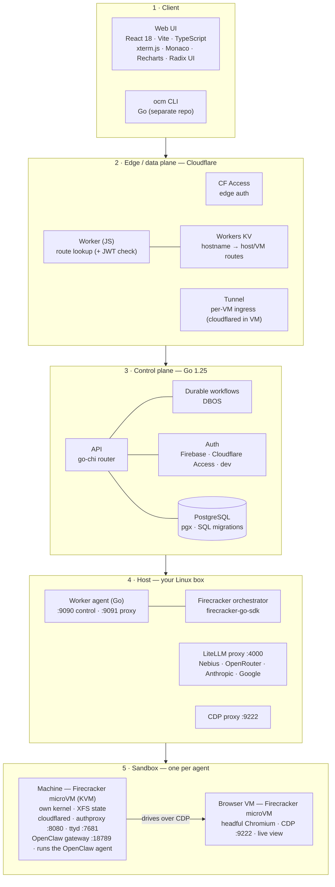

# Tech Stack

OpenClaw Machines is built in five layers — from the browser down to the
hardware-isolated sandbox.

## The stack, layer by layer

1. **Client.** A **React 18 + TypeScript** single-page app built with **Vite**,
   using **xterm.js** for the live terminal, **Monaco** for code, **Recharts**
   for usage views, and **Radix UI** primitives. The companion **`ocm` CLI** is a
   Go app (in the separate [`mathaix/ocm-cli`](https://github.com/mathaix/ocm-cli)
   repo).

2. **Edge / data plane (Cloudflare).** A **Cloudflare Worker** (JavaScript)
   authenticates each request (HS256 JWT) and looks up which host/VM it belongs to
   in **Workers KV**, then forwards it through a **Cloudflare Tunnel**
   (`cloudflared`) into your private host. This layer is what makes per-VM access
   secure and is optional in local mode.

3. **Control plane (Go 1.25).** The backend serves the API with the **go-chi**
   router, talks to **PostgreSQL** via **pgx** (with SQL migrations), and runs
   long-lived operations as **DBOS** durable workflows. Auth pluggably supports
   **Firebase**, **Cloudflare Access**, or a dev mode. Ships as a few Go binaries:
   `server`, `agent`, `authproxy`, `ocm-secrets`.

4. **Host (your Linux box).** A **worker agent** (Go) runs on each enrolled host
   and drives the **Firecracker orchestrator** (via `firecracker-go-sdk`) to boot,
   stop, and reap microVMs. On the host bridge network it also runs a **LiteLLM
   proxy** (`:4000`) that handles the VMs' model traffic (Nebius, OpenRouter,
   Anthropic, Google) and a **CDP proxy** (`:9222`) that routes Chrome DevTools
   traffic to each machine's paired browser VM.

5. **Sandbox (one per agent).** Each agent gets its own **Firecracker microVM**
   on **KVM** — its own guest kernel, **XFS**-backed state storage, an in-VM
   **cloudflared** tunnel and **authproxy** (`:8080`, machine-token JWT) guarding a
   **ttyd** terminal (`:7681`) and the **OpenClaw gateway** (`:18789`), with the
   **OpenClaw** runtime inside. For browser automation, a separate **browser VM**
   (headful Chromium with a live view) pairs 1:1 with the machine, and the agent
   drives it over **CDP** (Chrome DevTools Protocol, port 9222) via the host CDP
   proxy.

**Cross-cutting:** request tracing via **Opik** and **OpenTelemetry**, encrypted
per-machine secrets, and built-in backups/snapshots.

## See also

- [Architecture](architecture.md) — system design: data plane, routing, tunnels, lifecycle
- [Getting Started](getting-started.md) — run it yourself, in three stages
