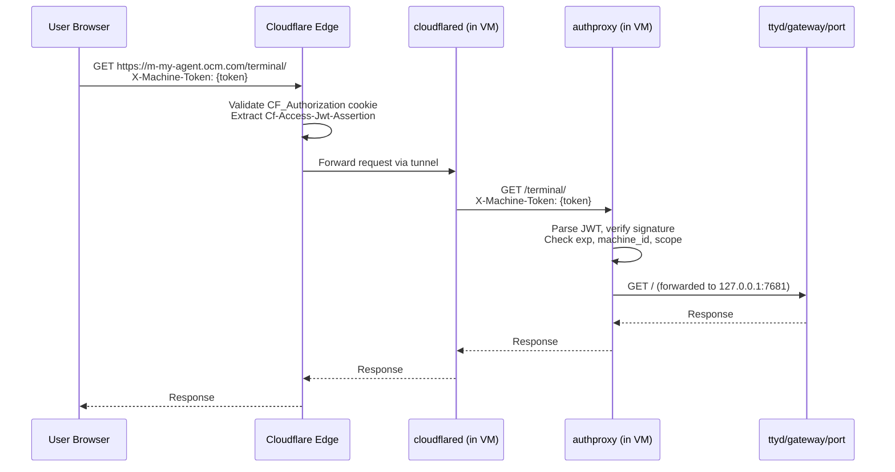
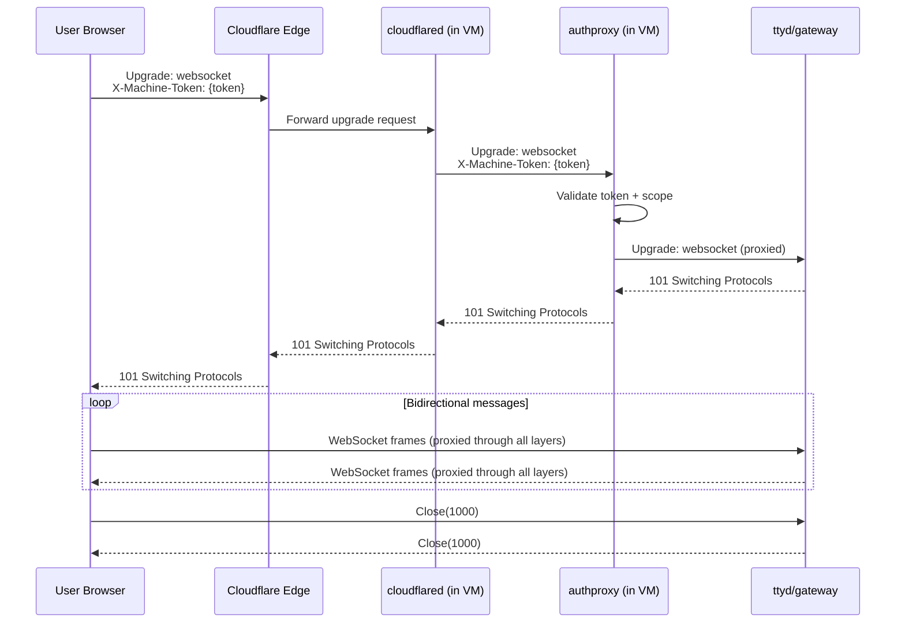
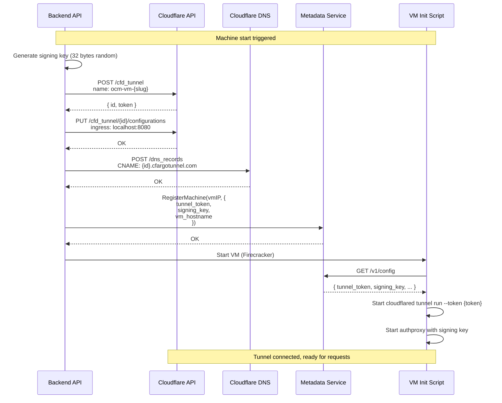

# Tunnel Architecture

*For system overview see [architecture.md](architecture.md), for the full data-plane request path see [routing.md](routing.md).*

OpenClaw Machines uses per-VM Cloudflare Tunnels to provide direct, authenticated access to each MicroVM without exposing public IPs or managing load balancers.

---

## Table of Contents

- [Architecture Overview](#architecture-overview)
- [Per-VM Tunnel Lifecycle](#per-vm-tunnel-lifecycle)
- [Tunnel Naming Convention](#tunnel-naming-convention)
- [Auth Proxy Architecture](#auth-proxy-architecture)
- [Tunnel Reaper](#tunnel-reaper)
- [Data Flow Diagram](#data-flow-diagram)
- [Tunnel Manager API](#tunnel-manager-api)

---

## Architecture Overview

### Design Principles

1. **One tunnel per VM** — Each MicroVM gets its own isolated Cloudflare Tunnel
2. **DNS per VM** — Each tunnel gets a dedicated subdomain: `m-{slug}.yourdomain.com`
3. **Auth at two layers** — CF Access at edge (authentication) + machine tokens in VM (authorization)
4. **Ephemeral tunnels** — Created on VM start, deleted on VM stop/destroy
5. **Self-healing** — Tunnel reaper cleans orphaned tunnels from crashes or race conditions

### Network Topology

```
User Browser
    ↓
Cloudflare Access (authentication)
    ↓
Cloudflare Tunnel (m-{slug}.yourdomain.com)
    ↓
cloudflared (inside VM)
    ↓
authproxy (port 8080, validates machine tokens)
    ↓
    ├─ /terminal → ttyd (port 7681)
    ├─ /gateway  → OpenClaw gateway (port 18789)
    └─ /port/N   → User-started server (port N)
```

**Key properties:**
- **Zero public IPs** — All VMs on private bridge (192.168.100.0/24)
- **One hop** — No proxy chain (previous architecture had 4 hops: Browser → Worker → Backend → Agent → VM)
- **Auto-TLS** — Cloudflare handles TLS termination
- **DDoS protection** — Cloudflare edge absorbs attacks

---

## Per-VM Tunnel Lifecycle

### Create (On VM Start)

When `startMachineInternal()` is called, the backend creates a tunnel:

1. **Generate signing key:**
   ```go
   signingKey := base64.StdEncoding.EncodeToString(crypto.RandBytes(32))
   ```

2. **Create tunnel via CF API:**
   ```go
   tunnelID, token, err := tunnelMgr.CreateVMTunnel(ctx, machineSlug)
   // POST https://api.cloudflare.com/client/v4/accounts/{account_id}/cfd_tunnel
   // Body: { "name": "ocm-vm-{slug}", "config_src": "cloudflare" }
   // Returns: { "id": "...", "token": "..." }
   ```

3. **Configure tunnel ingress rules:**
   ```go
   tunnelMgr.ConfigureVMTunnel(ctx, tunnelID, hostname)
   // PUT https://api.cloudflare.com/.../cfd_tunnel/{id}/configurations
   // Body: {
   //   "config": {
   //     "ingress": [
   //       { "hostname": "m-{slug}.yourdomain.com", "service": "http://localhost:8080" },
   //       { "service": "http_status:404" }
   //     ]
   //   }
   // }
   ```

4. **Create DNS record:**
   ```go
   tunnelMgr.CreateDNSRoute(ctx, tunnelID, hostname)
   // POST https://api.cloudflare.com/.../zones/{zone_id}/dns_records
   // Body: {
   //   "type": "CNAME",
   //   "name": "m-{slug}.yourdomain.com",
   //   "content": "{tunnelID}.cfargotunnel.com",
   //   "proxied": true,
   //   "ttl": 1
   // }
   ```

5. **Store in DB:**
   ```sql
   UPDATE machines SET
     tunnel_id = ?,
     tunnel_hostname = ?,
     signing_key = ?
   WHERE id = ?
   ```

6. **Pass to VM via metadata:**
   ```go
   metadata.RegisterMachine(vmIP, MachineConfig{
     TunnelToken: token,
     SigningKey: signingKey,
     VmHostname: hostname,
     // ...
   })
   ```

7. **VM boots:**
   - Init script fetches tunnel token from metadata
   - Starts `cloudflared tunnel run --token {token}`
   - Starts authproxy with signing key and machine ID
   - cloudflared connects to Cloudflare edge and registers the tunnel

**Timing:** Tunnel creation adds ~2-3 seconds to VM start time (CF API calls are fast).

### Delete (On VM Stop/Destroy)

When `stopMachineInternal()` is called:

1. **Mark machine as stopping:**
   ```sql
   UPDATE machines SET status = 'stopping' WHERE id = ?
   ```

2. **Rotate signing key (invalidate tokens):**
   ```sql
   UPDATE machines SET signing_key = ? WHERE id = ?
   ```

3. **Delete tunnel and DNS:**
   ```go
   tunnelMgr.DeleteTunnelAndDNS(ctx, machine.TunnelID, machine.TunnelHostname)
   // DELETE /zones/{zone_id}/dns_records/{record_id}
   // DELETE /accounts/{account_id}/cfd_tunnel/{tunnel_id}
   ```

4. **Stop VM process** (if destroy, also delete data volume)

**Idempotency:** Delete operations are idempotent. If the tunnel is already gone (404 from CF API), the operation succeeds.

---

## Tunnel Naming Convention

All VM tunnels follow the naming pattern:

```
ocm-vm-{machine-slug}
```

Examples:
- Machine slug `my-agent` → tunnel name `ocm-vm-my-agent`
- Machine slug `test-123` → tunnel name `ocm-vm-test-123`

**Why this pattern:**
- **Prefix filtering:** Tunnel reaper can list all tunnels and filter by `ocm-vm-` prefix
- **Collision avoidance:** Machine slugs are globally unique, so tunnel names are unique
- **Debugging:** Tunnel name immediately reveals which machine it belongs to

**Legacy tunnels:** The old shared host tunnel naming was `ocm-{host-name}`. The `ocm-vm-` prefix distinguishes new per-VM tunnels.

---

## Auth Proxy Architecture

Each VM runs an auth proxy that validates machine tokens and reverse-proxies to internal services.

### Binary

- **Path:** `/usr/local/bin/authproxy`
- **Built from:** `backend/cmd/authproxy/main.go`
- **Dependencies:** Stdlib + `backend/internal/auth` (for token validation)
- **Size:** ~8MB static binary

### Startup

In `scripts/init-openclaw.sh`:

```bash
SIGNING_KEY="$SIGNING_KEY" MACHINE_ID="$MACHINE_ID" /usr/local/bin/authproxy \
  >> /var/log/authproxy.log 2>&1 &
```

Environment variables sourced from metadata service.

### Routes

| Path | Scope | Upstream | Notes |
|------|-------|----------|-------|
| `/health` | (no auth) | — | Returns `{"status":"ok"}` |
| `/terminal/*` | `terminal` | `http://127.0.0.1:7681` | ttyd WebSocket terminal |
| `/gateway/*` | `gateway` | `http://127.0.0.1:18789` | OpenClaw gateway HTTP + WebSocket |
| `/port/{N}/*` | `port` | `http://127.0.0.1:{N}` | User-started servers (N = 1024-65535) |

### Token Validation

On every request (except `/health`):

1. Extract `X-Machine-Token` header (or `?token=` query param for WebSocket)
2. Parse JWT and verify HS256 signature using machine's signing key
3. Check `exp < now` (5-minute TTL)
4. Check `machine_id` matches this VM's ID (from env)
5. Check scope: path `/terminal/*` requires `terminal` scope, etc.
6. Log request (email, path, method, status, duration)
7. Reverse-proxy to upstream service

### WebSocket Support

Auth proxy preserves WebSocket upgrade headers:

```go
proxy.Director = func(req *http.Request) {
    req.URL.Scheme = targetURL.Scheme
    req.URL.Host = targetURL.Host
    req.Host = targetURL.Host

    // Pass through Upgrade/Connection headers for WebSocket
    if upgrade := r.Header.Get("Upgrade"); upgrade != "" {
        req.Header.Set("Upgrade", upgrade)
        req.Header.Set("Connection", r.Header.Get("Connection"))
    }
}
```

This allows WebSocket connections to `/terminal/ws` and `/gateway/*` to work transparently.

### Security Properties

- **No static passwords** — All auth via short-lived signed tokens
- **Scoped access** — Tokens explicitly list allowed paths
- **Request logging** — Every access logged with email, path, method, status
- **No token in URLs** — Tokens passed via custom header, not query params (prevents leakage in logs)
- **Fail closed** — Missing/invalid token → 401/403, no fallback

---

## Tunnel Reaper

A background goroutine that periodically cleans up orphaned tunnels.

### Purpose

Tunnels can become orphaned if:
- VM crashes before cleanup runs
- Backend crashes mid-stop sequence
- Race condition between VM stop and tunnel delete
- Manual intervention (e.g., direct DB delete)

The reaper ensures orphaned tunnels don't accumulate and waste Cloudflare resources.

### Algorithm

```go
func reap(ctx context.Context, mgr *Manager, checker MachineChecker) {
    // 1. List all tunnels from Cloudflare API
    tunnels, err := mgr.ListTunnels(ctx)

    // 2. Filter to VM tunnels (prefix "ocm-vm-")
    for _, t := range tunnels {
        if !strings.HasPrefix(t.Name, "ocm-vm-") {
            continue // skip non-VM tunnels
        }

        // 3. Extract machine slug from tunnel name
        slug := strings.TrimPrefix(t.Name, "ocm-vm-")

        // 4. Check if machine exists and is active in DB
        isActive, err := checker.IsMachineActive(ctx, slug)
        if err != nil {
            log.Warn("reaper check failed", "slug", slug, "error", err)
            continue
        }

        // 5. If not active, delete tunnel + DNS
        if !isActive {
            hostname := "m-" + slug + ".yourdomain.com"
            mgr.DeleteTunnelAndDNS(ctx, t.ID, hostname)
            log.Info("reaper deleted orphan", "tunnel_id", t.ID, "slug", slug)
        }
    }
}
```

### Configuration

- **Interval:** 10 minutes (configurable via `StartReaper` parameter)
- **Startup:** Called in `backend/cmd/server/main.go` after server starts
- **Context:** Respects server shutdown context (stops cleanly on SIGTERM)

### Metrics

Reaper logs every sweep:

```json
{
  "event": "tunnel.reaper.sweep_complete",
  "orphaned": 2,
  "active": 15,
  "skipped": 1
}
```

- `orphaned`: Tunnels deleted
- `active`: Tunnels kept (machine still running)
- `skipped`: Tunnels ignored (non-VM tunnels)

### Edge Cases

- **Concurrent stop:** If a machine is being stopped while reaper runs, reaper may try to delete an already-deleting tunnel. CF API returns 404, which is treated as success (idempotent).
- **TOCTOU race:** Machine could stop between reaper's "is active?" check and delete call. Same outcome (tunnel deleted), just redundant work.
- **Stale cache:** Reaper queries DB directly, no cache. Always sees latest machine status.

---

## Data Flow Diagram

### HTTP Request Path



### WebSocket Upgrade Path



### Tunnel Creation Sequence



---

## Tunnel Manager API

The Tunnel Manager (`backend/internal/tunnel/tunnel.go`) provides a Go API for managing Cloudflare Tunnels.

### Constructor

```go
func New(apiToken, accountID, zoneID string) *Manager
```

Returns `nil` if `apiToken` or `accountID` is empty (graceful degradation for dev environments).

### Methods

#### CreateVMTunnel

```go
func (m *Manager) CreateVMTunnel(ctx context.Context, machineSlug string) (tunnelID string, token string, err error)
```

Creates a new tunnel with name `ocm-vm-{machineSlug}` and returns the tunnel ID and connector token.

**CF API:**
```http
POST /accounts/{account_id}/cfd_tunnel
Content-Type: application/json

{
  "name": "ocm-vm-{slug}",
  "config_src": "cloudflare"
}
```

**Response:**
```json
{
  "success": true,
  "result": {
    "id": "...",
    "token": "..."
  }
}
```

#### ConfigureVMTunnel

```go
func (m *Manager) ConfigureVMTunnel(ctx context.Context, tunnelID string, hostname string) error
```

Sets ingress rules for the tunnel: `hostname → http://localhost:8080`, catch-all → 404.

**CF API:**
```http
PUT /accounts/{account_id}/cfd_tunnel/{tunnel_id}/configurations
Content-Type: application/json

{
  "config": {
    "ingress": [
      { "hostname": "m-{slug}.yourdomain.com", "service": "http://localhost:8080" },
      { "service": "http_status:404" }
    ]
  }
}
```

#### CreateDNSRoute

```go
func (m *Manager) CreateDNSRoute(ctx context.Context, tunnelID, hostname string) error
```

Creates a proxied CNAME record: `hostname → {tunnelID}.cfargotunnel.com`.

**CF API:**
```http
POST /zones/{zone_id}/dns_records
Content-Type: application/json

{
  "type": "CNAME",
  "name": "m-{slug}.yourdomain.com",
  "content": "{tunnelID}.cfargotunnel.com",
  "proxied": true,
  "ttl": 1
}
```

#### DeleteTunnelAndDNS

```go
func (m *Manager) DeleteTunnelAndDNS(ctx context.Context, tunnelID string, hostname string) error
```

Deletes the DNS record and then deletes the tunnel. Idempotent (404 treated as success).

**CF API:**
```http
GET /zones/{zone_id}/dns_records?name={hostname}&type=CNAME
DELETE /zones/{zone_id}/dns_records/{record_id}
DELETE /accounts/{account_id}/cfd_tunnel/{tunnel_id}
```

#### ListTunnels

```go
func (m *Manager) ListTunnels(ctx context.Context) ([]TunnelInfo, error)
```

Returns all non-deleted tunnels in the account (up to 1000).

**CF API:**
```http
GET /accounts/{account_id}/cfd_tunnel?is_deleted=false&per_page=1000
```

**Response:**
```json
{
  "success": true,
  "result": [
    { "id": "...", "name": "ocm-vm-my-agent", "created_at": "..." },
    ...
  ]
}
```

### Error Handling

All methods return errors with context:

```go
if err := tunnelMgr.CreateVMTunnel(ctx, slug); err != nil {
    return fmt.Errorf("create VM tunnel: %w", err)
}
```

CF API errors include the HTTP status code and CF error message:

```go
if !cfResp.Success {
    return fmt.Errorf("create tunnel: %s (status %d)", cfResp.Errors[0].Message, resp.StatusCode)
}
```

### Timeouts

All HTTP requests have a 30-second timeout (configured in `Manager.client`).

---

## Operational Notes

### Tunnel Limits

Cloudflare has no documented hard limit on tunnel count per account, but:
- **Rate limits:** Tunnel creation is rate-limited (~10/sec per account)
- **API pagination:** ListTunnels returns max 1000 per page (reaper handles this)
- **Cost:** Tunnels are free on all Cloudflare plans

### DNS Propagation

- **TTL:** 1 (auto, Cloudflare manages)
- **Proxied:** Yes (requests go through CF edge, not direct to tunnel)
- **Propagation:** Near-instant (DNS record creation returns when propagated to CF edge)

### Debugging

Check tunnel status via Cloudflare dashboard:
1. Zero Trust > Access > Tunnels
2. Find tunnel by name: `ocm-vm-{slug}`
3. Check status: "Healthy" (connected) or "Down" (cloudflared not running)

Logs inside VM:
- `/var/log/cloudflared.log` — cloudflared stdout/stderr
- `/var/log/authproxy.log` — authproxy access logs + errors

Check tunnel from backend:
```go
tunnels, _ := tunnelMgr.ListTunnels(ctx)
for _, t := range tunnels {
    if strings.HasPrefix(t.Name, "ocm-vm-") {
        fmt.Println(t.ID, t.Name, t.CreatedAt)
    }
}
```

### Cleanup After Crashes

If the backend crashes mid-stop:
1. Tunnel may remain in CF but machine is stopped in DB
2. Reaper will detect and delete on next sweep (within 10 minutes)
3. DNS record will also be deleted by reaper

Manual cleanup:
```bash
# List orphaned tunnels
curl -H "Authorization: Bearer $CF_API_TOKEN" \
  https://api.cloudflare.com/client/v4/accounts/$CF_ACCOUNT_ID/cfd_tunnel?is_deleted=false

# Delete tunnel
curl -X DELETE \
  -H "Authorization: Bearer $CF_API_TOKEN" \
  https://api.cloudflare.com/client/v4/accounts/$CF_ACCOUNT_ID/cfd_tunnel/{tunnel_id}
```
